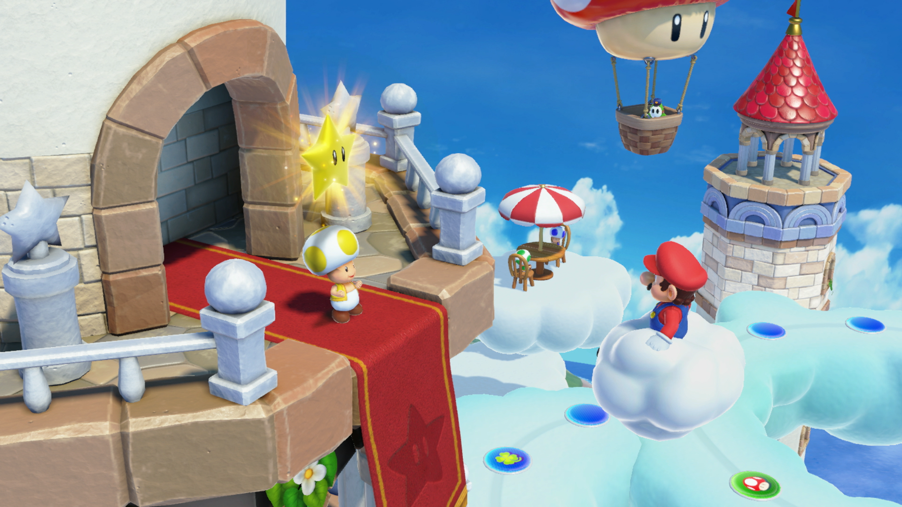
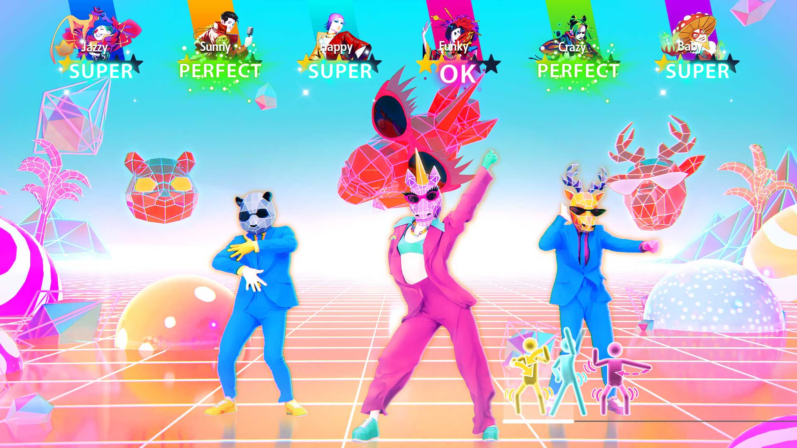

+++
title = "Mario Party Jamboree, Neva : le récap des sorties de la semaine (20/10)"
date = 2024-10-20T07:30:02+01:00
draft = false
author = "Félix"
tags = ["C’est dispo"]
image = "https://nostick.fr/articles/2024/octobre/2010-les-sorties-de-la-semaine/mario.png"
+++

Entre la garderie, les courses et le Super U d’en bas qui a augmenté les Weetablix Crispy Minis Chocolat de 20 centimes (c’est spécifique mais que voulez-vous je suis en rogne), vous n’avez peut-être pas eu le temps de vous intéresser aux nouveautés du moment. Qu’à cela ne tienne : voici les sorties de ces derniers jours qui ont retenu notre attention.

## Sans foi ni jeu de l’oie

Cette semaine est sorti le dernier ***Mario Party***, un nouvel opus au nom imprononçable qui va faire rigoler plus d’un vendeur Micromania. Comme d’hab’ il s’agit d’un jeu de l’oie avec toute la dream team Nintendo dans lequel on va devoir s’affronter sur des minis-jeux variés afin de récupérer un maximum d’étoiles. Sept plateaux sont proposés pour un total de 110 épreuves et 22 héros jouables, ce qui est pas mal du tout. La grosse nouveauté vient des « camarades de Jamboree », des personnages aléatoires dispersés sur le plateau qu’il faudra trouver et faire rejoindre son équipe pour gagner des bonus. De nouveaux modes comme le Koopathlon (une course sur 150 cases à 20) ou la Brigade anti-Bowser (mettant l’accent sur la co-op) ont été ajoutés. Les sans-amis pourront se tourner vers le multi qui prend en charge le mode de jeu principal et celui centré sur les minis-jeux. Les testeurs évoquent un titre généreux et sans grosse faiblesse qui ne devrait sans doute pas convaincre les allergiques au genre, mais qui reste une référence pour occuper une soirée entre amis. 60 balles [sur Switch](https://www.nintendo.com/fr-fr/Jeux/Jeux-Nintendo-Switch/Super-Mario-Party-Jamboree-2591147.html).

## Rien Neva plus

Le studio derrière le très-joli-mais-très-chiant *Gris* est de retour avec ***Neva***, un jeu d'action-aventure qui impressionne une fois de plus par sa patte graphique splendide qui mérite bien que vous regardiez le trailer un peu plus bas. On y incarne Alba, une jeune femme qui se retrouve liée à un étrange louveteau et qui va devoir traverser un monde sauvage en déclin corrompu par des bestioles qui auraient toute leur place dans un film Ghibli. La relation entre la femme et l’animal évoluera au fil des saisons, qui représentent autant de différents chapitres. Nomada Studio a mis en place un système de mort et de combat afin d’ajouter un peu de tension pendant cette promenade contemplative. *Gamekult* [a adoré](https://www.gamekult.com/jeux/neva-3050886845/test.html) le voyage et estime que la narration est désormais plus concrète, ce qui pourra séduire ceux que *Gris* avait laissé sur le carreau. Les autres tests sont tous très positifs mais notent que le jeu reste assez accessible (ne vous attendez pas à un plateformer à la *Celeste* ou à des combats complexes). Si vous cherchez une jolie balade ça devrait le faire, comptez 20 € pour environ 4 h de jeu [sur PC](https://store.steampowered.com/app/2420660/Neva/), Switch et consoles.



## Danser ? Personne ne veut danser ?

Les températures tombent et vous commencez à vous cailler dans votre passoire thermique : quelle merveilleuse occasion pour vous réchauffer en vous trémoussant devant ***‌Just Dance 2025***, justement sorti cette semaine. La licence était en perte de vitesse depuis un moment, et cette nouvelle cuvée ne remonte visiblement pas la pente. Côté gameplay ça ne bouge pas, le jeu consistant toujours à claquer sa plus belle chorégraphie pour faire péter les scores. Une quarantaine de chansons sont incluses, un catalogue assez maigre au vu du prix que l’on pourra étendre grâce à un abonnement mensuel ou via de multiples DLC. Cette version 2025 ne réinvente pas la roue avec ses graphismes colorés et ses modes de difficultés abordables pour toute la famille, mais les testeurs déplorent un manque de nouveautés à l’exception du catalogue mis à jour. *[Nintendo-Town](https://www.nintendo-town.fr/2024/10/15/just-dance-2025-edition-nintendo-switch-le-test/)* y a joué et note une playlist « *très pop-électro / hip-hop rap* » qui n’intéressera pas forcément les plus âgés. Comptez [de 50 à 75 €](https://www.ubisoft.com/fr-fr/game/just-dance/2025/buy) pour l’édition Ultime sur Switch, PS5 et Xbox.

## Du bruit pour rien

Halloween approche et vous avez envie de vous faire peur les soirs derrière le PC ? Cela tombe bien : ***‌ A Quiet Place: The Road Ahead*** est sorti cette semaine. Cette adaptation du film *Sans un bruit* a surtout fait parler d’elle pour son système de détection du bruit [via le micro](https://nostick.fr/articles/2024/octobre/1010-a-quiet-place-pas-un-mot/), les monstres pouvant vous repérer si vous commencez à couiner derrière votre PC (ou si votre moitié vient vous demander une connerie genre étendre le linge mais là n’est pas le sujet). Il s’agit d’un jeu solo vue FPS se voulant un spin-off des films, approfondissant l’univers en invitant à traverser des niveaux remplis de monstres. Ça a l'air correct, mais les quelques retours que j’ai lus déplorent des performances dans les choux sur PC ainsi qu’un rythme assez lent. On a visiblement à faire à un petit AA d’une dizaine d’heures pas mauvais mais pas incroyable qui vise surtout les fans de la série. Dispo sur PC, Xbox Series et PS5 [pour 30 balles](https://store.steampowered.com/app/2233120/A_Quiet_Place_The_Road_Ahead/), je serais vous j’attendrais une promo mais ça risque d’être raté pour l’ambiance Halloween.



## Mais aussi

Il fallait bien qu’il y ait un jeu d’horreur aux graphismes PS1 cette semaine, et c’est ***Sniper Killer*** qui s’y colle : ça a l’air bien mais sans plus selon *[Destructoid](https://www.destructoid.com/reviews/review-sniper-killer/)*. Si vraiment *Mouthwashing* vous a laissé sur votre faim pourquoi pas, il y a une démo et ça ne coûte [que 12 balles](https://store.steampowered.com/app/2389570/Sniper_Killer/), alors bon. Le boomer shooter ***‌Killing Time Resurrected*** est de retour [pour 24,50 € ](https://store.steampowered.com/app/1733170/Killing_Time_Resurrected/) dans un remake qui a l’air réussi sous réserve que vous soyez client du genre et de son ambiance bizarro. Notons enfin la sortie du jeu de plateforme ***‌Nikoderiko : The Magical World***, très inspiré de *Crash Bandicoot* et *Donkey Kong Country* qui a l’air fréquentable pour peu que vous acceptiez d’y jouer sur Switch ou consoles (la version PC arrivera [plus tard](https://store.steampowered.com/app/2374190/Nikoderiko_The_Magical_World/)).
