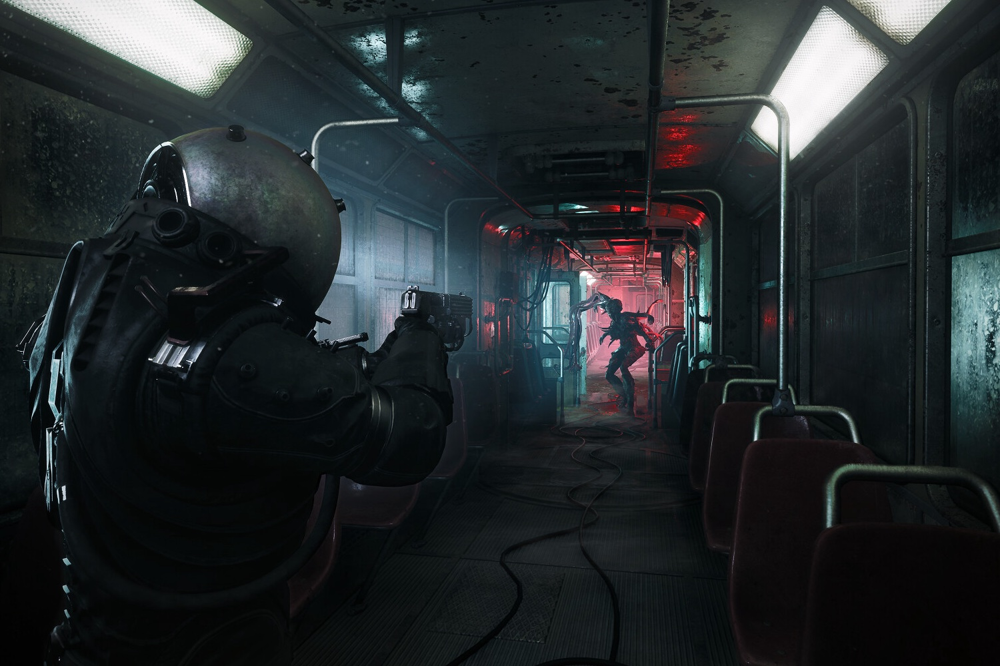

+++
title = "Les développeurs du remake de Silent Hill 2 veulent en terminer avec les « jeux pourris »"
date = 2024-10-21T08:00:32+01:00
draft = false
author = "Mickael"
tags = ["Actu"]
image = "https://nostick.fr/articles/vignettes/octobre/cronos.jpg"
+++

*Cronos: The New Dawn* a été une des sensations du [dernier  partner showcase de Xbox](https://nostick.fr/articles/2024/octobre/1710-partner-showcase-xbox-octore/). Le TPS de la Bloober Team a fait une grosse impression, avec son ambiance horrifique et des créatures particulièrement cheloues.

 

L'équipe polonaise espère que *Cronos* lui permettra de s'installer dans la première division des studios sur lesquels il faut compter. Bloober Team joue gros, mais son remake réussi de *Silent Hill 2* est le marchepied vers la rédemption. L'entreprise part de loin, ses précédents jeux (*Layers of Fear*, *Blair Witch*…) l'ayant catalogué dans la catégorie des poids légers.

« *Nous voulons trouver notre créneau, et nous pensons l'avoir trouvé, donc maintenant il ne reste plus qu'à évoluer avec* », explique Jacek Zieba, co-directeur du studio, auprès de *[GameSpot](https://www.gamespot.com/articles/bloober-team-says-its-done-with-shitty-games-and-silent-hill-2-remake-wasnt-a-fluke/1100-6527269/)*. « *Et la manière dont cela se produit est plus complexe, mais ça arrive aussi de façon organique, un peu comme avec Layers of Fear [en 2016], où les gens dans le studio se disaient : "D’accord, on a fait des jeux pourris avant, mais on peut évoluer".* ».

Il faut maintenant espérer que *Cronos* tiendra ses promesses. Au vu des premières images, il y a de quoi espérer que l'ère des « jeux pourris » est du passé.