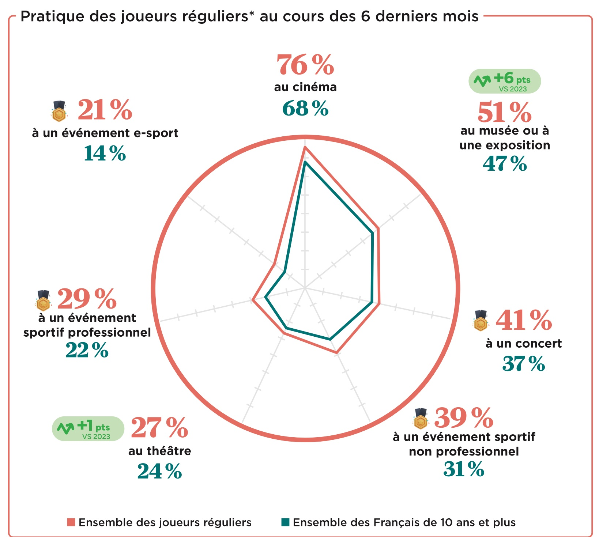

+++
title = "Les joueurs français se bougent plus volontiers que l'ensemble de la population"
date = 2024-10-21T08:01:32+01:00
draft = false
author = "Mickael"
tags = ["Actu"]
image = "https://nostick.fr/articles/vignettes/octobre/jeu-video.jpg"
+++

")

Le cliché des joueurs soudés à leur chaise dans la cave de leur maman a vécu, pour peu qu'il ait jamais existé (OK, chez certains c'est toujours le cas). Le baromètre 2024 du SELL, le syndicat des éditeurs de logiciels de loisirs (SELL), est absolument bourré de chiffres et de statistiques sur les relations entre les Français et le jeu vidéo — ils sont 38,3 millions, dont 75 % jouent au moins une fois par semaine. 

Une info sort toutefois du lot : les joueurs sont plus nombreux à aller au cinéma (76 %) que l'ensemble des Français (68 %). Ils sont 51 % à aller dans les musées ou les expositions, contre 47 % pour le reste des Français. 39 % sont allés à un événement sportif (non professionnel), soit 8 points de plus ; 29 % à un événement sportif professionnel (+7 points). 27 % vont au théâtre (+3 points).

Encore mieux : 76 % des joueurs font du sport au moins une fois par mois, contre 70 % pour l'ensemble des Français. Et 71 % s'adonnent à la lecture, contre 66 % pour tous les Français. Casaniers, les joueurs ? Recroquevillés sur leur loisir ? Cette étude démontre que non !

Le baromètre est plein d'enseignements qu'il est bien difficile de résumer ici, mais en vrac, sachez par exemple qu'à l'heure où les consoles glissent les lecteurs physiques sous le tapis, 67 % des joueurs préfèrent les formats physiques, contre 33 % pour le démat'. Les trois raisons principales : pour le plaisir de l'objet (48 %), pour pouvoir le revendre ensuite (43 %) et pour pouvoir l'échanger ou le prêter (40 %).

Parmi l'ensemble des joueurs, le temps hebdomadaire consacré aux jeux vidéo est de 5h52, avec un âge moyen de 39 ans. Le support de jeu le plus utilisé est le smartphone (56 %), suivi par la console de jeux (45 %) et le PC (38 %). Des supports qui ne sont pas exclusifs : 13 % des joueurs se servent de ces trois plateformes, 28 % d'une console et d'un smartphone, ou encore 19 % d'une console et d'un ordinateur.

Le rapport au complet est à télécharger (PDF) à cette [adresse](https://www.sell.fr/sites/default/files/essentiel-jeu-video/ejv_octobre_2024.pdf).