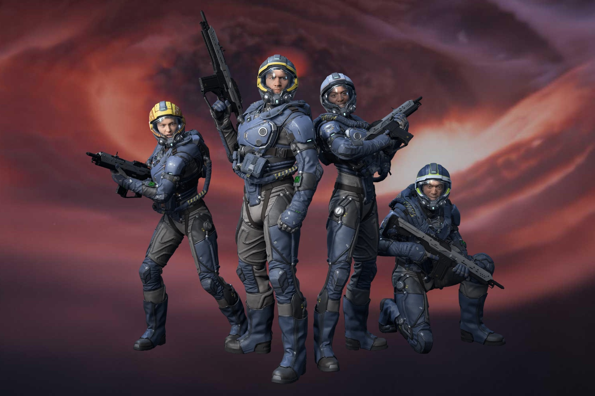

+++
title = "Squadron 42 sortira 14 ans après son annonce (si tout va bien)"
date = 2024-10-21T09:37:32+01:00
draft = false
author = "Mickael"
tags = ["Actu"]
image = "https://nostick.fr/articles/vignettes/octobre/squadron-42.jpg"
+++

*Squadron 42* sortira en 2026. Cette phrase n'a l'air de rien dite comme ça, mais pour des milliers de joueurs elle relève toujours de la science-fiction. La campagne solo du jeu massivement multijoueur *Star Citizen* avait en effet été annoncée en 2012 pour une sortie deux ans plus tard. Au bout du compte, les joueurs devront attendre 14 ans en tout pour voir débouler ce qui avait été présenté à l'époque comme une « courte campagne solo » !

 

L'annonce que tout le monde attendait a été faite par Chris Roberts, le patron de Cloud Imperium Games (CIG), à l'occasion de la CitizenCon qui s'est déroulée à Manchester. Durant l'événement relaté par *[IGN](https://www.ign.com/articles/star-citizen-dev-confident-of-releasing-standalone-single-player-story-game-squadron-42-in-2026)*, il a affirmé que *[Squadron 42](https://robertsspaceindustries.com/en/squadron42)*  proposera de 30 à 40 heures de jeu en solo, en compagnie de grands noms de Hollywood numérisés pour l'occasion : Mark Hamill, Gillian Anderson, Henry Cavill, Gary Oldman et d'autres vedettes passeront une tête dans les cinématiques !

Histoire de montrer que *Squadron 42* n'était pas le vaporware qu'il a fini par devenir, Chris Roberts (à l'origine de la saga *Wing Commander*) a montré sur scène une vidéo correspondant à la première heure du jeu. Un prologue bourré de bugs et qui a crashé à plusieurs reprises… mais il existe.

« *Il se passe beaucoup plus de choses dans Squadron 42 après ça, mais cela explique d'où vous venez et à partir de là, vous devenez pilote et commencez à servir sur un petit vaisseau, le Stanton* », a détaillé Chris Roberts. « *Mais il y a bien plus dans le jeu que ce que nous venons de montrer. Il est également beaucoup plus stable pour moi ces dernières semaines lorsque j'y ai joué* ».

« *Nous avons bon espoir de pouvoir amener la qualité du jeu au niveau que nous venons de montrer, voire plus, sans plantages* », a-t-il affirmé. « *L'équipe et moi sommes convaincus que nous pourrons vous livrer ce jeu en 2026* ». Chiche ! En tout cas, au vu de la vidéo du prologue ci-dessus (sans crash…), *Squadron 42* a de quoi faire mentir tous ceux qui ont dit du mal du jeu… si jamais il sort vraiment.

Cette campagne solo n'est pas la seule controverse qui entoure *Star Citizen*. Le jeu, toujours en alpha, a une sacré ambition avec son monde persistant massivement multijoueur et son modèle économique inédit. Pour éviter de dépendre d'un éditeur et avoir les mains libres, Chris Roberts se repose entièrement sur le financement participatif pour continuer à développer le jeu. Et ça marche : on en est à quasiment [730 millions de dollars](https://robertsspaceindustries.com/funding-goals) (!) collectés auprès des joueurs depuis 2012. 

Dans les faits, ces derniers achètent le jeu 49 euros, puis ils peuvent s'offrir des vaisseaux de toute taille, dont les prix varient de quelques dizaines à plusieurs centaines d'euros. Il y a aussi des packs en tout genre. CIG assure que ces achats intégrés ne sont pas nécessaires pour jouer et qu'il faut plus les voir comme des « dons » pour financer le développement du jeu.