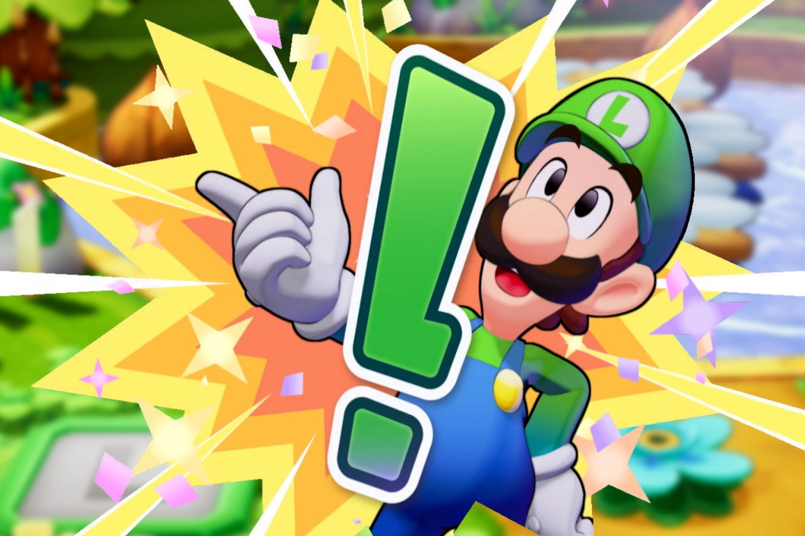

+++
title = "On sait enfin qui a développé Mario & Luigi : l'Épopée fraternelle"
date = 2024-10-22T08:47:32+01:00
draft = false
author = "Mickael"
tags = ["Actu"]
image = "https://nostick.fr/articles/vignettes/octobre/mario-luigi-epopee-fraternelle.jpg"
+++

Mais qui a développé *Mario & Luigi : l'Épopée fraternelle* ?! Pour une raison qui nous échappe toujours, Nintendo ne révèle plus les studios tiers qui créent ses jeux *first party*. Il a fallu attendre la sortie du remake de *Super Mario RPG* pour apprendre que le studio ArtePiazza avait bûché dessus. Et malgré l'évidence, Nintendo a attendu la dernière minute pour annoncer que *[Zelda: Echoes of Wisdom](https://nostick.fr/articles/2024/octobre/1510-test-legend-of-zelda-echoes-of-wisdom-jeu-trop-sage/)* avait, évidemment, été développé par Grezzo (le remake de *Link's Awakening*).

 

Et on pourrait multiplier les exemples ; Kevin Afghani, la nouvelle « voix » de Mario, n'a été connu qu'une semaine avant *Super Mario Bros. Wonder*. Bref, encore une étrange lubie de Nintendo qui frappe la future aventure de *Mario & Luigi*. Le jeu, qui sort le 7 novembre, n'avait jusqu'à aujourd'hui aucun studio attaché. Il a fallu fouiller dans les informations liées à la propriété intellectuelle pour découvrir le pot aux roses : c'est donc [Acquire](https://en.wikipedia.org/wiki/Acquire_(company)) qui est derrière le jeu. On [apprend](https://x.com/Nintendeal/status/1848186451261002223) aussi au passage que le titre a été développé avec le moteur Unreal.



Le studio japonais Acquire a été fondé en 1994, et il a changé plusieurs fois de propriétaire dans sa longue histoire ; l'entreprise fait actuellement partie du groupe Kadokawa Corporation, qui possède aussi un certain FromSoftware (*Elden Ring*). On lui doit récemment le co-développement d'*Octopath Traveler* et de sa suite, avec Square Enix.

Nintendo agrandit ici sa collection de studios tiers travaillant pour son compte, avec Game Freak (*Pokémon*), Camelot (les jeux sportifs Nintendo), Next Level (*Luigi's Mansion*), DeNA (jeux mobiles), Good-Feel (*Princess Peach: Showtime!*)…