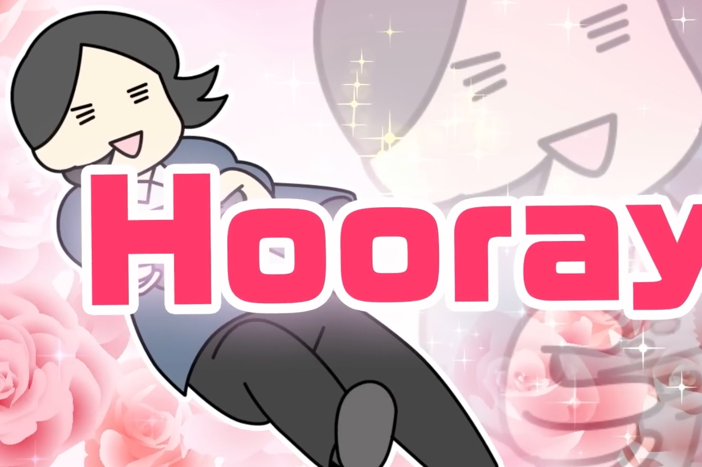
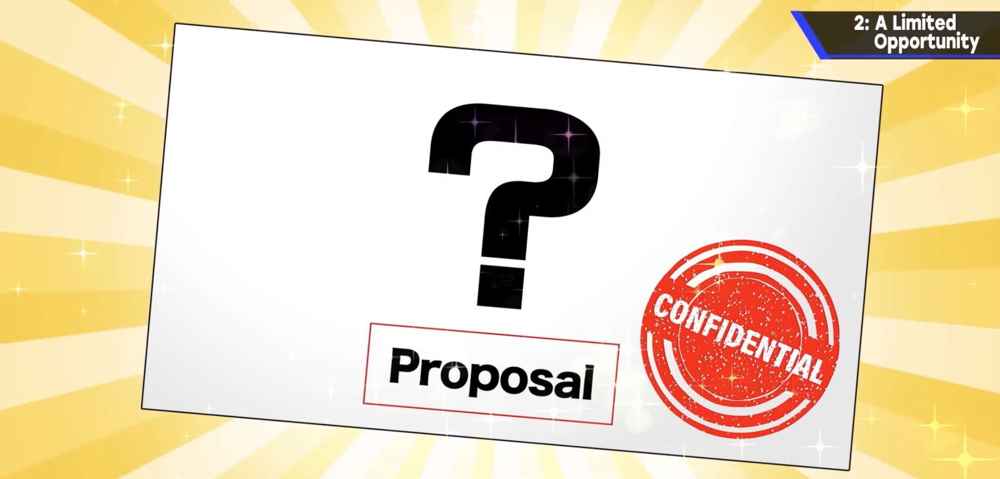
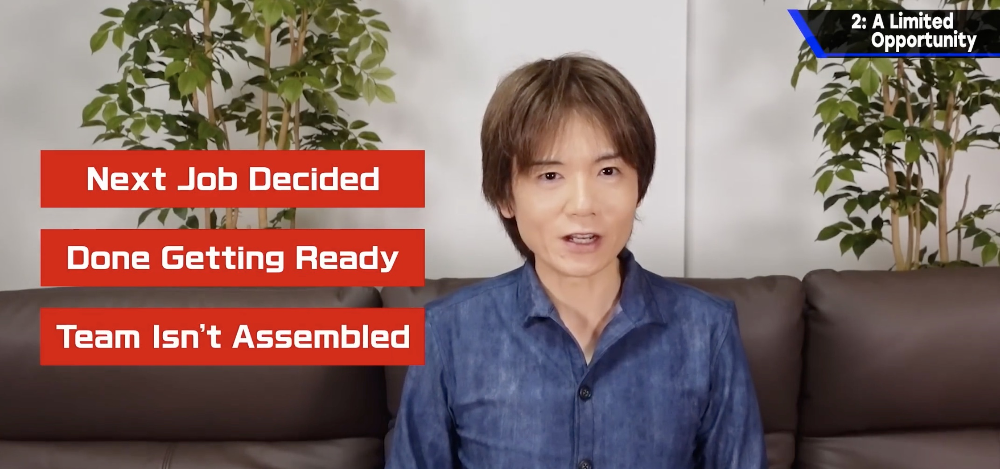
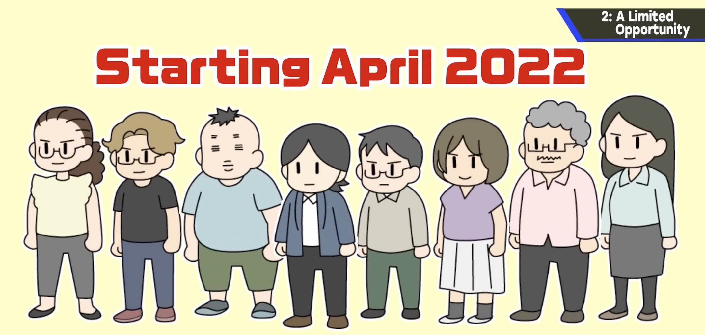

+++
title = "Masahiro Sakurai, le créateur de Super Smash Bros., travaille sur un nouveau jeu"
date = 2024-10-22T12:47:32+01:00
draft = false
author = "Mickael"
tags = ["Actu"]
image = "https://nostick.fr/articles/vignettes/octobre/sakurai-nouveau-jeu.jpg"
+++

Masahiro Sakurai travaille sur un nouveau jeu… depuis avril 2022. Le créateur de *Super Smash Bros.*, s'était éloigné de sa créature en octobre 2021, après l'arrivée de [Sora](https://www.youtube.com/watch?v=82Q2XTJ8jWk) dans le jeu de bagarre. Il a ensuite décidé de produire des vidéos YouTube sur une chaine dédiée, « [Masahiro Sakurai on Creating Games](https://www.youtube.com/c/sora_sakurai_en) ». Il y partage son précieux savoir et son immense expérience auprès de millions de développeurs, mais aussi d'amateurs.

 

Ça ne veut pas dire qu'il ait lâché le développement du jeu vidéo. Dans son ultime vidéo, il [révèle](https://www.threads.net/@wario64/post/DBbWjJxR5un) avoir rédigé une proposition de nouveau jeu « *à toute vitesse* » en juillet 2021 et qu'elle a obtenu le feu vert. Mais il a fallu rassembler l'équipe de développeurs, ce qui a demandé un peu de temps. La production à proprement parler a débuté en avril 2022.

Quant aux vidéos YouTube, elles ont été enregistrées il y a deux ans et demi (!), alors que Sakurai était dans l'attente de la mise en route de son nouveau jeu. La production des vidéos ne s'est cependant pas arrêtée à l'enregistrement, il a fallu les monter et les traduire, ce qui a été le travail respectif des studios Hike et [8-4](https://en.wikipedia.org/wiki/8-4).

Celui à qui l'ont doit aussi *Kirby* et *Kid Icarus* a payé tout ça de sa poche, l'équivalent de 600 000 $, sans qu'il ait rien touché en retour. Pour Sakurai, il s'agit d'un investissement pour le futur de l'industrie du jeu vidéo. Quant au jeu en lui-même, évidemment on ignore tout si ce n'est qu'il devrait être annoncé « *tôt ou tard* ». Autant dire qu'on a très hâte.