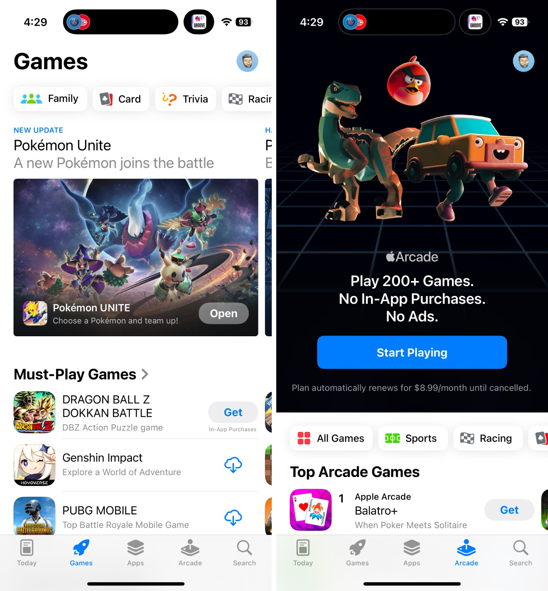

+++
title = "Apple plancherait sur une boutique de jeux en parallèle de l'App Store"
date = 2024-10-22T17:47:32+01:00
draft = false
author = "Mickael"
tags = ["Actu"]
image = "https://nostick.fr/articles/vignettes/octobre/app-store-jeux-2.jpg"
+++

Les jeux sont la vache à lait de l'App Store. Apple palpe un max sur les cosmétiques et les machins sans intérêt que les joueurs achètent dans leurs jeux sur iPhone ou iPad. C'est pourquoi il n'est pas si étonnant d'apprendre que le constructeur travaille au développement d'une nouvelle boutique dédiée entièrement aux jeux.

*[9to5Mac](https://9to5mac.com/2024/10/22/apple-new-app-store-like-app-games/)*, qui rapporte la nouvelle sur la base de sources fiables, explique que ce cousin de l'App Store aurait dans ses rayons non seulement les jeux mobiles habituels, mais aussi les titres du catalogue Apple Arcade. Il intégrerait également le profil Game Center du joueur, vous savez ce bidule qui conserve au chaud la progression et les classements.

L'application compterait plusieurs onglets, dont « Play Now » qui serait l'équivalent de l'onglet « Aujourd'hui » de l'App Store classique. On y retrouverait des suggestions de jeux, des « articles » plus ou moins promotionnels rédigés par Apple pour vanter tel ou tel titre, mais aussi des classements, des défis et la liste des succès.

Apple plancherait aussi sur une intégration de FaceTime et d'iMessage directement dans cette boutique. Les joueurs pourraient s'entraider de la sorte. Dans l'idée, ce serait assez proche de ce que Microsoft est en train de faire [en fusionnant ses deux apps mobiles Xbox](https://nostick.fr/articles/2024/septembre/2509-xbox-apps-mobiles-fusion/).

Et si cette boutique pouvait alléger l'App Store, ça ne serait pas un mal : le magasin d'applications actuel est un monstre boursouflé bourré de réclames qui ploie sous son propre poids. En revanche, on ignore si Apple a l'intention de lancer cette nouveauté avec une prochaine mise à jour d'iOS 18, ou si le constructeur attendra iOS 19.