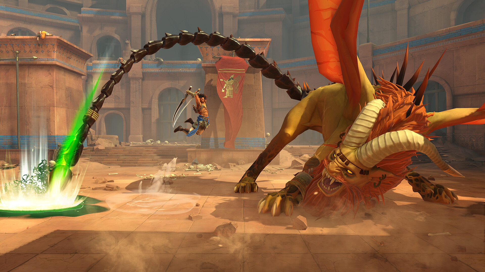

+++
title = "Ubisoft a démantelé l’équipe derrière ‌Prince of Persia : The Lost Crown"
date = 2024-10-22T18:00:00+01:00
draft = false
author = "Félix"
tags = ["Actu"]
image = "https://nostick.fr/articles/2024/octobre/2210-ubisoft-demantele-equipe-pop-lost-crown/popo.jpg"
+++

 

Ce n’est toujours pas la joie chez Ubisoft : l’équipe en charge du sympathique *‌[Prince of Persia : The Lost Crown](https://store.steampowered.com/app/2751000/Prince_of_Persia_The_Lost_Crown/)* a été dissoute. Ce jeu sorti en début d’année et développé par Ubi Montpellier a pourtant été plutôt accueilli par la critique, adaptant la licence au format metroidvania 2D pour un résultat réussi.

L’info a été relayée par Gautoz dans [sa mardinale](https://www.youtube.com/watch?v=8HgkIyq0emY&t=1411s) pour Origami. Selon lui, les ventes auraient été en dessous des attentes d’Ubisoft, habitué aux démarrages en fanfare des blockbusters. La décision de dissoudre l’équipe aurait donc été prise au printemps, malgré la désapprobation de ses membres ayant bataillé pour demander du contenu supplémentaire ou une éventuelle suite. Celle-ci a été refusée par les patrons sous prétexte qu’elle aurait pu « *cannibaliser les ventes du premier* » (ne rigolez pas). 

*‌Prince of Persia : The Lost Crown* n’aura finalement eu qu’un [unique DLC](https://store.steampowered.com/dlc/2751000/Prince_of_Persia_The_Lost_Crown/) et une poignée de patchs. La centaine de personnes ayant bossé dessus ont depuis été réallouées dans d’autres divisions chez Ubisoft. Dommage, une telle équipe aurait sans doute pu accoucher d’autres projets cool plutôt que d’aller en renfort sur *Assassin’s Creed n°9239* ou de retourner sur l’enfer *Beyond Good & Evil 2*, qui n’a toujours pas été annulé.