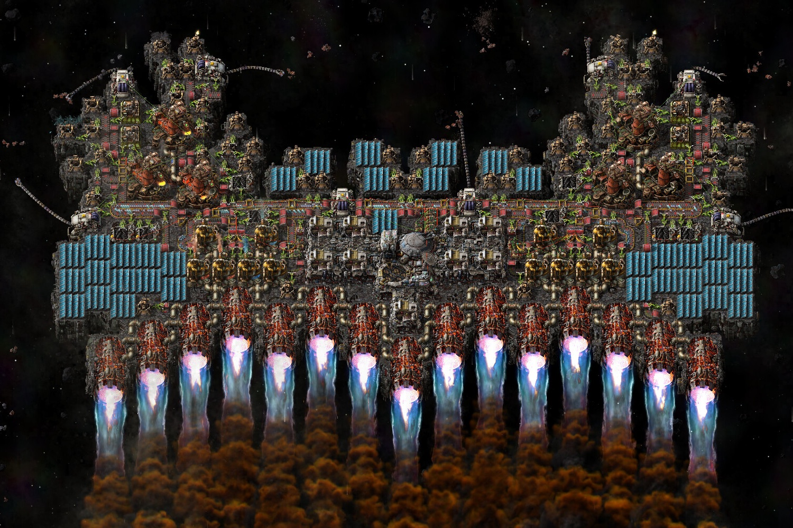

+++
title = "Factorio bat des records avec son DLC « Space Age »"
date = 2024-10-23T08:07:32+01:00
draft = false
author = "Mickael"
tags = ["Actu"]
image = "https://nostick.fr/articles/vignettes/octobre/factorio.jpg"
+++

Que se passe-t-il dans *[Factorio](https://factorio.com)*, après l'envoi dans l'espace de ses premières fusées ? Le jeu de simulation, de gestion et de construction d'usines développé par Wube Software y a finalement répondu avec l'extension « Space Age » sortie le 21 octobre !

 

Le DLC permet de partir à la découverte de nouveaux mondes, d'exploiter des ressources extra-terrestres, d'inventer de nouvelles technologies et de conquérir la galaxie. Tout un programme qui ravit les fans : le jeu a atteint un pic à [91 801 joueurs](https://steamdb.info/app/427520/charts/#1w) sur Steam, à la sortie de l'extension. La moyenne tournait ces dernières semaines à environ 20 000…

Il faut dire que le studio n'a pas fait les choses à moitié, il y a beaucoup à faire dans le DLC qui double tout simplement la taille du jeu original. À sa sortie en 2020, *Factorio* avait décroché le seuil des 34 700 joueurs en simultané, ce qui était déjà un excellent score pour un jeu de gestion. Une catégorie qui a d'ailleurs le vent en poupe : *Satisfactory*, sorti en septembre, a absolument explosé les compteurs avec un pic à [186 000 joueurs](https://steamdb.info/app/526870/charts/#max) !

Est-on entré dans « l'âge d'or » des jeux de construction d'usines, comme veulent le croire certains fans du genre ? Peut-être pas encore tout à fait, comme le relève *[PCGamer](https://www.pcgamer.com/games/strategy/factorios-player-count-is-through-the-roof-after-the-space-age-expansion-ripping-thousands-of-engineers-away-from-their-day-jobs/)*. Le nombre de joueurs de *Satisfactory* a plongé de 20 000 à la sortie du DLC de *Factorio* : les deux jeux se partagent donc un grand nombre de joueurs (ce qui est normal)