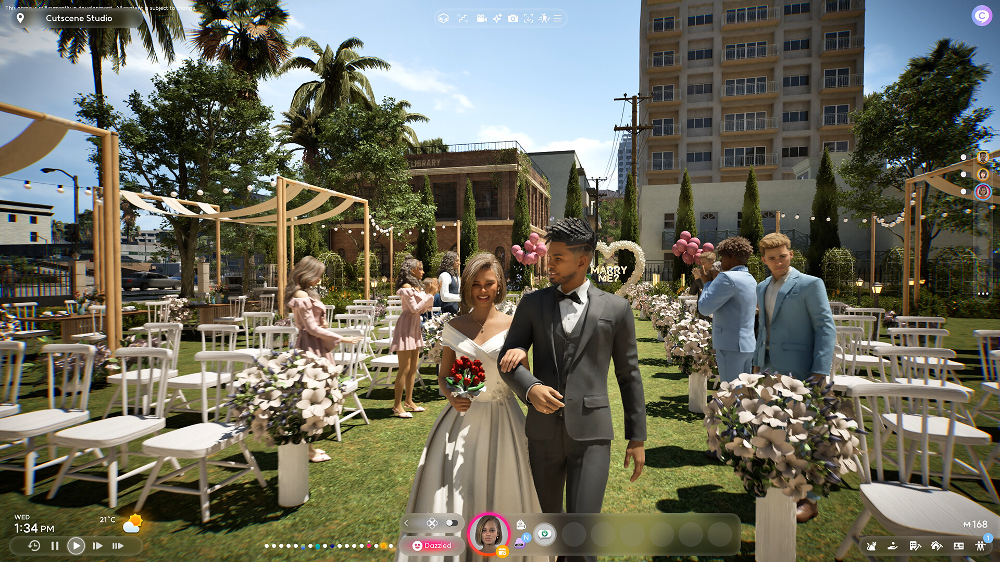

+++
title = "inZOI ouvrira bien son accès anticipé cette année"
date = 2024-10-23T08:44:32+01:00
draft = false
author = "Mickael"
tags = ["Actu"]
type = "telex"
+++

Les fatigués des *Sims* et les déçus de l'abandon de *Life by You* attendent *inZOI* avec grande impatience. Le genre des simulations de vie est très populaire — *les Sims 4* le démontrent chaque jour depuis dix ans ! — mais les éditeurs ne se bousculent pas au portillon pour concurrencer le mastodonte d'EA. On attend donc Krafton au tournant, et *inZOI* a pour lui un sacré atout : le réalisme de ses graphismes, à commencer par les personnages.

Histoire de faire monter la sauce, l'éditeur coréen avait même proposé cet été une démo du système de création des Zoi. Mais maintenant que les joueurs ont goûté au truc, ils en veulent plus. Un accès anticipé avait été promis pour 2024 et comme chacun peut le voir, on s'approche dangereusement de la fin de l'année.

Krafton a voulu rassurer son monde. Durant une présentation du jeu cette semaine, un porte-parole a assuré à *[PCGamer](https://www.pcgamer.com/games/life-sim/life-sim-inzoi-is-still-set-to-release-in-early-access-this-year-krafton-confirms/)* que l'accès anticipé aurait bien lieu avant la fin décembre. Il ne s'agira pas du jeu au complet : Hyungjun Kim, le directeur d'inZOI, a expliqué qu'il lui faudrait encore 10 ans pour réaliser sa vision du jeu ! « *Je pense que beaucoup d'améliorations peuvent être faites. Par exemple, nous avons besoin de plus de villes (…) afin d'aider les gens à expérimenter d'autres cultures et d'autres pays* », a-t-il affirmé. Tout un programme qui va mettre un certain temps à se mettre en route.