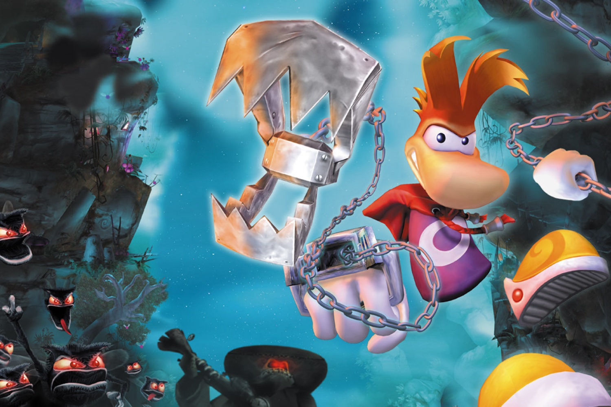

+++
title = "Un remake de Rayman dans les tuyaux, Michel Ancel serait de la partie"
date = 2024-10-23T12:47:32+01:00
draft = false
author = "Mickael"
tags = ["Actu"]
image = "https://nostick.fr/articles/vignettes/octobre/rayman.jpg"
+++

Rayman s'est fait discret ces dernières années. La mascotte d'Ubisoft a passé une tête (sans cou) dans le dernier *Mario + The Lapins Crétins* sur Switch. L'éditeur aurait en tête un « vrai » retour du héros bondissant sous la forme d'un remake portant le nom de code « projet Steambot », selon *[Insider-Gaming](https://insider-gaming.com/rayman-remake-team-prince-of-persia/)*.

Le projet en question serait supervisé principalement par Ubisoft Milan, qui s'y connait en la matière : on lui doit en effet *Rayman* pour Game Boy Color (ok, ça ne nous rajeunit pas). Il développe aussi la saga *Just Dance* et donne un coup de main aux autres studios du groupe. Son haut fait d'armes, c'est justement les deux *Mario + The Lapins Crétins* avec l'aide d'Ubisoft Paris.

Bref, il y a une certaine logique à voir la filiale milanaise à la tête de ce remake. Pour gonfler les équipes, Ubisoft aurait placé une dizaine de développeurs qui étaient chargés de *Prince of Persia: The Lost Crown* avant que [l'entreprise démantèle le groupe](https://nostick.fr/articles/2024/octobre/2210-ubisoft-demantele-equipe-pop-lost-crown/) à cause de ventes décevantes.

Le hic, c'est que Michel Ancel, créateur de *Rayman*, serait aussi impliqué dans ce remake en tant que consultant. Le même Ancel qui a été accusé de management toxique il y a quatre ans, et qui a cessé toute activité dans le jeu vidéo depuis. En interne, cette présence même lointaine jetterait une ombre sur le projet.