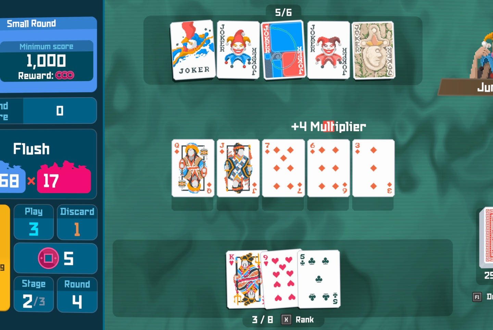

+++
title = "Balatro fait le plein de nouvelles skins et se joue dans Dave the Diver"
date = 2024-10-24T18:47:32+01:00
draft = false
author = "Mickael"
tags = ["Actu"]
type = "telex"
+++

*Balatro* continue d'être le meilleur jeu de l'année avec un gros tas de nouveautés gratuites ! Des skins supplémentaires sont maintenant disponibles sur PC, consoles et mobile, inspirées de *Cyberpunk 2077*, *The Binding of Isaac*, *Slay The Spire*, and *Stardew Valley*. C'est la deuxième fournée de l'année pour ces « Friends of Jimbo », après les cartes *The Witcher III*, *Among Us*, *Vampire Survivors* et *Dave the Diver*.

 

Mais attendez, ce n'est pas tout ! Juste retour des choses, *Dave the Diver* accueille sa propre version de *Balatro*, baptisée *Jimbo's Game*. Les plus balaises recevront un charme spécial qui renforce les capacités des armes. Retrouvera-t-on *Balatro* dans d'autres jeux ? Après tout pourquoi pas, c'est plutôt sympa de voir des développeurs se prêter main forte !