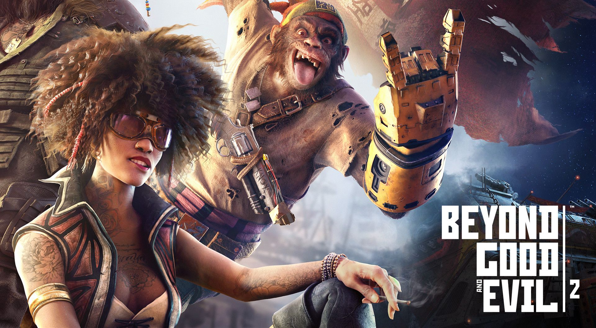

+++
title = "Beyond Good & Evil 2 a un nouveau directeur créatif"
date = 2024-10-24T18:30:00+01:00
draft = false
author = "Félix"
tags = ["Actu"]
image = "https://nostick.fr/articles/2024/octobre/2410-bge2-nouveau-directeur-creatif/bge2.jpeg"
+++

 

[Remake](https://nostick.fr/articles/2024/octobre/2310-rayman-retour-ubisoft-michel-ancel/) de *Rayman*, [démantèlement](https://nostick.fr/articles/2024/octobre/2210-ubisoft-demantele-equipe-pop-lost-crown/) de l’équipe derrière *Prince of Persia : The Lost Crown**, [difficultés](https://nostick.fr/articles/2024/octobre/1610-xdefiant-melodrame-ubisoft/) de *XDefiant*… On va finir par ouvrir un tag spécial Ubisoft ! L’entreprise française fait de nouveau parler d’elle, cette fois-ci pour une plutôt bonne nouvelle : *Beyond Good & Evil 2* a un nouveau directeur créatif. Il s’agit de Fawzi Mesmar, passé chez Gameloft, King et Dice avant de rejoindre Ubi en 2021. Il a depuis chapeauté des jeux comme *Mario + The Lapins Crétins Sparks of Hope*, le récent *Star Wars Outlaws* mais aussi… [l’édition anniversaire](https://nostick.fr/articles/2024/juin/2006-une-edition-anniversaire-pour-beyond-good-evil-le-25-juin/) de *BGE* premier du nom.

La bonne nouvelle a été partagée [sur son compte LinkedIn](https://www.linkedin.com/feed/update/urn:li:activity:7254961343143772161/). « *Aujourd’hui, je suis heureux de vous annoncer que j’ai rejoint l’équipe de Beyond Good & Evil 2 en tant que directeur créatif. Cela fait des années que je travaille avec ces personnes sur ce jeu ambitieux et j'ai pu constater leur talent de mes propres yeux. Je m'appuie sur les épaules des géants de la création qui ont soutenu l'équipe avant moi, et j'ai hâte de continuer à créer un jeu vraiment unique pour le plus grand plaisir des joueurs* », écrit-il.

Annoncé [il y a plus de 15 ans](https://www.youtube.com/watch?v=-nh6qcfSEg4) et rebooté [il y a environ 8 ans](https://www.facebook.com/beyondgoodandevil/photos/a.168617863187768.35250.131546723561549/1068744866508392/?type=3&theater), *Beyond Good & Evil 2* est devenu malgré lui une référence du vaporware. Les choses ont légèrement bougé dernièrement, l’édition des 20 ans du premier jeu comportant une mission teasant cette suite. L’annonce d’aujourd’hui laisse à penser qu’une sortie approche (*très très doucement*, entendons-nous bien). On croise les doigts en espérant qu’il arrivera dans un meilleur état que *Skull & Bones*.