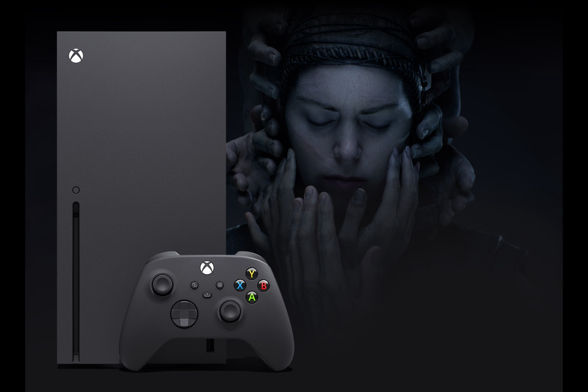

+++
title = "La Xbox Series X finalement devant la Series S"
date = 2024-10-24T08:47:32+01:00
draft = false
author = "Mickael"
tags = ["Actu"]
image = "https://nostick.fr/articles/vignettes/octobre/xbox-series-X.jpg"
+++

La Xbox Series X dépasse finalement sa petite sœur, la Series S, aux États-Unis du moins. Sur le seul mois de septembre, la Series X représentait 58 % des ventes de Xbox, selon les données de Circana. C'est un changement important, mais ce qui l'est encore plus c'est quand on prend en compte l'ensemble des unités vendues depuis le lancement de la gamme fin 2020 : la Series X pèse désormais plus de la moitié (51 %) des ventes de Xbox.

La Series X revient de loin. En 2022, plus de 78 % du parc de Xbox était constitué de Series S, contre 25 % seulement de Series X d'après des chiffres qui avaient fuité pendant un procès. Le ratio était plus équilibré l'année suivante, mais toujours à l'avantage de la Series S.

Le déséquilibre des premières années s'explique assez simplement. D'une part, Microsoft n'avait guère que des Series S à vendre entre 2020 et 2022, en raison des difficultés d'approvisionnement liées à la pandémie. Les stocks de Series X sont devenus à peu près normaux par la suite. Ensuite, comme l'indique Mat Piscatella de Circana auprès d'*[IGN](https://www.ign.com/articles/september-2024-sales-charts-xbox-series-x-is-finally-outselling-the-series-s)*, le marché s'est reporté vers des acheteurs un peu plus vieux qui ont davantage de moyens.

Cette bascule est cependant largement symbolique, surtout au vu des sommes en jeu. En septembre, les dépenses des consommateurs américains pour les consoles de jeu ont été les plus basses depuis 2019 (-44 % d'une année sur l'autre). Les ventes de Xbox ont plongé de 54 %, celles de PS5 de 45 %, et celles de la vaillante Switch de 23 %. Par ailleurs, en termes de volume et de valeur, la PS5 est devant à 40 %.