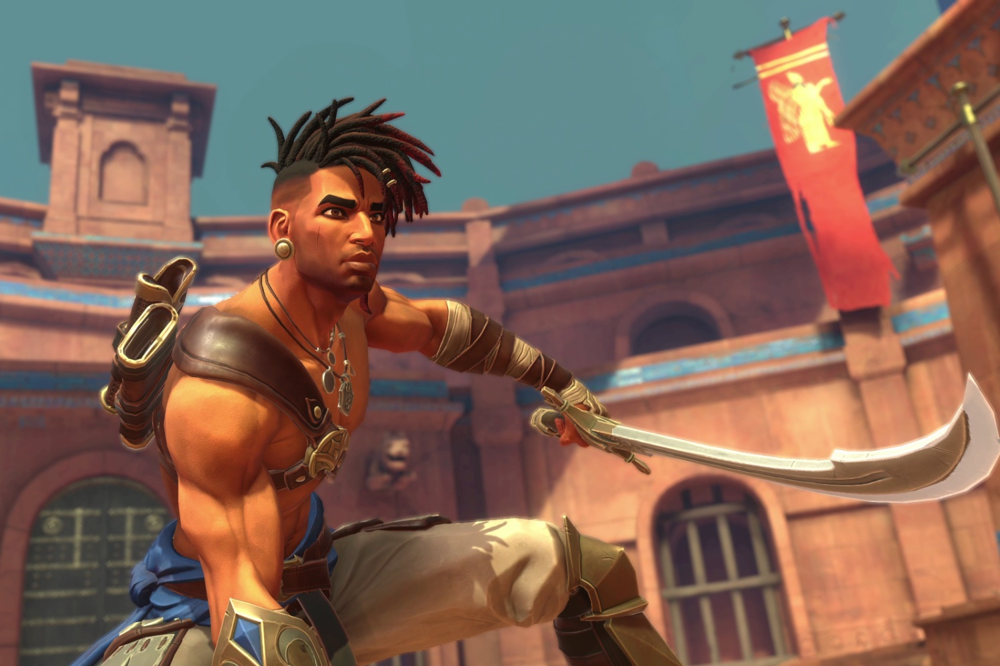

+++
title = "Pour Larian, le succès de Prince of Persia: The Lost Crown a été sabordé par Ubisoft"
date = 2024-10-25T10:47:32+01:00
draft = false
author = "Mickael"
tags = ["Actu"]
image = "https://nostick.fr/articles/2024/octobre/2510-larian-ubisoft-saborde-prince-of-persia/prince-of-persia-lost-crown.jpg"
+++

Les fans de *Prince of Persia* qui sont tombés amoureux de *The Lost Crown* n'ont plus guère que leurs yeux pour pleurer : ils n'auront jamais un deuxième épisode du Metroidvania d'Ubisoft. À cause de ventes jugées décevantes, [l'éditeur a en effet démantelé l'équipe basée à Montpellier](https://nostick.fr/articles/2024/octobre/2210-ubisoft-demantele-equipe-pop-lost-crown/), elle a été réaffectée à plusieurs projets dont [un remake de *Rayman*](https://nostick.fr/articles/2024/octobre/2310-rayman-retour-ubisoft-michel-ancel/)… et [le purgatoire de *Beyond Good & Evil 2*](https://nostick.fr/articles/2024/octobre/2410-bge2-nouveau-directeur-creatif/).

Mais ce n'est pas la faute des développeurs si *The Lost Crown* n'a pas connu le succès escompté. S'il y a quelqu'un à blâmer ici, c'est la direction YOLO d'Ubisoft et ses choix commerciaux n'ayant aucun sens, comme l'affirme Michael Douse, directeur de la publication de Larian (*Baldur's Gate 3*). Si ce nouvel épisode de *Prince of Persia* était sorti sur Steam, « *non seulement il aurait été un succès commercial, mais il y aurait probablement une suite, car l’équipe est très solide* », assène-t-il.

*The Lost Crown* est le meilleur jeu d'Ubisoft depuis longtemps, et il fera certainement partie de la liste des jeux de l'année chez de nombreux joueurs. Mais le prince avait des bottes de plomb : le lancement du titre s'est en effet limité à la boutique Ubisoft et l'Epic Games Store. La version Steam est arrivée fin août, largement après la hype. Être distribué sur la plateforme de Valve n'est pas une garantie de succès, mais ne pas y être c'est se coller un sac de caillasses sur le dos.

Ubisoft a d'ailleurs fini par le comprendre : ses prochains jeux sortiront « day one » sur Steam… Mais pour *The Lost Crown*, c'est trop tard. Michael Douse en rajoute une louche sur la stratégie plus générale de l'éditeur français. « *Le dernier jeu notable sur leur plateforme était sans doute Far Cry 6 en 2021. The Crew [Motorfest], [Assassin's Creed] Mirage et Avatar sont arrivés en 2023 mais n'ont pas performé* », décrypte-t-il.

« *On peut donc supposer que les abonnements [à Ubisoft+] étaient en baisse lors de la sortie de Prince of Persia en 2024. Ce qui signifie que les gens n’ouvraient pas beaucoup leur boutique.* » D'où le désintérêt injuste envers *Prince of Persia*. Et malheureusement, ce sont les équipes de dévs qui trinquent.

Michael Douse conclut son coup de gueule en rappelant la petite phrase, désormais fameuse, d'un cadre Ubisoft qui affirmait ue les joueurs devaient s'habituer à ne plus posséder leurs jeux. « *Si cette affirmation est vraie à cause d'une stratégie de lancement spécifique (autrement dit : les abonnements sont plus importants que les ventes), alors celle-ci l'est tout autant : "Les développeurs devraient s'habituer à ne pas garder leurs boulots s'ils font des jeux acclamés par la critique"* ». Privilégier la stratégie de la plateforme par rapport aux ventes effectives du jeu n'a aucun sens, même d'un point de vue commercial, finit-il.

Cette position est cohérente par rapport à la propre stratégie de Larian, qui ne [veut pas](https://www.ign.com/articles/baldurs-gate-3-isnt-going-to-be-on-game-pass-insists-larian-boss) du chèque de Microsoft pour intégrer *Baldur's Gate 3* dans le Game Pass. Un exemple à suivre pour Ubisoft ?