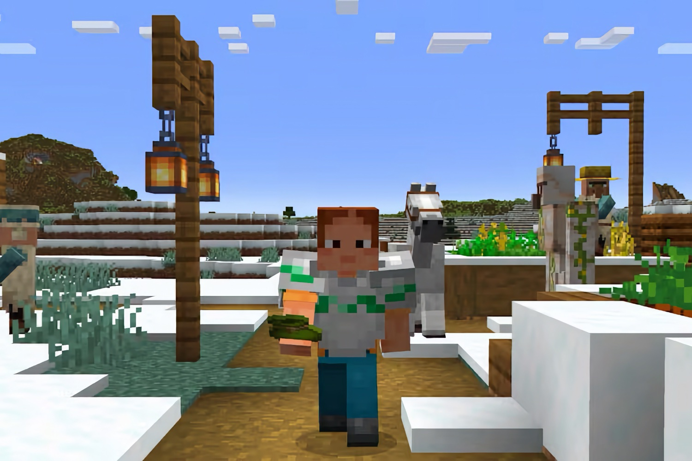

+++
title = "Minecraft VR se mange le mur de la réalité"
date = 2024-25-10T08:07:32+01:00
draft = false
author = "Mickael"
tags = ["Actu"]
image = "https://nostick.fr/articles/vignettes/octobre/minecraft-VR.jpg"
+++

La VR, ça eût payé… mais ça paye plus. Enfin attendez, non, la VR ça n'a jamais vraiment payé, en fait ! Et Mojang a fini par s'en rendre compte : le studio a finalement [annoncé](https://www.minecraft.net/en-us/article/minecraft-1-21-40-bedrock-changelog) que le support de sa version en réalité virtuelle allait mettre la clé sous la porte.

Dans les notes de version de Minecraft Bedrock 1.21.40, on peut ainsi lire que la capacité du studio à prendre en charge les casques VR et MR (réalité mixte) ne sera plus d'actualité après une ultime mise à jour prévue pour mars 2025. Passée cette date, les joueurs VR pourront continuer à jouer à *Minecraft*, mais sans porter de casque, en mode « flat » quoi.

On sentait le coup venir de toute manière, puisqu'en septembre dernier Mojang prévenait que la prise en charge du PSVR (vous savez, le casque VR de PlayStation) s'arrêtera en mars 2025, ce qui n'est probablement pas une coïncidence. L'édition Bedrock du jeu a été lancée en 2016, avec le support de l'Oculus Rift, puis l'année suivante sur les casques Windows VR (une telle chose a existé).

Néanmoins, comme le rappelle le site *[RoadtoVR](https://www.roadtovr.com/minecraft-openxr-pc-vr-psvr-support-dropped/)*, les utilisateurs de PCVR peuvent toujours se tourner vers l'alternative *Vivecraft*, un mod qui s'appuie sur les versions Java de *Minecraft* mais avec des limitations (il ne se connecte pas aux serveurs officiels). Les utilisateurs Quest ont de leur côté l'option *QuestCraft*.