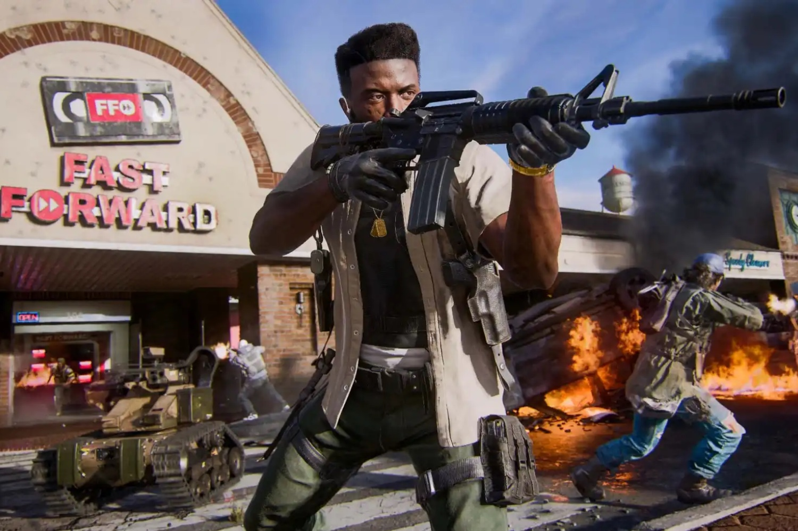
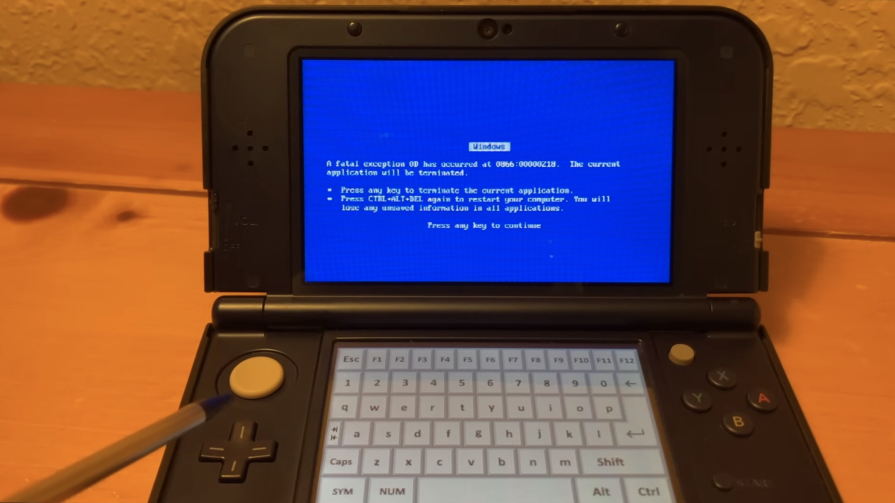
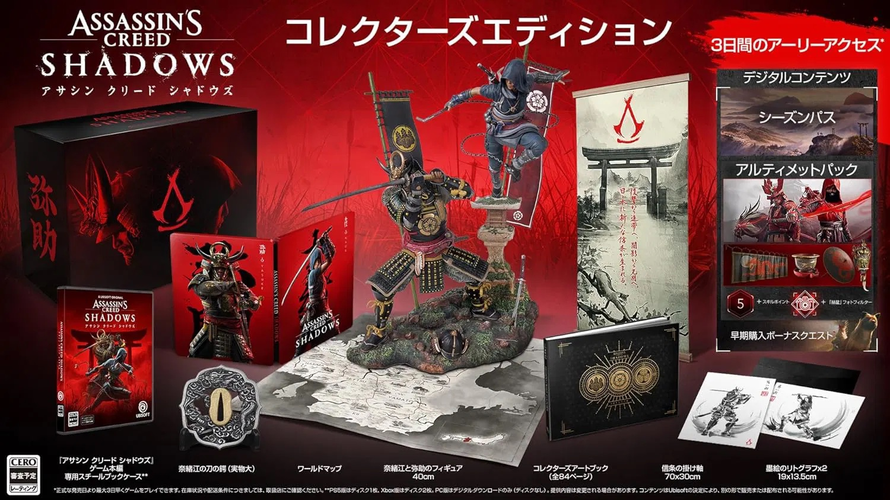

+++
title = "On vide le backlog de la semaine : les jeux physiques en carafe, la boite à baffes d'Ubisoft, une belle bidouille 3DS…"
date = 2024-10-26T07:20:01+01:00
draft = false
author = "Mickael"
tags = ["XXL"]
image = "https://nostick.fr/articles/2024/octobre/black-ops-6.jpg"
+++

 

L’actualité du jeu vidéo ne s’arrête pas à la poignée d’articles publiés sur *Nostick* ! Histoire de rattraper le retard accumulé, voici un retour rapide sur quelques unes des infos les plus importantes (ou insignifiantes) de la semaine.

## La vidéo de la semaine : et pourquoi pas Windows 95 dans une 3DS

C'est vrai ça, et pourquoi pas ? Et surtout… pourquoi ? En tout cas, c'est possible comme le montre le bidouilleur MetraByte : il est passé par DOSBox dispo sur la petite console de Nintendo, pour y installer Windows 95. Alors on peut le faire, mais est-ce réellement souhaitable ?

 

Passé l'assistant de configuration de l'OS, on ne peut quasiment rien faire avec Windows 95 sur la 3DS. La console a même du mal à afficher le bureau de l'OS, mais en même temps elle n'a pas été conçue pour ça. Lancer MS Paint demande une patience d'ange, et la réactivité de l'interface est évidemment aux fraises.

MetraByte pousse le vice jusqu'à installer le logiciel de musique Ableton pour tenter d'en faire quelque chose sur l'appareil. Une vision difficile à soutenir.

 

## La grosse info de la semaine : le physique sur une voie de garage, le démat' en force

On peut le déplorer, on peut pleurer de rage, on peut maudire les dieux, on peut aussi rouler par terre en frappant le sol de ses petits poings vengeurs mais rien n'y fait : les bonnes vieilles galettes, c'est de plus en plus du passé. Dans leur très grande majorité, les joueurs achètent leurs jeux en version dématérialisée !

") 

Aux États-Unis, entre janvier et le mois d'août, Mat Piscatella  de Circana a [calculé](https://bsky.app/profile/matpiscatella.bsky.social/post/3l6slorqedc2f) que 53 % des jeux Switch avaient été achetés sur l'eShop (c'est 1 point de plus que l'année précédente sur la même période). La différence est encore plus marquée sur la PS5, où 78 % des jeux achetés l'ont été en ligne (+3 points), et sur les Xbox Series S/X où les jeux physiques ont quasiment disparu — 91 % d'entre eux sont dématérialisés.

En Europe, la situation est similaire, avec des variations. Depuis le début de l'année, les jeux vendus en ligne représentent 68 % du volume total pour la PS5, 81 % pour la Xbox Series S/X et 35 % pour la Switch, selon les chiffres de GSD [relayés](https://x.com/Chris_Dring/status/1848351926041100641) par Christopher Dring. 

Avant de tirer des conclusions, il faut garder en tête les différences entre les deux instituts : côté européen, GSD prend en compte les ventes de jeux AA et AAA y compris ceux qui ne sont vendus qu'en démat'. Néanmoins, les données proviennent des grands éditeurs, comme Microsoft, Sony, EA ou encore Sega. Les ventes des petits éditeurs ne sont pas intégrées, même s'ils peuvent peser très lourd. *Black Myth Wukong*, *Palworld* ou encore *Baldur's Gate 3* sont ainsi exclus du lot malgré les cartons atomiques de ces jeux.

Côté américain, Mat Piscatella explique que ses stats ne représentent pas la « vraie » demande : les revendeurs gèrent les stocks au plus près des commandes, les achats en volume sont donc beaucoup moins importants. Et les éditeurs poussent énormément pour vendre du démat' (coucou le Game Pass)… tout comme les constructeurs de consoles (coucou le Game Pass, bis) !

Si Sony a fait beaucoup parler avec la PS5 Slim et son lecteur de disque optionnel, puis avec la PS5 Pro vendue à prix d'or mais toujours sans lecteur Blu-Ray, le mouvement a été initié par Microsoft avec la Series S, ce qui explique au passage pourquoi le ratio des ventes penche autant vers le numérique au détriment des supports physiques. [La Series S a longtemps été plus populaire que la Series X](https://nostick.fr/articles/2024/octobre/2410-xbox-series-x-finalement-devant-series-s/).

Et justement, la Series X a rejoint le troupeau, avec [la nouvelle version blanche](https://nostick.fr/articles/2024/aout/2108-nouvelles-xbox-preco/), sans lecteur externe à acheter à côté. Il va falloir se faire à l'idée que les futures Xbox et PlayStation soient tout aussi dépourvues de lecteur optique. Une bascule qui a été opérée il y a des années sur les PC.

Malgré les précautions prises par les deux analystes, le mouvement est très clair : les supports physiques sont sur une voie de garage, délaissés par les acheteurs, peut-être à leur corps défendant d'ailleurs. Certains voudraient sûrement acheter des galettes, mais en l'absence d'offre disponible, ils se tournent vers les boutiques en ligne. Ce mouvement de plaque tectonique va assécher le marché de l'occasion pour ces deux consoles. Et la problématique de la préservation du jeu vidéo, déjà inquiétante, ne va pas aller en s'arrangeant.

Reste la position de la Switch, où les jeux physiques sont toujours bon pied bon œil, en particulier en Europe. L'eShop est une horreur aussi bien en termes de fonctionnalités que de catalogue (on se croirait sur l'App Store d'Apple, c'est dire), on n'y va que vraiment contraint et obligé ! Et puis les capacités de stockage des consoles hybrides, de 32 à 64 Go, n'aident pas à emmagasiner les jeux dématérialisés même si le port SD se montre bien pratique.

La Switch 2 devrait conserver son port cartouche, ce qui leur permettra de subsister pendant de longues années. Mais Nintendo ne sera plus guère que le seul constructeur de toute l'industrie du jeu vidéo, consoles et PC compris, à prendre en charge des supports physiques.

## La promo de la semaine : l'édition collector d'Assassin's Creed Shadows baisse de prix

*Assassin's Creed Shadows* a décidément des airs de chemin de croix pour Ubisoft. Jeté aux ordures par la frange des joueurs les plus racistes (rendez-vous compte, un samuraï noir), l'éditeur a aussi [multiplié les bourdes bêtes](https://nostick.fr/articles/2024/juillet/2707-backlog-semaine-nintendo-marvel-vs-capcom-assassins-creed-shadow/#les-emmerdes-de-la-semaine-pour-ubisoft). La sortie en demi-teinte de *Star Wars Outlaws* a forcé à un [report du nouvel épisode d'*Assassin's Creed* au 14 février prochain](https://nostick.fr/articles/2024/septembre/2509-assassins-creed-shadow-14-fevrir-aussi-sur-steam/), histoire de serrer quelques boulons.

Ubisoft ne s'est pas contenté de repousser le blockbuster de plusieurs mois, ratant au passage les fêtes de fin d'année. L'éditeur a aussi impulsé de gros changements dans ses pratiques commerciales : Steam sera servi « day one », ce qui devrait permettre d'engranger quelques ventes supplémentaires ;  surtout, cette restructuration signe le glas du season pass et de l'accès anticipé, une technique indigne pour faire cracher les fans au bassinet.

Pour *Shadows*, l'early access de 3 jours est donc supprimé et tous ceux qui ont préco recevront à la place la première extension sans frais supplémentaires. Ubisoft a également [abaissé](https://www.reddit.com/r/assassinscreed/comments/1g8u4xo/information_about_the_collectors_edition_from/) le prix de l'édition Collector du jeu : vendu à l'origine 290 €, elle reviendra finalement à… 240 €. OK, ça reste chérot.

 

Exit l'accès anticipé et le season pass, ce qui est logique et justifie la baisse du tarif. Pour le reste, pas de changement, on aura bien sûr droit au jeu de base accompagné de cosmétiques supplémentaires, ainsi que d'une statuette des deux héros Naoe et Yasuke, d'un steelbook, deux lithographies, la carte du jeu, un art book, ainsi que le tsuba du katana de Naoe en taille réelle (le disque entre la lame et la poignée du sabre).

Si vous aimez (lire du mal de) Ubisoft, restez encore un peu avec nous car ça ne s'arrange pas.

## Ubisoft ouvre la boîte à baffes de la semaine

Soyons juste, Ubisoft n'a pas attendu cette semaine pour ouvrir la boîte à baffes, mais ces derniers jours ont bien rougi les joues de l'éditeur. D'abord parce que [Ubisoft a confirmé le démantèlement de l'équipe de Montpellier](https://nostick.fr/articles/2024/octobre/2210-ubisoft-demantele-equipe-pop-lost-crown/) qui a planché sur son seul bon jeu de l'année, *Prince of Persia: The Lost Crown*. Un crève-cœur alors que le titre a connu un gros succès critique, mais hélas pas public.

Mais la faute à qui ? [Comme l'a affirmé Michael Douse](https://nostick.fr/articles/2024/octobre/2510-larian-ubisoft-saborde-prince-of-persia/), directeur de publication chez Larian, *The Last Crown* a surtout été victime des pratiques commerciales pourries d'Ubisoft. Limiter la sortie du jeu à la boutique Ubisoft et à l'Epic Games Store, c'était l'envoyer au casse-pipe. La logique aurait voulu que Steam soit servi en même temps que tout le monde, mais fidèle à son ancienne stratégie, l'entreprise a boudé la boutique de Valve jusqu'à la fin août. Trop peu, trop tard…

Si les dirigeants d'Ubisoft ne souffriront pas de la fin prématurée de ce qui s'annonçait comme une nouvelle « branche » de Prince of Persia (un 2e épisode était espéré), pour les développeurs c'est la soupe à la grimace. [Une partie a été affectée à *Beyond Good & Evil 2*](https://nostick.fr/articles/2024/octobre/2410-bge2-nouveau-directeur-creatif/), en développement depuis 15 ans (!) et qu'on ne voit toujours pas venir. D'autres vont plancher avec les collègues d'Ubisoft Milan sur un remake de Rayman.

De prime abord, la nouvelle (confirmée là aussi par Ubisoft) est plutôt bonne : Rayman nous manque beaucoup, et le pedigree de ces deux équipes laisse entrevoir le meilleur. Mais l'entreprise n'a rien trouvé de mieux que de [sortir Michel Ancel de sa retraite](https://nostick.fr/articles/2024/octobre/2310-rayman-retour-ubisoft-michel-ancel/), alors que le créateur du personnage avait lâché le milieu du jeu vidéo en 2020 suite à des accusations de management toxique.

Le revoir en selle, même en tant que consultant « *pour s'assurer de la cohérence de l'univers* » dans le futur jeu, ne doit ravir personne en interne. Et pour ne rien arranger, le syndicat Solidaires a [révélé](https://x.com/solinfojeuvideo/status/1849337527800299698) le retour de Christine Burgess Quémard dans un rôle de directrice exécutive. Elle avait été condamnée pour délit d'initié en 2016, avec à la clé une amende de 200 000 €. Quatre ans plus tard, elle quittait Ubisoft pour raisons personnelles… avant de revenir par la petite porte.

On a presque peur de savoir de quoi sera faite la semaine prochaine pour Ubisoft.

## On n'a pas eu le temps cette semaine, mais on pense à eux

 

*Metal Slug* s'adapte à tout, y compris au genre stratégie isométrique au tour par tour ! Et ça lui va plutôt bien finalement. Teasé depuis des mois, Dotemu a annoncé la date de sortie de *Metal Slug Tactics*, ce sera pour le 5 novembre sur toutes les plateformes.

 

Mais où s'arrêtera *No Man's Sky* ? Impossible à dire, tellement le développeur Hello Games balance de mises à jour et autres « expéditions ». La dernière du genre, « The Cursed », la seizième du genre, permet aux joueurs de combattre dans une sorte de réalité parallèle bourré de créatures effrayantes. Et ça durera deux semaines.

 

*Clair Obscur: Expedition 33*, l'intriguant RPG de Sandfall Interactive à sortir l'année prochaine, se déroule dans un univers inspiré par la Belle Époque. Quoi de plus normal que de voir le studio mettre le paquet sur le casting vocal français, qui compte plusieurs grands noms du genre à retrouver dans la bande annonce ci-dessus. Mieux encore, on apprend qu'il sera possible de débloquer un costume très… typique bleu-blanc-rouge.

## osef

*Call of Duty: Black Ops 6* est sorti cette semaine.

## Dans le reste de l'actu déchaînée

- Les vieux de la vielle se rappelleront peut-être de *Squadron 42*, la campagne solo de *Star Citizen* annoncée… en 2012 ! Et bien le jeu sortira bientôt. Enfin, dans deux ans quoi. [Si tout va bien](https://nostick.fr/articles/2024/octobre/2110-squadron-42-sortira-14-ans-apres-annonce/).
- La Bloober Team qui vient de sortir le remake de *Silent Hill 2* et qui prépare *Cronos*, ne veut plus faire de « *jeux pourris* ». [On vous dit pourquoi ici](https://nostick.fr/articles/2024/octobre/2110-developpeurs-remake-silent-hill-2-jeux-pourris/).
- Casaniers, fainéants, bons à rien les joueurs français ? Laissez moi rire ! Le baromètre du SELL dit tout le contraire, et [c'est à lire dans cette actu](https://nostick.fr/articles/2024/octobre/2110-joueurs-francais-bougent-population/).
- Évidemment, le jeu mystère testé par Nintendo auprès de 10 000 joueurs n'allait pas rester nimbé de secret très longtemps. [Les premiers détails sont ici](https://nostick.fr/articles/2024/octobre/2110-premiers-details-jeu-mystere-test-nintendo/).
- Mine de rien, ça fait un an qu'*Alan Wake 2* est sorti. Pour fêter ça, Remedy propose une grosse mise à jour avec des tas de nouveautés ! [Direction cette actu pour tout savoir](https://nostick.fr/articles/2024/octobre/2110-alan-wake-2-grosse-mise-a-jour/).
- Le « vrai » Steam Deck de 2e génération se fait attendre, et Valve prévient qu'on risque de poireauter encore longtemps. [C'est à lire par là](https://nostick.fr/articles/2024/octobre/2210-valve-steam-deck-2.0-moteur/).
- Bizarrement, Nintendo se refuse à révéler le nom des studios qui développent ses jeux *first party*. Mais on sait finalement qui se cache derrière le dernier Mario & Luigi. [Et l'heureux gagnant est](https://nostick.fr/articles/2024/octobre/2210-mario-luigi-epopee-fraternelle-studio-dev/)…
- Allons bon, Netflix en a déjà terminé de ses prétentions AAA, en fermant le studio créé pour l'occasion pour concevoir son premier blockbuster. [Dommage, ça se présentait bien](https://nostick.fr/articles/2024/octobre/2210-netflix-studio-aaa-team-blue/).
- Masahiro Sakurai, le créateur de *Smash* et de *Kirby*, a décidément de la ressource. Il a révélé qu'il travaillait depuis deux ans sur un nouveau jeu ! [Quelques (maigres) détails à picorer par ici](https://nostick.fr/articles/2024/octobre/2210-masahiro-sakurai-createur-super-smash-bros-nouveau-jeu/).
- Nouveau coup dur pour Ubisoft qui a démantelé l'équipe ayant développé l'excellent *Prince of Persia: The Lost Crown*. [Les ventes ne seraient pas rendez-vous](https://nostick.fr/articles/2024/octobre/2210-ubisoft-demantele-equipe-pop-lost-crown/).
- Apple aurait en tête de créer un petit frère à l'App Store dédié uniquement aux jeux mobiles. [Plus d'infos (et de rumeurs) par ici](https://nostick.fr/articles/2024/octobre/2210-apple-app-store-boutique-jeux/).
- L'excellent jeu de construction *Factorio* cartonne depuis le lancement de son DLC « Space Age », et c'est mérité ! [On s'en réjouit par ici](https://nostick.fr/articles/2024/octobre/2310-factorio-record-space-age-dlc/).
- Ne cherchez pas, vous ne pourrez pas refourguer vos vieux jeux Steam sur Leboncoin ! [On vous explique pourquoi là](https://nostick.fr/articles/2024/octobre/2410-interdit-vendre-jeux-steam-occasion/).
- C'est bientôt terminé pour Minecraft VR ! Le studio Mojang va fermer cette version du jeu, qui continuera toutefois d'être jouable sur les écrans bêtement plats. [C'est à lire par ici](https://nostick.fr/articles/2024/octobre/2510-minecraft-vr-mange-mur-realite/).