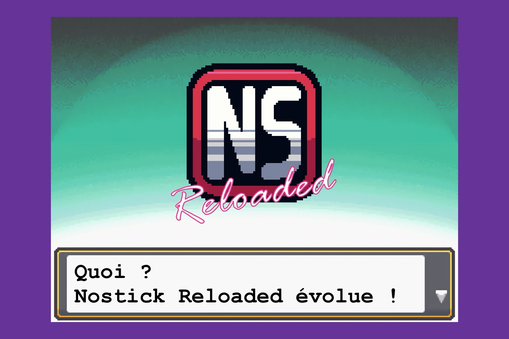

+++
title = "Nostick Reloaded : abonnez-vous à notre newsletter toute belle toute neuve !"
date = 2024-11-01T13:30:00+01:00
draft = false
author = "Mickael"
tags = ["Actu"]
type = "une"
image = "https://nostick.fr/articles/vignettes/octobre/nostick-reloaded.jpg"
+++

*Nostick Reloaded* a changé de plateforme de publication et de gestion : on a décidé de laisser tomber Substack et ses pratiques [problématiques](https://www.theguardian.com/media/2024/jan/12/casey-newton-quits-substack-nazi-newsletter), et de nous lancer avec [Ghost](https://reloaded.nostick.fr/) ! Les premiers pas ont été encourageants, la newsletter est bien arrivée dans les bonnes boîtes aux lettres la semaine dernière, on croise les doigts pour que ça se passe bien dimanche.

- [Abonnez-vous à Nostick Reloaded](https://reloaded.nostick.fr)
- [Les archives de la newsletter](https://reloaded.nostick.fr/page/2/)

Le contenu de la newsletter ne change pas, vous y retrouverez toujours un résumé des principales actus et sorties JV de la semaine. En revanche, pour Félix et pour moi, Ghost offre une plus grande flexibilité pour mettre en page les différents articles. Nous allons d'ailleurs continuer à faire des petits changements dans les prochaines semaines !

À terme, c'est à dire pas tout de suite quand même, c'est tout le site *Nostick* qui passera sur Ghost, ce qui nous permettra d'ajouter une dimension sociale et des outils qui manquent cruellement (genre un moteur de recherche !). Mais pour le moment, c'est *Nostick Reloaded* qui essuie les plâtres, en espérant que vous serez nombreux [à vous inscrire](https://reloaded.nostick.fr) : c'est gratuit, c'est sans pub et c'est pas chiant !

Un dernier mot enfin pour saluer nos abonnés Ulule sans qui tout cela ne serait pas possible. Si vous voulez nous donner un coup de main (et lire nos gros articles en avant-première !), n'hésitez pas : il y a des paliers à partir de [3 € par mois](https://fr.ulule.com/nostick/).