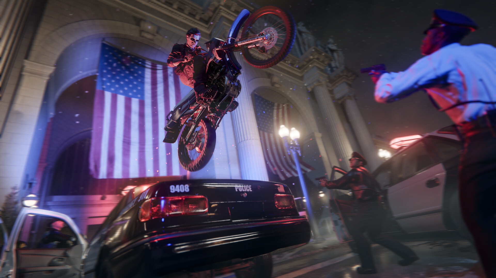
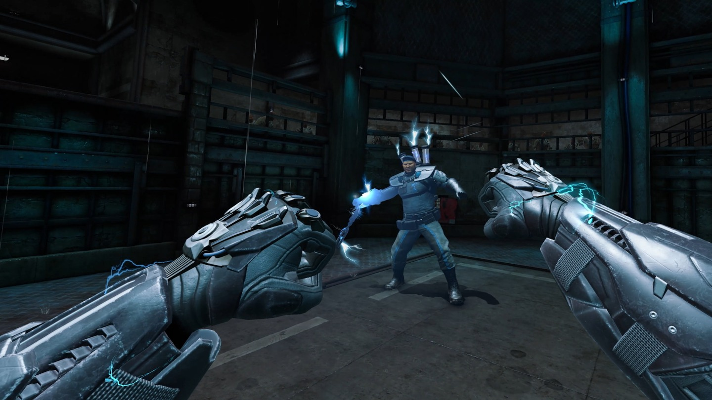

+++
title = "Black Ops 6, Sonic X Shadow Generations : le récap des sorties de la semaine (27/10)"
date = 2024-10-27T07:30:02+01:00
draft = false
author = "Félix"
tags = ["C’est dispo"]
image = "https://nostick.fr/articles/2024/octobre/2710-les-sorties-de-la-semaine/callof.png"
+++

 

Entre la garderie, les courses et cette connerie de passage à l’heure d’hiver qui vous fiche le moral dans les chaussettes, vous n’avez peut-être pas eu le temps de vous intéresser aux nouveautés du moment. Qu’à cela ne tienne : voici les sorties de ces derniers jours qui ont retenu notre attention.

## Et ça fait clic, clic clic pan pan pan

Aussi régulier que les impôts ou le vaccin contre la grippe, un nouveau *Call of Duty* est sorti en cette fin octobre. Bonne nouvelle, c’est un peu plus enthousiasmant que l’opus de l’année dernière. ***Black Ops 6*** nous invite à chausser les rangers de Case, un agent de la CIA en action pendant la Guerre du Golfe. La campagne est une suite directe à celle du *Black Ops Cold War* de 2020, et comme d’hab il va s’agir de faire le tour du monde en canardant à tout va. Le titre axe cependant un peu plus sur l’infiltration en proposant différentes manières d’aborder une mission, ce qui sera pas mal pour la rejouabilité. Le mode solo est visiblement dans le haut du panier (les tests m’ont donné envie d'essayer, c’est dire) et dure environ 8 heures, ce qui est pas mal du tout pour un *Call of*. Les tests sur le multi sont rares, mais celui-ci était plutôt convaincant d’après les retours sur la bêta. Cette année marque également le retour du mode zombie à la Treyarch avec deux maps originales qui devraient ravir les nostalgiques de *Kino der Toten*. Bref, c’est pas le pire *Call of* qu’on ait vu et celui-ci a l’avantage d’être dispo gratos dans le Game Pass, alors ça pourra tuer un week-end. Les autres pourront raquer 80 balles [sur Steam](https://store.steampowered.com/app/2933620/Call_of_Duty_Black_Ops_6/) ou consoles (mais pas la Switch, faut pas déconner).

## Remake Without a Cause

Il fallait bien qu’il y ait un remake cette semaine, et c’est Sega qui s’y colle avec ***Sonic X Shadow Generations***, une version revue du *Sonic Generations* de 2011 (360/PS3). Cette nouvelle édition apporte « *des graphismes améliorés et des cinématiques retravaillées* », ce qui est bien la moindre des choses pour un machin vendu 50 balles. Le plus gros ajout vient d’un nouveau scénario original lié à Shadow, le Sonic d4rk qui évolue dans des niveaux exclusifs plus grands et plus libres. Le gameplay change étant donné que le hérisson noir et rouge a des pouvoirs spéciaux lui permettant par exemple de voler ou de flotter sur l’eau. Les tests sont mitigés, certains déplorant un remake décevant face à une très bonne aventure originale là où d’autres trouvent la partie exclusive moyenne mais apprécient le dépoussiérage. Écoutez, dans tous les cas il devrait y avoir un morceau que vous aimerez, et c’est déjà pas si mal pour les fans de Sonic qui ont l’habitude d’être déçus. Dispo sur [Steam](https://store.steampowered.com/app/2513280/SONIC_X_SHADOW_GENERATIONS/), consoles et Switch.



## Na-Na-Na-Na-Na-Na-Na-Na…

La série ***Batman: Arkham*** est de retour avec… un nouvel opus en VR. Exclusif au Meta Quest 3 et 3S. Bon c’est pas tous les jours qu’on a un jeu qui joue dans la même cour qu’*Half-Life Alyx* alors on va en parler deux minutes. Le joueur est invité à enfiler le Batslip du Chevalier noir, parti sur les traces du Roi des Rats et de sa secte de fanatiques. On y retrouve les niveaux à la logique metroidvania des précédents épisodes, sauf qu’ici la baston se fait avec à coup de vraies patates dans le vide. Le jeu propose d’utiliser les différents gadgets habituels (Batarang, Bat-Grappin, [Bat-Credit Card](https://batman.fandom.com/wiki/Bat-Credit_Card)…) dans une expérience forcément beaucoup plus immersive. J’ai pu y jouer une vingtaine de minutes, et c’est de la bonne : c’est un des plus beaux jeux pour Quest, le gameplay est bien foutu et l’intrigue prenante. Les tests décrivent un vrai jeu complet avec son lot de puzzles et de boss qui devrait vous tenir en haleine une dizaine d’heures. Les petits gars de chez Camouflaj se sont fait plaisir en cachant tout un tas d'easter eggs et de références. Bref, un immanquable si vous avec un casque compatible et même si (comme moi) la licence Batman vous laisse de marbre. Comptez [46 €](https://www.meta.com/fr-fr/experiences/batman-arkham-shadow/3551691271620960/) tout de même, sachant que le titre est offert pour l’achat du tout frais Quest 3S.

 

## Sous les projecteurs

C’est la saison des jeux d’horreurs à gros poly. ***‌Fear the Spotlight*** est un nouveau représentant du genre sorti cette semaine dans lequel on suit l’histoire de deux ados s’infiltrant dans leur lycée pour une séance de spiritisme nocturne. L’affaire tourne mal et l’établissement se transforme en musée des horreurs que l’on va devoir parcourir en résolvant des puzzles ici et là. Les tests parlent d’un petit jeu réussi qui arrive à créer une ambiance flippante sans reposer sur des jumpscares en cascade. L’histoire est prenante et plus complexe qu’elle en a l’air tandis que le titre se paye quelques bonnes idées et des références à *Silent Hill* ou *Resident Evil*. Si vous n’avez pas fait une overdose ces derniers temps, ça peut valoir le coup d’œil. 20 € [sur Steam](https://store.steampowered.com/app/1959390/Fear_the_Spotlight/) (où il y a une démo), aussi dispo sur Switch, Xbox Series X/S, Xbox One, PS5 et PS4.



## Mais aussi

Évidemment qu’il y a eu un autre jeu d’horreur low-poly cette semaine : ***While We Wait Here*** propose de gérer un restaurant le jour de la fin du monde, et il va falloir attendre la mort en papotant avec les clients. Ça a l’air rigolo et ça ne coûte [que 5 balles sur Steam](https://store.steampowered.com/app/2213120/While_We_Wait_Here/), pour occuper 2 h pourquoi pas. La licence ***No More Room in Hell*** est de retour avec un second opus visiblement tout pourri au vu des critiques négatives qu’il se tape [sur Steam](https://store.steampowered.com/app/292000/No_More_Room_in_Hell_2/), donc vous pouvez laisser tomber. Les fans de JRPG pourront zieuter du côté de ***Ys X : Nordics*** ([60 €](https://store.steampowered.com/app/2731870/Ys_X_Nordics/)) ou du remake du jeu de 1993 ***Romancing SaGa 2: Revenge Of The Seven*** ([60 €](https://store.steampowered.com/app/2455640/Romancing_SaGa_2_Revenge_of_the_Seven/)), sur lesquels nos lecteurs weebs seront sans doute beaucoup plus calés que moi. Notons enfin que ***Factorio*** et ***Alan Wake 2*** ont tous deux eu droit à des DLC qui ont l’air réussis et qui seront un bon prétexte pour y replonger.
