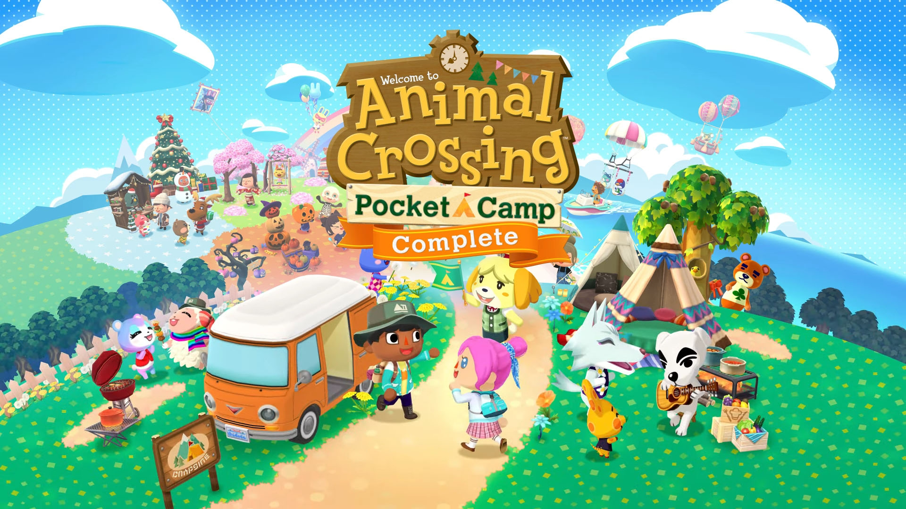

+++
title = "Nintendo va ressortir son F2P Animal Crossing: Pocket Camp sans achat in-app pour 20 €"
date = 2024-10-28T18:30:00+01:00
draft = false
author = "Félix"
tags = ["Actu"]
image = "https://nostick.fr/articles/2024/octobre/2210-netflix-studio-aaa-team-blue/netflix.jpg"
+++

 

À la fin de l’été, Nintendo a annoncé la mise en bière d’*Animal Crossing: Pocket Camp*, son free-to-play mobile basé sur la célèbre licence et qui aura tourné pendant 7 ans. Une bien mauvaise nouvelle pour les joueurs et autres fans, qui appréciaient ce petit jeu visiblement honnête. Étonnamment, ce n’est pas la fin de l’histoire : Nintendo vient [d’annoncer](https://faq.complete.ac-pocketcamp.com/hc/fr/articles/38440141011993-Informations-sur-Pocket-Camp-Complete) que le jeu allait revenir dans une version hors-ligne à partir du 2 décembre sur iOS et Android.

Le contenu de cette version « Complete » sera en grande partie identique à celui du free-to-play, mais sans les achats in-app ni la possibilité d’interagir avec d’autres joueurs. Les vétérans pourront transférer leur sauvegarde vers cette nouvelle version pour peu qu’ils aient un compte Nintendo. Pas chien, le géant japonais a même pensé à ajouter [du contenu exclusif](https://faq.complete.ac-pocketcamp.com/hc/fr/articles/33884017856281-À-propos-des-événements) avec un mix d’évènements originaux et d’autres plus anciens. On pourra également se créer une CampiCarte, un QR Code que pourront scanner vos amis pour voir votre personnage avec un arrière-plan et une pose soigneusement choisis.

Reste la question du prix : 20 €. Les esprits chagrins trouveront ça fort de café pour un jeu qui était jusqu’à présent gratuit, là où les plus optimistes y verront une chouette manière de découvrir le jeu sans se taper pubs et autres achats in-app. Si le prix est discutable, c’est tout de même un bon point pour la préservation du titre, qui restera accessible encore quelques années et qui devrait avoir droit à quelques petites mises à jour purement techniques. Notons que le jeu sera à moitié prix jusqu’au 31 janvier, tandis que les serveurs de la version free-to-play fermeront à la fin novembre 2024.