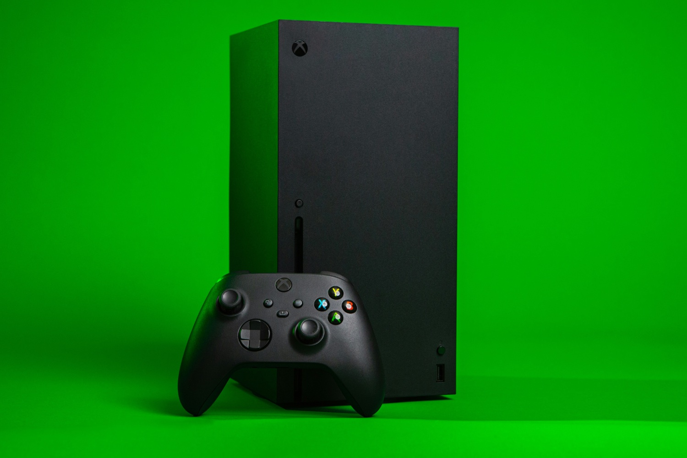

+++
title = "Le patron de Microsoft veut plus d'exclusivités Xbox sur les autres plateformes"
date = 2024-10-28T08:47:32+01:00
draft = false
author = "Mickael"
tags = ["Actu"]
image = "https://nostick.fr/articles/vignettes/octobre/xbox-series-x-green.jpg"
+++

Au vu de la polémique qui a entouré l'annonce de la sortie d'*Indiana Jones et le Cercle ancien* sur PS5, Microsoft va peut-être communiquer sur les portages de ses exclusivités Xbox [avec plus de discernement à l'avenir](https://nostick.fr/articles/2024/octobre/2510-microsoft-xbox-pedale-douce-portages-ps5/). Ça ne veut pas dire pour autant que ce mouvement va s'arrêter, loin de là ! 

Dans son bilan annuel [posté](https://www.linkedin.com/pulse/my-annual-letter-relevance-reinvention-satya-nadella-v91xc/) sur LinkedIn, Satya Nadella, le patron de Microsoft, se réjouit de voir que les jeux Xbox — après l'acquisition d'Activision en octobre 2023 — sont entre les mains de « *centaines de millions de joueurs* » supplémentaires désormais intégrés dans l'écosystème maison.

Un écosystème dans lequel 20 franchises ont généré plus d'un milliard de dollars ; il cite en premier lieu *Candy Crush*, ce qui n'est probablement pas un hasard : le développeur King est certainement une des principales raisons pour lesquelles Microsoft a signé un chèque de 69 milliards de dollars l'an dernier. *Diablo*, *Halo*, *Warcraft*, *Elder Scrolls* et *Gears of War* sont également cités, mais bizarrement pas *Call of Duty*.

Satya Nadella n'oublie pas de dire un mot du service Xbox Cloud Gaming, qui devrait bénéficier sous peu de la possibilité de streamer les jeux de sa bibliothèque Xbox, en plus de ceux du Game Pass. Surtout, il rappelle le portage de quatre jeux Xbox sur PlayStation et Switch « *pour la première fois* ». Et c'est évidemment loin d'être terminé : « *Nous continuons d'étendre notre contenu vers de nouvelles plateformes* ». Au risque de [déclasser encore plus les consoles Xbox](https://nostick.fr/articles/2024/octobre/1910-backlog-life-is-strange-atari-xbox--activision-ps5-pro/#le-gros-anniversaire-de-la-semaine--il-y-a-un-an-microsoft-achetait-activision-et-maintenant-) ?

Billy Freeman (Unsplash)