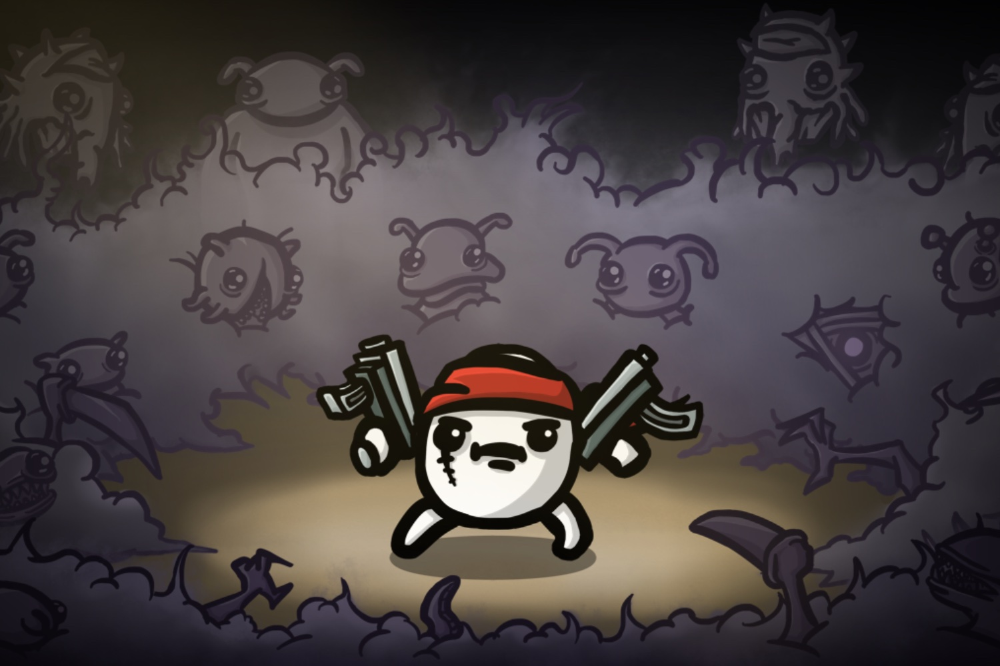

+++
title = "Les patates de Brotato tapent les aliens à plusieurs"
date = 2024-10-28T08:07:32+01:00
draft = false
author = "Mickael"
tags = ["Actu"]
image = "https://nostick.fr/articles/vignettes/octobre/brotato.jpg"
+++

*Brotato* n'a pas la hype de *Vampire Survivors*, mais le roguelike de Blobfish, au gameplay similaire, mérite qu'on en parle ! Ce d'autant que la communauté qui gravite autour est très active. Et puis on est toujours partant pour exploser des créatures extra-terrestres dans la peau d'une patate armée jusqu'aux dents. Ce sera encore plus amusant avec la dernière mise à jour gratuite, et un nouveau DLC payant.

 

Côté gratos, les patates vont pouvoir s'entraider avec le mode co-op en local (jusqu'à 4 joueurs) qui contient 4 nouveaux personnages, 5 armes supplémentaires et 15 équipements en plus.  Oh, il y a aussi de nouvelles musiques.

L'extension « Abyssal Terrors » — qui coûte 4 €, ça ne va pas vous ruiner — monte le potard à onze avec 14 personnages en plus, 16 armes, une trentaine d'items, et une nouvelle map avec 20 vagues de nouveaux ennemis et de boss. Il y a aussi de nouveaux mécanismes d'amélioration.

La mise à jour et le DLC sont dispos sur [Steam](https://store.steampowered.com/app/1942280/Brotato/) et sur [Xbox](https://www.xbox.com/en-CA/games/store/brotato/9p9vnsqk1w3k), les autres plateformes (*Brotato* étant disponible partout y compris sur les mobiles) arriveront un peu plus tard.