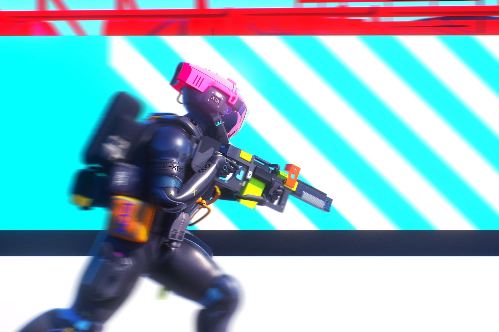
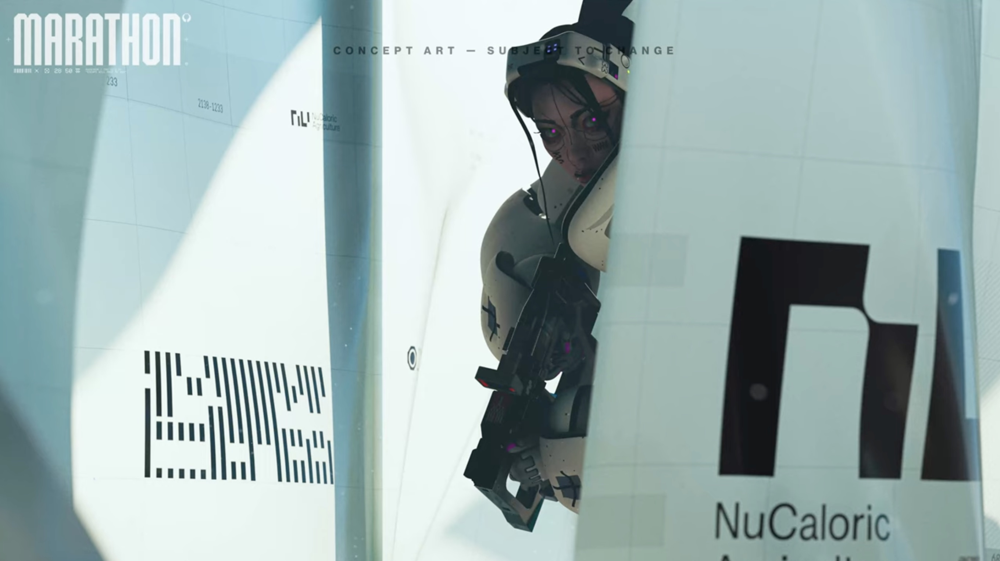
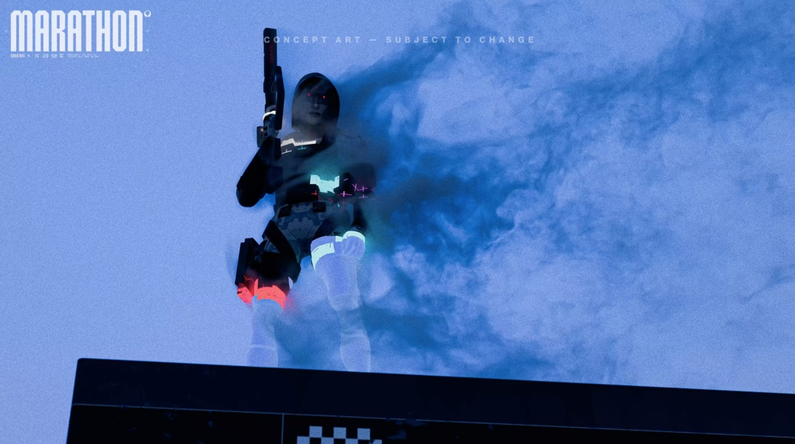

+++
title = "Bungie donne des nouvelles de Marathon, mais toujours pas de gameplay"
date = 2024-10-29T08:37:32+01:00
draft = false
author = "Mickael"
tags = ["Actu"]
image = "https://nostick.fr/articles/2024/septembre/2009-marathon-concord-prix-destin/marathon-bungie.jpg"
+++

Allons bon, on vient à peine d'oublier que *Concord* avait jamais existé que Bungie rappelle *Marathon* à notre ~~mauvais~~ bon souvenir. Le studio de PlayStation a donné quelques détails à l'occasion d'un [dev update](https://www.youtube.com/watch?v=r8WgMQuPwRE) avec Joe Zeigler, le directeur du jeu. Déjà, c'est une preuve de vie que *Marathon* est toujours vivant, on n'avait plus eu de nouvelles depuis mai 2023 et le teaser ci-dessous.

 

Malheureusement, Bungie n'est pas encore prêt à montrer le gameplay du jeu. Joe promet cependant qu'il s'agira d'un extraction shooter « intense » où les joueurs devront batailler pour choper du loot, survivre et s'en tirer. Il a aussi montré les classes Voleur et Furtif des « runners », les mercenaires cybernétiques de *Marathon*. Attention, ce sont des concepts art, les versions finales pourraient être différentes mais ils donnent une bonne idée du style visuel en phase avec la première bande annonce.

Quant au jeu en lui-même, il est « *sur la bonne voie* » même si « *des changements radicaux* » y ont été apportés en fonction des retours des premiers testeurs et des créateurs de contenus. Les joueurs pourront poser leurs pattes sur *Marathon* l'année prochaine, le studio ayant l'intention d'élargir les phases de test — évitant ainsi l'écueil de *Concord* qui s'était lancé la fleur au fusil, sans chercher à recueillir les d'améliorations de la communauté.

Ça ne veut pas dire que la version finale du jeu sortira en 2025 (sur PC, PS5 et Xbox), mais le chantier a l'air d'avancer correctement. 