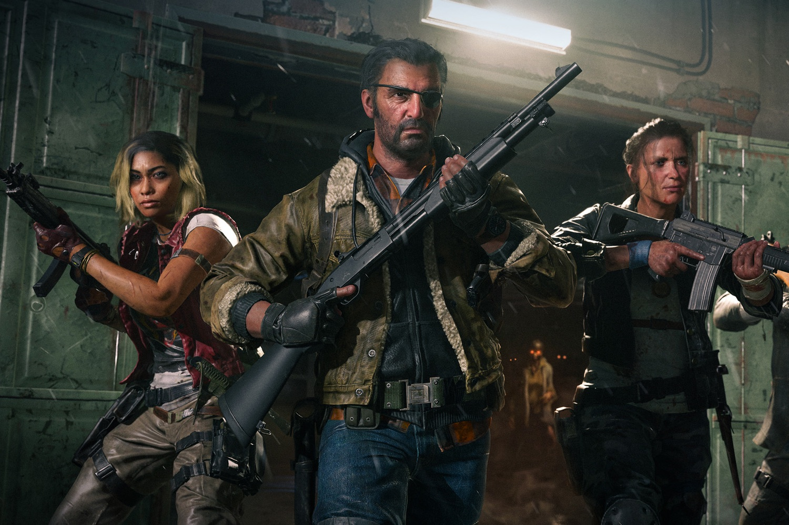

+++
title = "Microsoft ne s'est pas tiré une balle dans le pied avec Call of Duty: Black Ops 6"
date = 2024-10-29T08:07:32+01:00
draft = false
author = "Mickael"
tags = ["Actu"]
image = "https://nostick.fr/articles/vignettes/octobre/cod-bo6.jpg"
+++

Vendredi dernier, c'était le grand jour pour Microsoft qui a lancé *Call of Duty: Black Ops 6* à l'assaut de toutes les plateformes (enfin, sauf la Switch). Une première depuis l'acquisition d'Activision il y un an ! Autant dire qu'il valait mieux ne pas se planter, et… ça ne s'est pas trop mal passé, manifestement. 

Le jeu, touffu avec ses différents modes (solo, multi, zombies), n'a pas encore reçu sa note de la part des testeurs professionnels, en revanche du côté des joueurs l'opinion est « généralement favorable » sur [Metacritic](https://www.metacritic.com/game/call-of-duty-black-ops-6/), mais « moyennes » sur [Steam](https://store.steampowered.com/app/2933620/Call_of_Duty_Black_Ops_6/). Des problèmes techniques et d'optimisation, et des bugs de spawns font baisser les appréciations.

Toutefois, il est indéniable que ce nouvel opus payant — d'une série plutôt appréciée des joueurs de *CoD* — attire du monde. Toujours sur Steam, le record du nombre de joueurs connectés en même temps dépasse les [490 000](https://steamdb.info/app/1938090/charts/#max), et à l'heure où ces lignes sont écrites, on en est à 220 000 environ. Le pic pour *Modern Warfare III* avait été de 190 707, mais rappelons que l'opus 2023 de *Call of* est universellement détesté. En 2022, *Modern Warfare II* avait atteint près de 265 000 joueurs en simultané.

Ces chiffres sont à prendre avec les pincettes habituelles. Non seulement *Black Ops 6* est aussi dispo sur Xbox et PlayStation, mais aussi sur le Game Pass. De fait, il sera difficile de faire des comparaisons en termes de ventes avec les précédents épisodes. La vraie « valeur » de *Black Ops 6* ne se révélera que dans quelques mois, quand Microsoft aura une meilleure idée des performances des micro-transactions et des recrutements sur le Game Pass.

Tout cela étant dit, le solo de ce *Call of* est assez rigolo avec des moments « what-le-fuck » surprenants. Et je ne pensais pas avoir à écrire ça un jour !