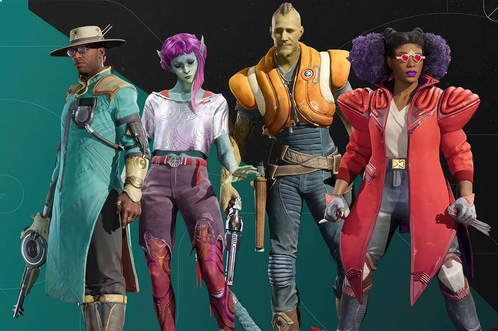

+++
title = "Après le crash de Concord, Sony ferme Firewalk Studios"
date = 2024-10-29T18:20:00+01:00
draft = false
author = "Félix"
tags = ["Actu"]
type = "une"
image = "https://nostick.fr/articles/2024/octobre/2810-nintendo-va-preserver-animal-crossing-pocket-camp/animalcross.jpg"

+++

 

Ouch. À peine deux mois après la mise hors-ligne des serveurs de *Concord*, Firewalk Studios va fermer ses portes. La mauvaise nouvelle a été annoncée par Sony dans un mail interne [rendu public](https://sonyinteractive.com/en/news/blog/an-update-from-playstation-studios/). Pour rappel, *Concord* est un hero-shooter lancé sur PC et PS5 fin août qui a fait un énorme flop, tant et si bien que les serveurs ont été débranchés [deux semaines](https://reloaded.nostick.fr/sony-debranche-concord-carton-plein/) après le lancement et les clients remboursés. 

Ce studio fondé en 2018 avait été racheté par Sony en 2021 pour devenir le 20e PlayStation Studios. Mis à part *Concord*, il n’avait sorti aucun jeu et seulement planché sur la franchise *Destiny*. On se faisait peu d’espoir pour lui après l’accident industriel qu’a été le défunt hero-shooter, le directeur du jeu ayant claqué la porte il y a quelques semaines.

Les plus optimistes espéraient un retour de *Concord* : Sony avait annoncé vouloir « *explorer d’autres options* » pour toucher les joueurs tandis que le jeu a reçu [quelques mises à jour](https://nostick.fr/articles/2024/octobre/1710-concord-bouge-encore/) sur Steam laissant penser qu’il pourrait revenir sous forme de free-to-play. Dans son mail, Hermen Hulst, le PDG du Studio Business Group de Sony explique que le jeu ne reviendra pas : 

>  Certains aspects de Concord étaient exceptionnels, mais d'autres n'ont pas réussi à capter l'attention de suffisamment de joueurs. En conséquence, nous avons décidé de retirer le jeu. Nous avons passé beaucoup de temps au cours des derniers mois à explorer toutes nos options.

> Après mûre réflexion, nous avons déterminé que la meilleure voie à suivre est de mettre définitivement fin au jeu et de fermer le studio. Je tiens à remercier toute l'équipe de Firewalk pour leur savoir-faire, leur esprit créatif et leur dévouement.

C’est donc un gros paquet de dollars que Sony vient de mettre à la poubelle : le titre a passé au moins quatre en en développement et coûté des millions. SIE a également annoncé la fermeture de Neon Koi, un studio allemand qui travaillait sur un jeu d'action mobile.
