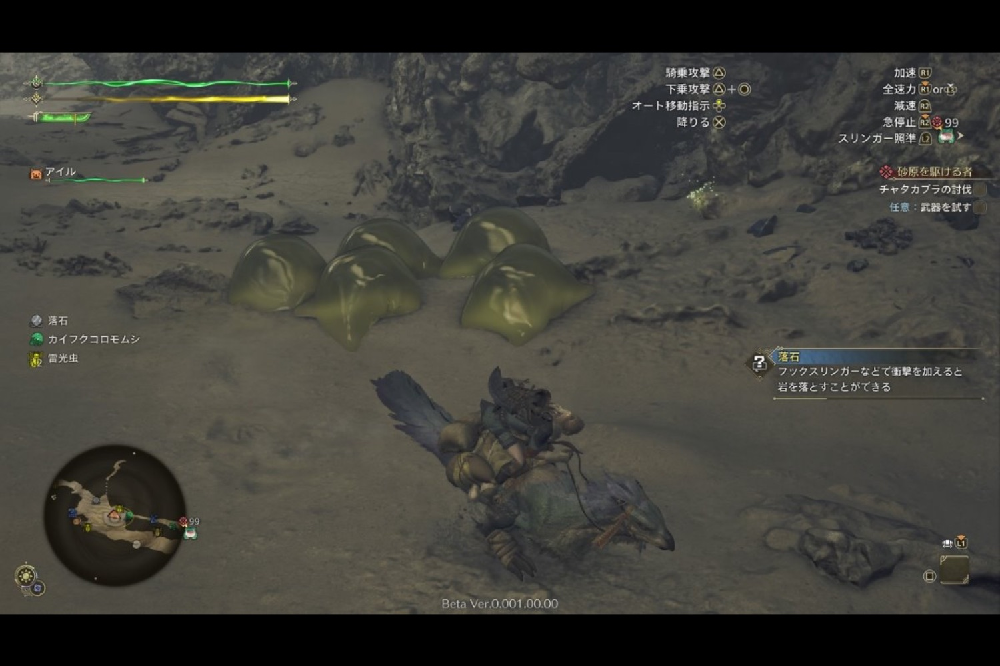

+++
title = "Peur des araignées ? Monster Hunter Wilds les transforment en blobs"
date = 2024-10-29T10:47:32+01:00
draft = false
author = "Mickael"
tags = ["Actu"]
image = "https://nostick.fr/articles/vignettes/octobre/monster-hunter-wilds.jpg"
+++

Personne n'est obligé d'aimer les araignées, mais pour ceux qui se sentent mal à la moindre vue d'une petite patte poilue la vie n'est pas facile : les jeux vidéo sont en effet friands d'arachnides, des petits comme des gros modèles. Les développeurs en ont cependant de plus en plus conscience, et mettent au point des modes « arachnophobie » dans leurs jeux.

C'est le cas dans *Monster Hunter Wilds*, qui n'est pas avare de créatures à plusieurs pattes. La bêta ouverte du jeu de Capcom intègre un de ces modes, baptisé « assistance arachnophobique », qui remplace les araignées, les petits monstres similaires à des insectes et la faune endémique par des sortes de blobs verts translucides, comme le [rapporte](https://automaton-media.com/en/news/monster-hunter-wilds-features-an-accessibility-mode-for-players-who-fear-spiders-and-insects/) *Automaton*.



Cette fonction d'accessibilité n'est pas une première : elle est aussi présente dans *Star Wars Jedi: Survivor*, dans *Grounded* ainsi que dans *Hogwarts Legacy* (où les pattes des araignées sont remplacées par des patins à roulettes). Dans le jeu *Kill it With Fire*, où il s'agit de flinguer des araignées, l'activation du mode transforme ces ennemies mortelles en adorables araignées… en peluche !