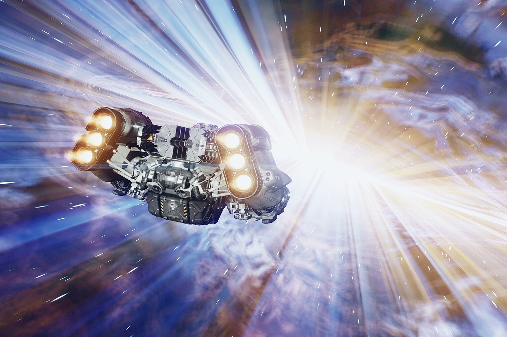

+++
title = "Starfield 2 sera sûrement meilleur que Starfield 1"
date = 2024-10-29T08:47:32+01:00
draft = false
author = "Mickael"
tags = ["Actu"]
image = "https://nostick.fr/articles/vignettes/octobre/starfield.jpg"
+++

Qui veut d'un *Starfield 2* ? Non, ne levez pas tous les main en même temps. Bon, il y en a bien un ou deux qui voudraient d'un deuxième *Starfield*, non ? Non ?!? Bon sang, vous êtes durs, mais en même temps difficile de vous donner tort. Le nouvel univers de Bethesda compte pas mal de détracteurs, et aussi de déçus qui ne comprennent pas ce que le studio est allé faire dans cette galère.

Si les joueurs qui détestent *Starfield* risquent bien de ne plus jamais avoir quoi que ce soit à faire avec ce jeu ou d'éventuelles suites, ceux qui se disent déçus pourraient lui donner une nouvelle chance si d'aventure Bethesda se remontait les bretelles. C'est l'avis de Bruce Nesmith, ancien designer du studio qui a planché sur *Starfield*, *Skyrim*, *Oblivion* et *Fallout*.

Dans une interview pour *[VideoGamer](https://www.videogamer.com/features/starfield-2-one-hell-of-a-game-claims-designer-bethesda/)*, il explique que *Starfield* étant une toute nouvelle direction pour Bethesda, tout ne peut pas être parfait du premier coup. « *Lorsque nous avons créé Skyrim, nous avions l’immense avantage de Oblivion, qui bénéficiait lui-même de l’immense avantage de Morrowind* », décrypte-t-il. « *Tout ce travail était déjà fait pour nous. Tout ce que nous avions à faire, c’était de continuer à améliorer et à ajouter de nouvelles choses. Nous n’avons pas eu à tout recommencer à zéro. Si nous avions dû partir de rien, cela aurait pris deux ou trois années de développement supplémentaires* ».

Mais évidemment, *Starfield* n'a pas bénéficié d'un prédécesseur direct. « *J'ai hâte de voir Starfield 2* », s'avance Bruce Nesmith. « *Je pense que ce sera un sacré jeu, car il répondra à beaucoup des critiques actuelles. Il pourra prendre ce qui existe déjà et y ajouter beaucoup de nouvelles choses tout en corrigeant bon nombre de ces problèmes* » — une manière de dire que lui aussi déplore quelques soucis avec le jeu actuel, malgré le feu roulant des mises à jour.

L'ancien cadre convoque à la barre « *le premier Dragon Age, le premier Assassin's Creed* » pour faire valoir son argument. « *[Ces jeux] montrent souvent des éclairs de génie, au milieu de beaucoup d’autres éléments qui ne captivent pas forcément tout le monde (…) Il faut parfois, malheureusement, une deuxième ou une troisième version du jeu pour vraiment enrichir l’ensemble* ». Mais Bethesda et la maison-mère Microsoft voudront-ils vraiment poursuivre dans cette voie alors qu'il y a déjà tant à faire, de *Fallout* à *Elder Scrolls* ?