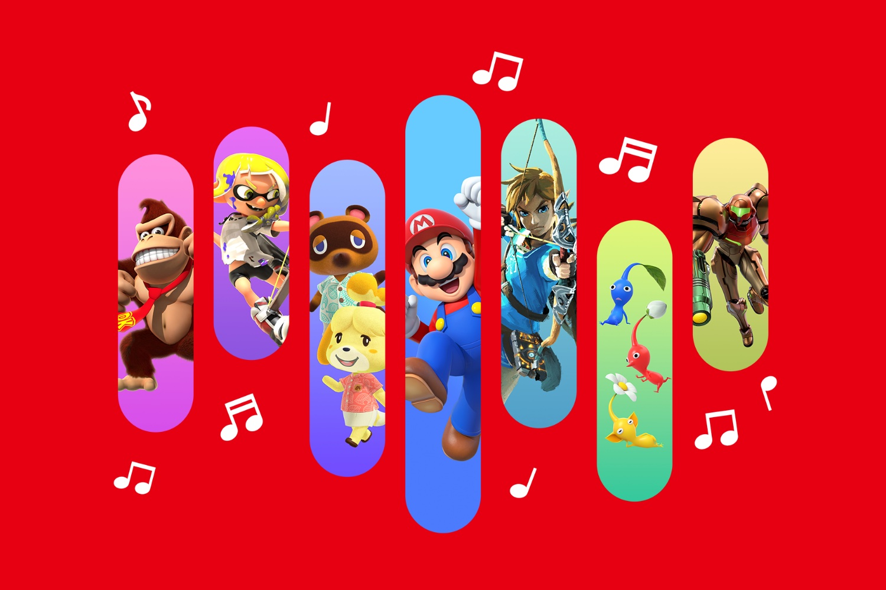
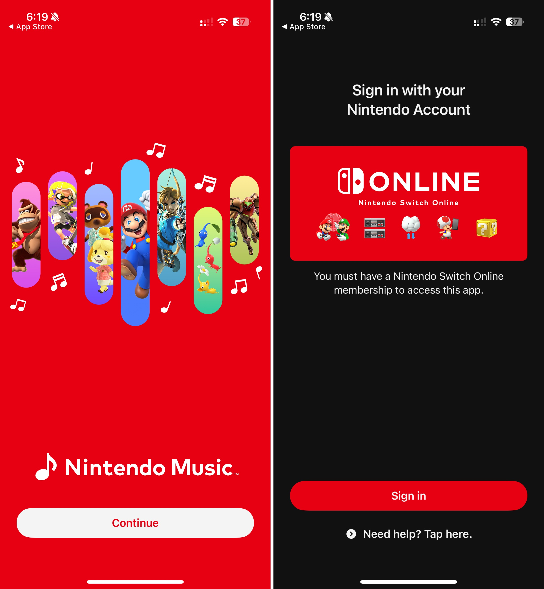
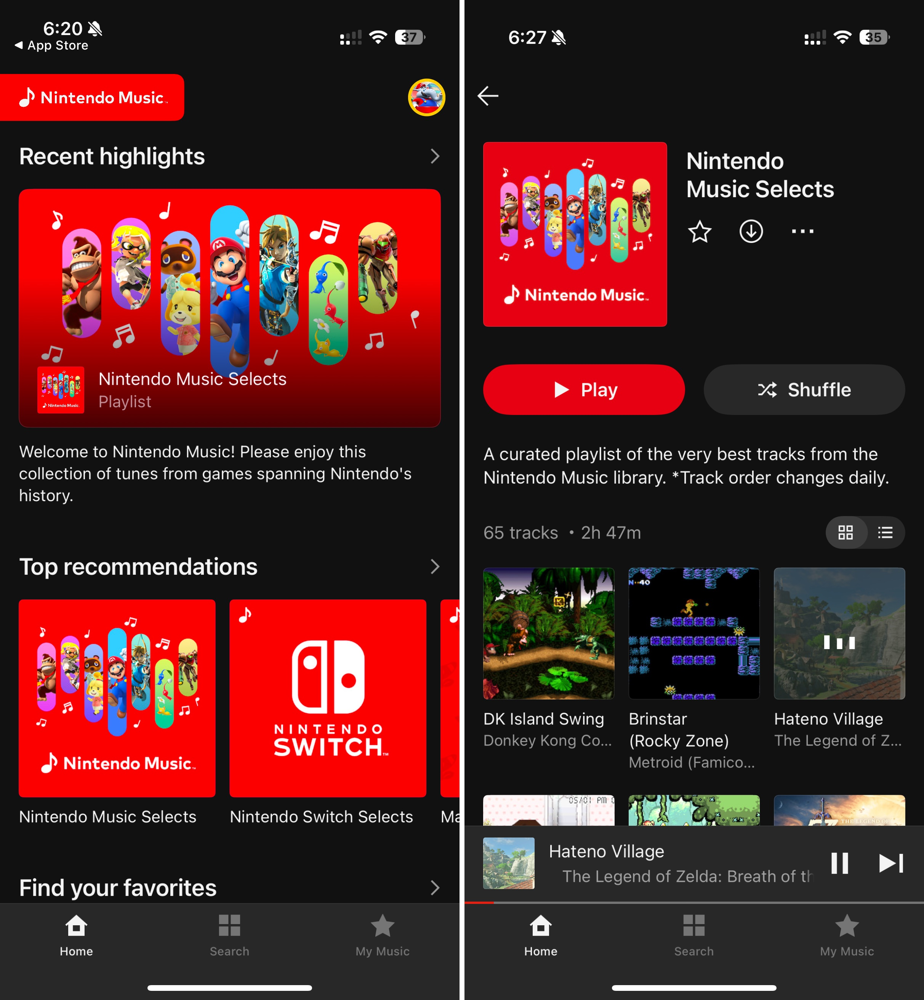
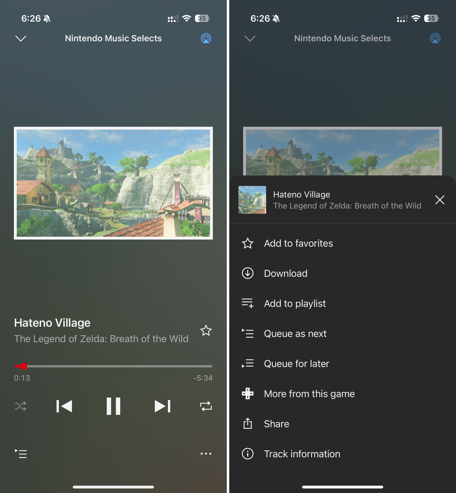
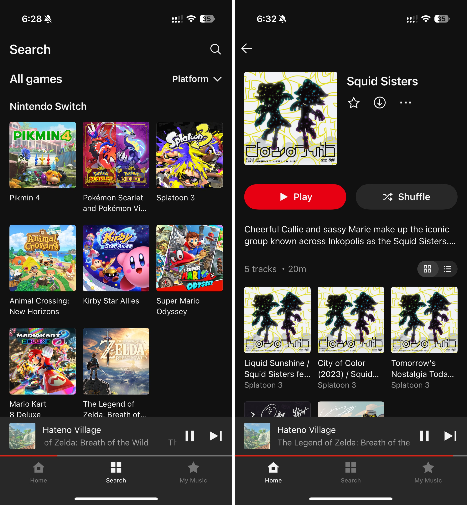
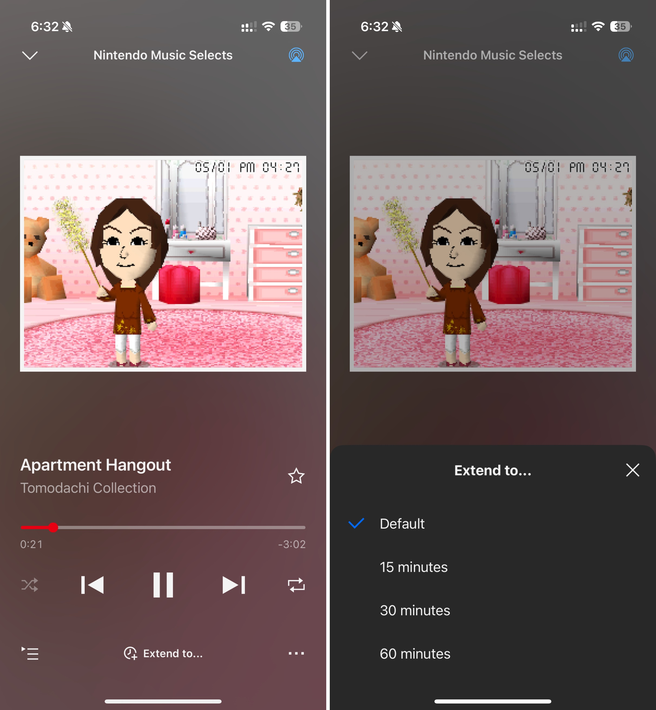

+++
title = "La nouvelle app Nintendo Music vend du rêve aux oreilles"
date = 2024-10-30T21:01:32+01:00
draft = false
author = "Mickael"
tags = ["Actu"]
type = "une"
image = "https://nostick.fr/articles/vignettes/octobre/nintendo-music-5.jpg"
+++

Grosse surprise nocturne : Nintendo vient de lancer une nouvelle application mobile que les fans réclamaient à corps et à cri depuis toujours, [Nintendo Music](https://www.nintendo.com/us/switch/online/nintendo-switch-online/nintendo-music/) ! Dispo sur [iOS](https://apps.apple.com/fr/app/nintendo-music/id6466376604) et [Android](https://play.google.com/store/apps/details?id=com.nintendo.znba&hl=en_CA), cette app permet comme son nom l'indique d'écouter les bandes son des jeux Nintendo sur son smartphone.

 

Pour en profiter, il faudra cependant être abonné au Switch Online. L'application sera écoutable durant les 7 jours d'essai du NSO, ce qui est déjà ça. Nintendo Music comprend un catalogue assez fourni de compositions, que l'on pourra sélectionner en fonction d'un personnage, de l'humeur du moment, ou tout simplement par jeu.

Dans ce dernier cas, la sélection est classée par plateformes, ce qui permet au passage de voir qu'il en manque encore pas mal (pas de *Xenoblade*, assez peu de *Zelda* et de *Fire Emblem*…). En tout, l'app offre un peu plus de 65 heures de musique et d'OST tirés de 23 jeux.

Il y a quand même de quoi s'en mettre plein les oreilles en attendant que Nintendo garnisse les rayons. Et qu'on se rassure, les musiques Wii Channels sont disponibles !. Détail sympathique, l'écoute de certains morceaux peut être « étendue » pour en profiter plus longtemps.

L'app propose également des recommandations et permet même de masquer les morceaux des jeux qui pourraient spoiler des jeux que l'auditeur n'a pas encore terminé ! Les listes de lecture et les morceaux peuvent être téléchargés pour une écoute hors connexion, mais malheureusement pas achetées. Et on pourra épingler ses compos préférées en favori, qui seront disponibles dans l'onglet Ma Musique. Sur iOS, les morceaux peuvent être diffusés avec AirPlay.