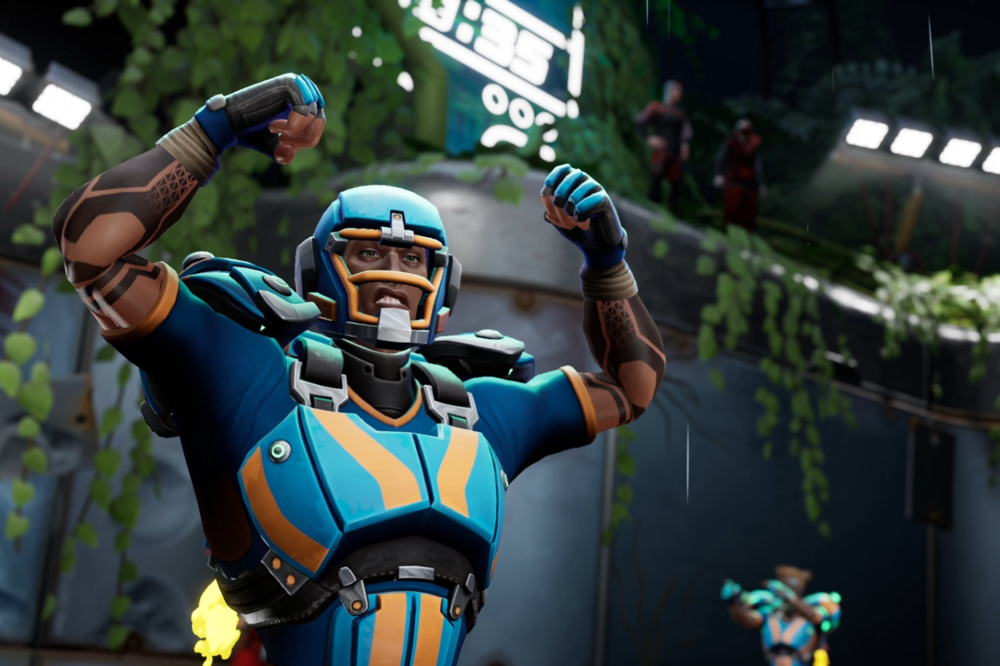

+++
title = "Speedball est de retour pour casser des dents"
date = 2024-10-30T08:48:32+01:00
draft = false
author = "Mickael"
tags = ["Trailer"]
image = "https://nostick.fr/articles/vignettes/octobre/speedball.jpg"
+++

Du sang, de la violence gratuite, de la tripaille… et un ballon. Il en faut peu pour combler un joueur, et c'est ce qui lui propose *Speedball*, une simulation de sport futuriste en accès anticipé sur Steam qui a un pedigree bien particulier. 

 

Il ne s'agit pas d'un jeu original, mais du remake du *Speedball* que les vieux de la vieille ayant connu l'Amiga ont certainement pratiqué dans leur jeunesse. Enfin, surtout *Speedball 2: Brutal Deluxe*, l'excellente suite développée (tout comme le premier volet) par Bitmap Brothers. Ce « sport » mixe des éléments provenant du football US, du rugby, du MMA, avec une pincée du film *Rollerball* — [l'original](https://en.wikipedia.org/wiki/Rollerball_(1975_film)) de 1975, pas la [bouse](https://en.wikipedia.org/wiki/Rollerball_(2002_film)) de McTiernan de 2002.

Ce remake a été conçu par Rebellion (créateur de *Sniper Elite*), qui marche dans les pas de Bitmap Brothers puisque le jeu se présente tout simplement un nouveau volet de la franchise. « *C'est le seul sport qui permet à deux équipes augmentées cybernétiquement de s'affronter à une vitesse et avec une violence au-delà des limites humaines, où chaque instant pourrait être le dernier pour un joueur* », promet le descriptif.

Il faudra non seulement démontrer ses compétences sur le terrain sans y perdre trop de dents, mais aussi dans la gestion de l'équipe et de la stratégie. Chaque joueur sur le terrain a ses propres forces et faiblesses, sans oublier des augmentations spécifiques. Tout cela a l'air fort alléchant.

Le studio a planché sur une feuille de route de 12 mois avant la version finale, mais les plus enthousiastes peuvent d'ores et déjà tenter leur chance avec l'accès anticipé sur [Steam](https://store.steampowered.com/app/1795190/Speedball/) vendue une vingtaine d'euros. En plus du mode solo, ils y trouveront un multi en ligne et en local.