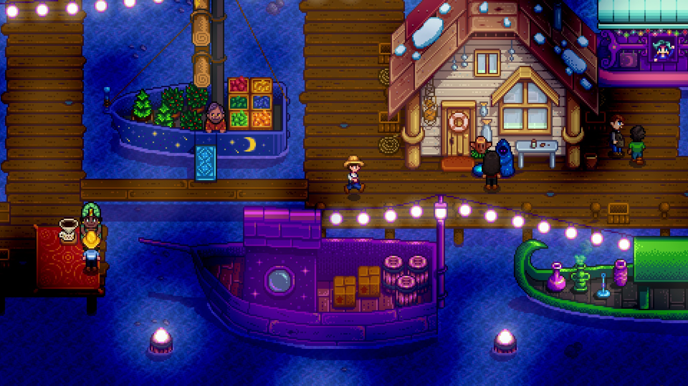

+++
title = "Le développeur de Stardew Valley a finalement platiné son propre jeu"
date = 2024-10-30T09:24:32+01:00
draft = false
author = "Mickael"
tags = ["Actu"]
type = "telex"
+++

La persévérance finit toujours par payer. Eric Barone, alias ConcernedApe, est finalement [parvenu](https://x.com/ConcernedApe/status/1851124749994455547) à taper les 100 % de succès dans *Stardew Valley*… son propre jeu, sorti il y a huit ans ! L'exploit n'est pas mince, puisque pour y parvenir il faut décrocher le redoutable succès « Fector's Challenge » : 1,2 % seulement des joueurs de la simulation de ferme y sont parvenus.

On décroche ce succès en battant le mini-jeu « Journey of the Prairie King » sans mourir. « *C'était une tentative légitime, sans mort* », assure Eric qui donne ce conseil à tous ceux qui voudraient se frotter au mini-jeu : « *Achetez le meilleur objet que vous pouvez vous permettre dans cet ordre : munitions > revolver > bottes. Gardez un bonus de mitrailleuse pour affronter Fector ; vous pouvez le neutraliser avant même qu'il ait la chance d'attaquer* ». Pas compliqué.