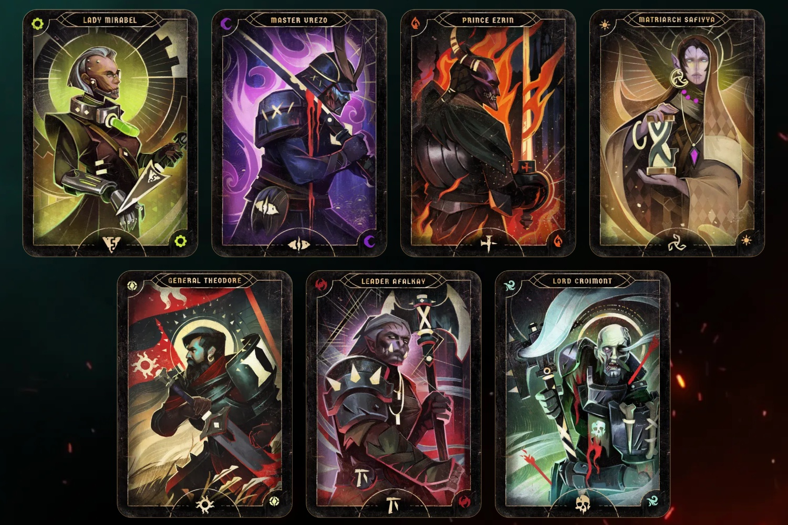
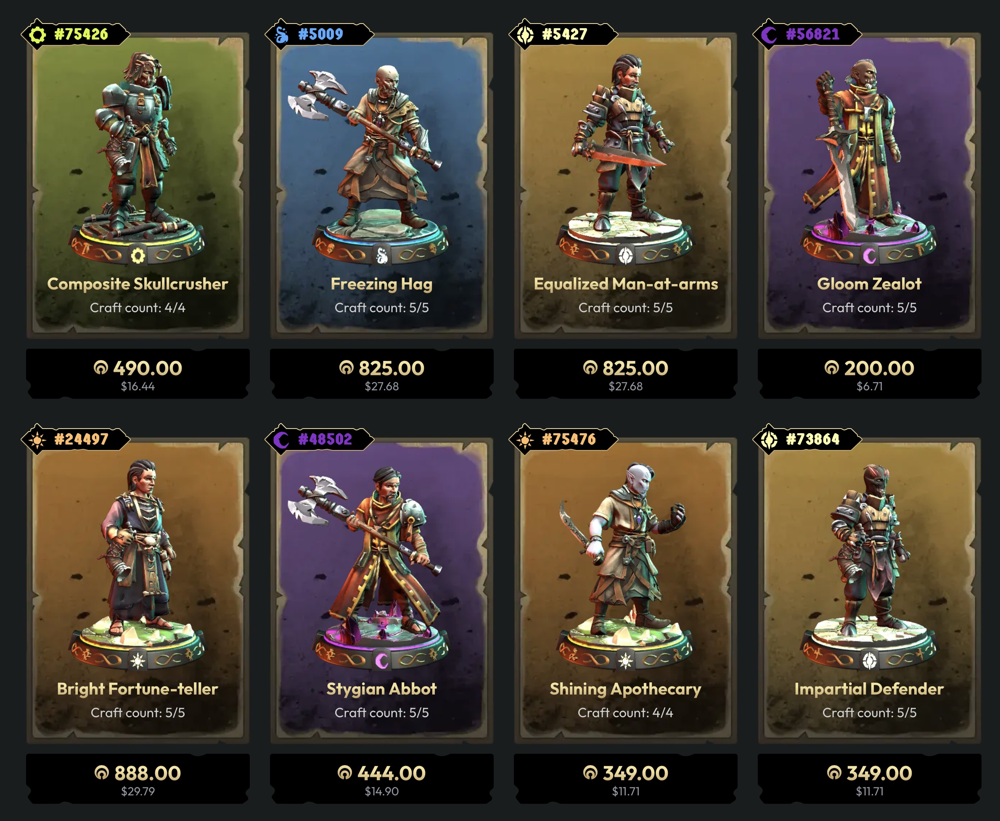

+++
title = "Ubisoft a discrètement lancé Champions Tactics, son nouveau jeu à base de NFT pourris"
date = 2024-10-30T08:06:32+01:00
draft = false
author = "Mickael"
tags = ["Actu"]
image = "https://nostick.fr/articles/vignettes/nostick.jpg"
+++

Toujours dans les bons coups, Ubisoft a lancé *Champions Tactics: Grimoria Chronicles* dans une discrétion tout à fait remarquable. Et pour une très bonne raison : ce RPG multijoueur au tour par tour est un jeu NFT ! Oui, l'éditeur n'a pas abandonné ses ambitions dans le web3, malgré le crash mérité de cette escroquerie.



Le jeu pour PC est gratuit au [téléchargement](https://championstactics.ubisoft.com), mais il nécessite un compte Ubisoft — jusque là, rien que de très normal — mais aussi une connexion à un wallet crypto, comme le raconte *[IGN](https://www.ign.com/articles/ubisoft-just-quietly-launched-a-full-blown-nft-game?utm_source=flipboard&utm_medium=activitypub)*. Le jeu tourne autour de combats de figurines, chacune ayant évidemment des caractéristiques et des capacités propres. Si le jeu donne au début quelques figurines gratuites, elles sont temporaires. 

Pour renforcer son deck, il faudra mettre la main à la poche et acheter (avec des cryptos ou l'argent du jeu) de nouvelles figurines qui ne sont autres que des NFT. Il est aussi possible de créer ses propres figurines. Un petit tour dans la boutique permet d'avoir une petite idée des prix pratiqués : cela va de 6,70 $ à 63 372 $ (!) pour un « [Swift Zealot](https://championstactics.ubisoft.com/items/champions/2107) » qui n'a même pas pour lui d'être joli.

Techniquement, il est possible de jouer à ce truc sans rien débourser, mais rapidement on risque de bloquer. *Champions Tactics* n'a aucun mode solo (à part le tuto), et les combats contre les ~~gogos~~ joueurs qui acceptent de raquer risquent de tourner court.

Le jeu a été développé par le studio parisien d'Ubisoft, où l'on jure que « *que l’utilisation de la blockchain contribue à offrir des expériences de jeu nouvelles et innovantes pour nos joueurs* ». Il fait miroiter des « *millions* » de figurines générées de manière procédurale, ainsi qu'un marché ouvert « *permettant aux joueurs de composer leurs équipes (…) à l’image d’un jeu de cartes à collectionner physique* ». Ça fait rêver.

Ubisoft a été un des premiers éditeurs à monter dans le wagon nauséabond des NFT, et à l'exception peut-être de Square Enix, c'est aussi un des derniers à être toujours investis dans le web3. Ubi avait ainsi lancé sa propre version des NFT, les « Quartz », qui ont fait long feu avec *Ghost Recon Breakpoint*. Pas de quoi décourager l'entreprise qui, il est vrai, [aime collectionner les casseroles](https://nostick.fr/articles/2024/septembre/2809-backlog-assassins-creed-shadows-frostpunk-2-musee-nintendo-tcg-card-shop-simulator/#la-grosse-info-de-la-semaine--comment-ça-va-mal-ubisoft-) — et pas virtuelles, celles-là.