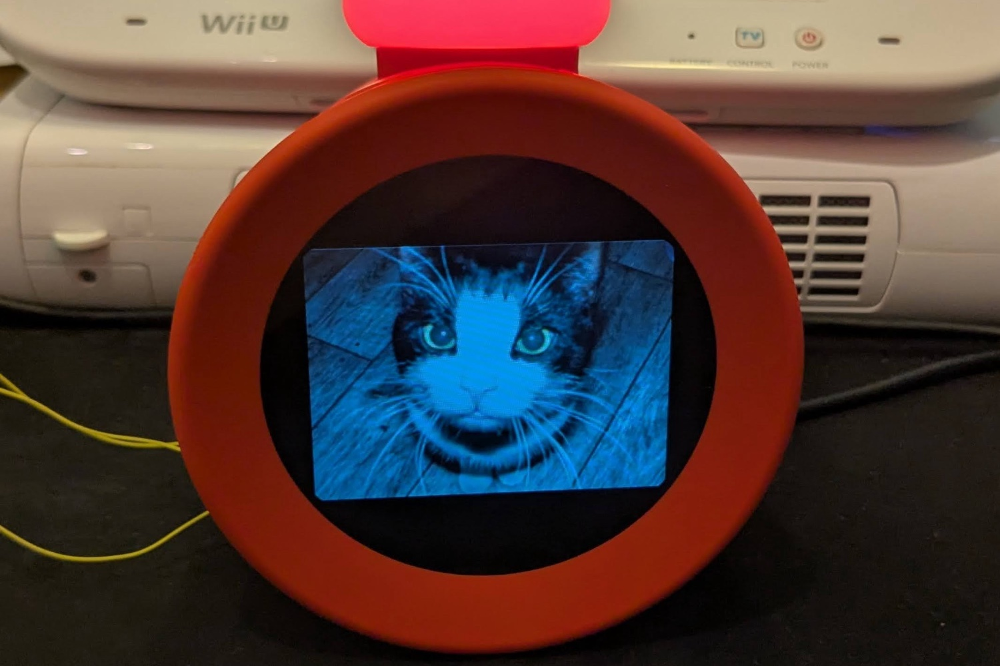

+++
title = "L'Alarmo est à deux doigts de faire tourner Doom"
date = 2024-10-31T08:07:32+01:00
draft = false
author = "Mickael"
tags = ["Actu"]
image = "https://nostick.fr/articles/vignettes/octobre/alarmo-hack.jpg"
+++

L'Alarmo ne sera pas vraiment pris au sérieux tant que *Doom* ne tournera pas dessus, comme bon nombre d'appareils ~~idiots~~ du même genre. Le [réveil de Nintendo](https://nostick.fr/articles/2024/octobre/0910-pas-de-switch-2-reveil-alarmo-nintendo/) n'est pas encore arrivé là, mais on s'en rapproche. Enfin, surtout le bidouilleur GaryOderNichts qui a pris son courage à deux mains pour ouvrir le bazar et l'étudier sous toutes les coutures.

Le réveil, dont on apprend qu'il embarque une mémoire eMMC de 4 Go, fonctionne avec un microcontrôleur STM32 fabriqué par STMicroelectronics, une puce solide et suffisamment puissante pour accomplir des tâches graphiques, et qu'on retrouve dans de nombreux appareils. Nintendo a certes placé des protections pour éviter qu'un curieux viennent fouiner dans la flash interne de l'Alarmo, mais la popularité de ce contrôleur fait que la documentation est largement disponible pour contourner ce genre de difficulté.



Les données du firmware ont pu être déchiffrées, et surtout le bricoleur a débusqué des failles dans les protections, ce qui lui permet d'exécuter du code simplement en passant par le port USB-C à l'arrière, sans avoir à démonter l'engin ! On peut alors transformer l'Alarmo en cadre photo, par exemple.

Les amateurs pourront [jeter un œil](https://garyodernichts.blogspot.com/2024/10/looking-into-nintendo-alarmo.html) et essayer de comprendre comment Gary est parvenu à réaliser son exploit. Il propose aussi sur [GitHub](https://github.com/GaryOderNichts/alarmo) le code qui permet d'afficher une photo de chat, en espérant que la communauté l'améliore pour multiplier les usages.