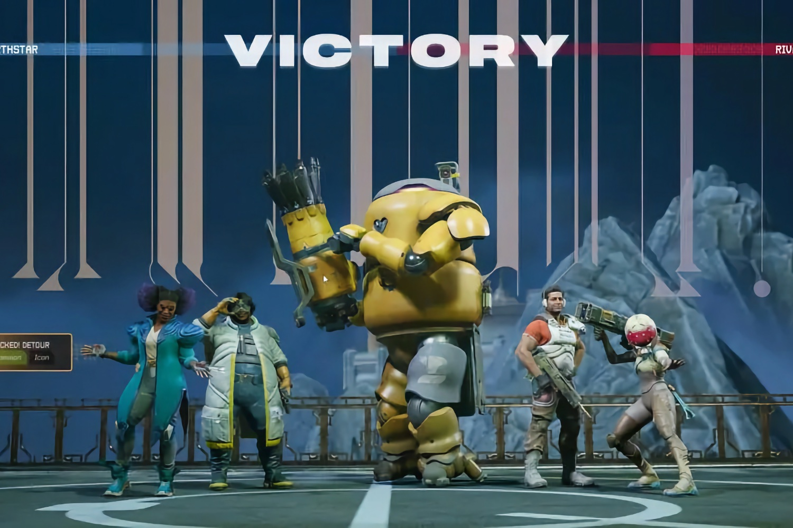
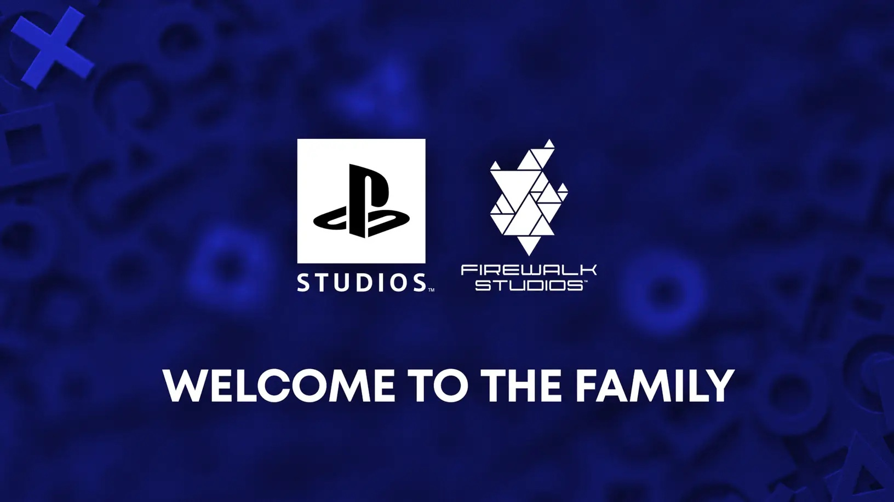
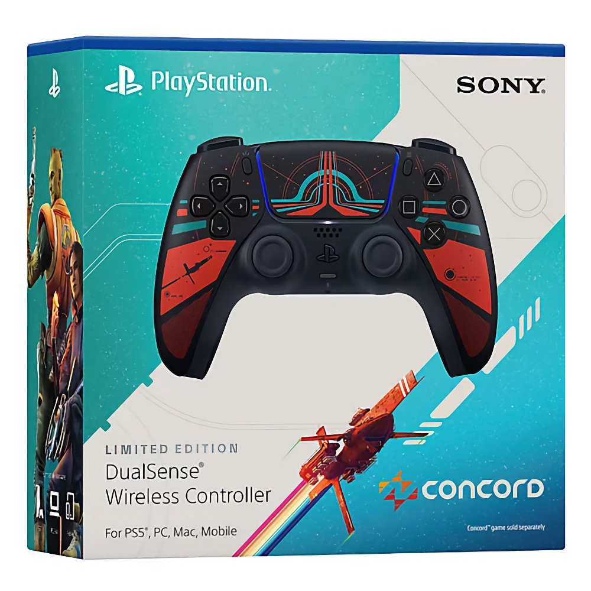

+++
title = "Concord : chronologie d'un désastre"
date = 2024-10-31T12:47:32+01:00
draft = false
author = "Mickael"
tags = ["XXL"]
type = "une"
image = "https://nostick.fr/articles/vignettes/octobre/concord-ps5.jpg"
+++

*Concord* restera dans les annales, mais certainement pas comme Sony l'avait espéré. À côté de l'*ET* d'Atari, le shooter développé par le studio Firewalk est un des plus gros flops de tous les temps, et son histoire alimentera sans aucun doute de nombreux livres et documentaires.

[La fermeture cette semaine du studio Firewalk](https://nostick.fr/articles/2024/octobre/2910-firewalk-studios-ferme-ses-portes/) clôt cette incroyable aventure ratée, qui méritait bien qu'on y revienne pas à pas.

## 2018

Cette histoire débute en 2018, lors de la création du studio Firewalk, à Bellevue (Washington). Dès le départ, l'idée du tout jeune studio est de développer un jeu multijoueur « *s'adressant au plus grand nombre* », qui deviendra *Concord*. 

À l'époque, l'idée est de travailler en collaboration avec [ProbablyMonsters](https://www.probablymonsters.com), un incubateur composé de développeurs spécialisés dans les AAA dont Firewalk est une des créations. La [mission](https://www.linkedin.com/company/probablymonsters/) de la maison-mère est de « *rassembler, guider et donner les moyens aux équipes talentueuses de redéfinir ce que signifie livrer des jeux exceptionnels au sein d'une culture de travail saine* ». Tout un programme !

Firewalk compte dans ses rangs des vétérans de Bungie, dont le patron Tony Hsu (il a été le directeur général de *Destiny* chez Activision) et le directeur du jeu Ryan Ellis, ancien directeur créatif chez Bungie. 

C'est sous la houlette de ProbablyMonsters que le studio commence à plancher sur son jeu. Des travaux préliminaires qui se déroulent sur quatre ans et qui occupe une toute petite équipe, avant que la production ne démarre réellement en 2022.

## 2021

Mais avant même que le chantier ne débute, Sony flaire la bonne affaire. En avril 2021, le constructeur et Firewalk [signent](https://www.gamesindustry.biz/playstation-signs-aaa-multiplayer-game-from-former-destiny-veterans) un accord : le jeu sera publié par PlayStation. 

Hermen Hulst, qui était alors le patron des studios PlayStation, considère alors ce « *partenariat stratégique* » comme un moyen « *d'explorer de nouveaux territoires* ». Il croyait alors dans la « *vision ambitieuse* » du studio pour son jeu multijoueur, qui offrira « *quelque chose de vraiment nouveau et enthousiasmant* ».

En coulisse, Sony mitonne une stratégie pour le moins ambitieuse : devenir une place forte du jeu service. La plateforme PlayStation est reconnue pour ses expériences solo, les fameux « walking dad simulators » que sont *Last of Us* et *God of War*, mais aussi des aventures à pratiquer seul comme *Horizon* ou *Spider-Man*. Ces jeux rapportent des brouettes de cash, mais ce n'est pas suffisant pour la direction de Sony qui lorgne très clairement du côté des jeux multi type *Overwatch*, *Fortnite*, *Apex Legends* et quelques autres.

## Février/mars 2022

Les pièces du puzzle commencent à se mettre en place en février 2022, d'abord avec [l'acquisition](https://www.bungie.net/7/en/News/article/50989) de Bungie pour 3,6 milliards de dollars ; puis, quelques jours plus tard, par [l'annonce choc](https://www.eurogamer.net/playstation-plans-to-launch-more-than-10-live-service-games-before-march-2026) d'Hiroki Totoki, alors directeur des opérations et président de Sony : « *Grâce à une collaboration étroite entre Bungie et PlayStation Studios, nous voulons lancer plus de 10 jeux services d'ici la fin de l'exercice fiscal en mars 2026.* »

Jim Ryan, à l'époque CEO de Sony Interactive Entertainment (SIE) et cheville ouvrière de la stratégie jeu service, en ajoute une louche le mois suivant : « *Ce phénomène des jeux service a, en grande partie, alimenté l’énorme croissance de l’industrie du jeu vidéo que nous avons observée au cours des dix dernières années* », [décrypte-t-il](https://www.gamesindustry.biz/playstations-jim-ryan-our-games-could-suffer-if-we-put-them-straight-into-ps-plus). Évoquant l'abonnement PS Plus, il assure que « *la tendance des services en ligne va se poursuivre* », mais surtout que « *les jeux service répondent sans doute mieux à ce critère [l'engagement soutenu sur le long terme] qu'un service d'abonnement* ».

Pleine vapeur vers l'eldorado de l'argent qui coule sans fin ! Et *Concord* devait en être une pièce maitresse.

## 2022/2023

Les développeurs de Firewalk ne se tournent pas les pouces. Il a fallu « *concevoir un moteur FPS de nouvelle génération sur mesure dans Unreal 4, puis 5* », [explique](https://x.com/FirewalkStudios/status/1851327043956592781) le compte Twitter de Firewalk dans son son ultime post. L'objectif était d'offrir aux joueurs une « *jouabilité optimale, des mondes magnifiques et une expérience technique de premier plan à 60 images par seconde sur une infrastructure stable et évolutive, sur PS5 et sur PC* ».

Et visiblement, ce travail séduit Sony, à tel point qu'en avril 2023, le groupe [annonce](https://blog.playstation.com/2023/04/20/welcoming-firewalk-studios-to-the-playstation-studios-family/) l'acquisition pure et simple de Firewalk. « *L'approche novatrice de Firewalk en matière de narration connectée et son engagement pour un gameplay de haute qualité continuent de dépasser nos attentes* », s'enthousiasme Hermen Hulst, qui pense que « *les fans seront ravis lorsqu’ils découvriront ce que Firewalk leur réserve* ».

« *Firewalk Studios est dirigé par une équipe de classe mondiale, hautement expérimentée et profondément passionnée par la création de jeux multijoueurs exceptionnels qui favorisent des expériences partagées inoubliables,* » déclare de son côté Jim Ryan. Le boss en est persuadé : « *le prochain projet du studio sera un ajout solide au portfolio de PlayStation, et son expertise en matière de service en ligne et de technologie sera déterminante pour aider à élargir la portée de PlayStation* ».

## 24 mai 2023

C'est peu dire que le State of Play du jour était attendu : Sony n'avait pas fait grand bruit en 2022 et les fans commençaient à sérieusement s'inquiéter du manque relatif de communication autour des prochains jeux PlayStation. 

Mais au lieu de leur servir les milles et une merveilles attendues chez Sucker Punch (*Ghost of Tsushima*) ou Naughty Dog (*The Last of Us*), Sony met le paquet sur ses jeux services : *Fairgame$* et donc, *Concord*. Ni l'un ni l'autre n'ont su convaincre avec des bandes annonces *full CGI* ne révélant rien de leur gameplay.

 

Peu de joueurs étaient convaincus du bien-fondé de la stratégie jeu service de Sony jusqu'à présent ; mais c'est à partir de ce State of Play que les choses ont commencé à sérieusement s'aggraver pour *Concord*. Et malheureusement, ça ne s'est pas arrangé au fil des trailers et des annonces qui ont suivi.

## 6 juin 2024

Jour des [précommandes](https://www.pushsquare.com/news/2024/06/sonys-new-ps5-pc-shooter-concord-confirmed-as-a-usd40-game) : on sait finalement que *Concord* ne sera pas un free-to-play, mais un jeu payant. 40 $, c'est toujours moins que les 70 $ d'un jeu classique, mais c'est aussi 40 $ de trop pour beaucoup de joueurs biberonnés aux shooters en tout genre complètement gratuits. *Concord* doit non seulement se battre sur le terrain du prix, mais aussi de l'univers : celui du jeu est complètement inédit, il ne repose sur aucune franchise connue… si ce n'est, peut-être, celle d'une version Wish des *Gardiens de la Galaxie*.

## 12 au 21 juillet 2024

PlayStation organise deux bêtas pour *Concord* sur deux week-end. Les joueurs qui ont précommandé le jeu ont droit à un accès anticipé le premier week-end, le second est ouvert à tous, sur PS5 comme sur PC. La veille du premier week-end, Sony change en catastrophe son fusil d'épaule, en [ouvrant](https://blog.playstation.com/2024/07/11/concord-beta-early-access-preload-and-server-times-pc-specs-and-more-detailed/) l'accès aux membres PS Plus, probablement au vu du faible volume de précos. Cette première salve de test est aussi [prolongée](https://x.com/PlayConcord/status/1812564007250792524) d'une journée.

## 22 juillet 2024 

Les premiers chiffres ne sont guère encourageants après le second week-end d'accès anticipé. Sur Steam, [*Concord* n'a pas dépassé les 2 400 joueurs](https://nostick.fr/articles/2024/juillet/2207-concord-playstation-flop/) en simultané, alors qu'il était ouvert à tous, et gratuit. Mais Steam ne prend en compte que les joueurs PC… Les joueurs PS5 ont sûrement compensé. Hein ? Hein ?

Haut les cœurs ! En indécrottables optimistes, nous écrivions alors que Sony avait encore quelques semaines pour faire monter la sauce, avant le lancement du jeu le 23 août. Et puis PlayStation a [dévoilé](https://direct.playstation.com/en-us/buy-accessories/dualsense-wireless-controller-concord-limited-edition?clickref=1101lzRtW5X4&emcid=ot-ps-456950) une DualSense édition spéciale aux couleurs de *Concord*, c'est bien qu'ils y croient !

## 23 août 2024

C'est le grand jour pour *Concord*, qui doit se débarrasser de l'étiquette de vilain petit canard que lui ont collé des joueurs déçus de voir PlayStation tremper dans le jeu service. Il y a de l'espoir : les previews et les premiers tests de la presse sont encourageants, le gameplay est plutôt apprécié et on relève quelques idées originales.

Mais il y a quelque chose qui cloche. Sony ne s'est pas foulé pour la promo, se contentant de mettre en ligne des petits trailers pour présenter les personnages du jeu[^1]. Mais pas de gros push, pas de coup d'éclat marketing à la *Spider-Man*. Curieux…

Ce qui devait devenir le triomphe de la stratégie jeu service soigneusement mise en place ces dernières années se transforme en cauchemar dès les premières heures du lancement.

## 24 août 2024

Qui en 2024 a envie d'un hero shooter à 5 contre 5, un genre qui a atteint un pic 8 ans auparavant avec *Overwatch* ? Réponse : pas grand monde.

Le lendemain de fête se transforme en gueule de bois. Sur Steam, [le jeu n'a pas franchi la barre des 700 joueurs](https://nostick.fr/articles/2024/aout/2408-concord-se-crashe-au-decollage/), un score misérable qui fait passer les 6 000 joueurs du flop patenté *Redfall* pour un triomphe historique.

## 31 août 2024

Alors que *Concord* a déjà disparu du paysage, une estimation du nombre de ventes du jeu donne le bourdon : selon l'analyste Simon Carless, [PlayStation aurait vendu 10 000 copies sur Steam, 15 000 sur PS5](https://nostick.fr/articles/2024/aout/3108-concord-25000-copies-playstation/). *Redfall*, encore lui, avait eu la décence d'atteindre les 70 000 copies…

## 3 septembre 2024

C'est la fin. [Sony annonce que *Concord* sera débranché le 6 septembre](https://nostick.fr/articles/2024/septembre/0309-sony-concord-debranche-serveurs-rembourse-joueurs/), deux semaines après le lancement du jeu. Le constructeur rembourse les joueurs, mais Firewalk laisse planer la possibilité d'un retour sous une forme ou sous une autre — en free-to-play ?

## 29 octobre 2024

Il n'en sera rien, [Sony décide de fermer purement et simplement Firewalk](https://nostick.fr/articles/2024/octobre/2910-firewalk-studios-ferme-ses-portes/), 18 mois seulement après l'acquisition du studio. Les quelque 200 employés se font montrer la porte de sortie, certains pouvant se recaser au sein des studios PlayStation.

« *Le genre des jeux de tir à la première personne en PvP est un secteur très concurrentiel en constante évolution* », explique Hermen Hulst, devenu co-CEO de SIE en charge de l'activité studios. « *Malheureusement, nous n'avons pas atteint nos objectifs avec ce titre* », euphémise-t-il.

« *Nous tirerons les leçons de Concord* », assure celui qui a poussé si fort pour *Concord*, jusqu'à racheter le studio. Ce qui signifie que Sony revoit sa stratégie ? La suite de la déclaration ne laisse rien présager de tel : « *[nous]  continuerons à développer nos capacités de jeux services pour favoriser une croissance future dans ce secteur* ». Bon courage avec ça.

## Épilogue

Au bout du compte, ce flop aura coûté cher à Sony : selon *[Kotaku](https://kotaku.com/firewalk-studios-concord-ps5-sony-live-service-shutdown-1851684290)*, le budget pour le développement de *Concord* se montait à 200 millions de dollars. Mais l'enveloppe n'a pas suffi et il a fallu rallonger la sauce pour couvrir non seulement le reste du développement, mais aussi l'achat de la propriété intellectuelle auprès de Firewalk.

Pire encore que les pertes financières : l'image de marque de PlayStation est pour toujours entachée par le fiasco magistral de *Concord*. Le constructeur s'en remettra, mais cette histoire marque très certainement le début de la fin pour la stratégie du jeu service imaginée par les pontes de Sony qui n'ont rien vu venir… ou qui ont refusé de voir les signes avant-coureurs de cette catastrophe.

Il se murmure qu'en interne, à l'époque où tout roulait chez Firewalk, *Concord* était même [présenté](https://x.com/longislandviper/status/183715779613703014) comme le « *futur de PlayStation* ». Le futur s'est pris le mur de la réalité en pleine face.

[^1]: Ce qui permet à la frange la plus raciste de Twitter et Reddit de s'en donner à cœur joie.