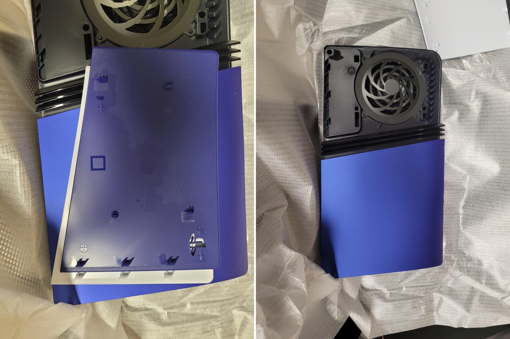

+++
title = "Les façades de la PS5 ne sont pas compatibles avec la PS5 Pro"
date = 2024-10-31T08:20:32+01:00
draft = false
author = "Mickael"
tags = ["Actu"]
type = "telex"
+++

Les impatients qui attendent que leur PS5 Pro arrive sur le pas de leur porte (elle sortira le 7 novembre) doivent absolument éviter d'acheter des façades PS5 dans l'espoir qu'elles soient compatibles avec la nouvelle console. Car ça ne sera pas le cas ! 

 

Sur [Reddit](https://www.reddit.com/r/playstation/comments/1gfr6ot/playstation_5_pro_does_not_work_with_the_slim/), Zrorro a eu l'occasion d'approcher une PS5 Pro et il a eu l'idée de tester une façade cobalt de PS5 Slim. Si les plaques inférieures sont compatibles (😆), ce n'est pas le cas des plaques supérieures (🤬). « *Les encoches qui se connectent au système sont placées légèrement différemment* », explique-t-il au grand désespoir de tous.

*IGN* a [reçu](https://www.ign.com/articles/ps5-plates-wont-work-on-ps5-pro-sony-says-updated-covers-will-be-available-in-the-future) la confirmation officielle de Sony : « *Les façades de PS5 ne sont pas compatibles avec la PS5 Pro* ». Bouh ! En revanche et puisqu'il n'y a pas de petit profit, « *les joueurs pourront remplacer les coques de la PS5 Pro par d'autres modèles lorsqu'ils seront disponibles à l'avenir* ». Il y aura donc des façades pour la Pro, c'est déjà ça.