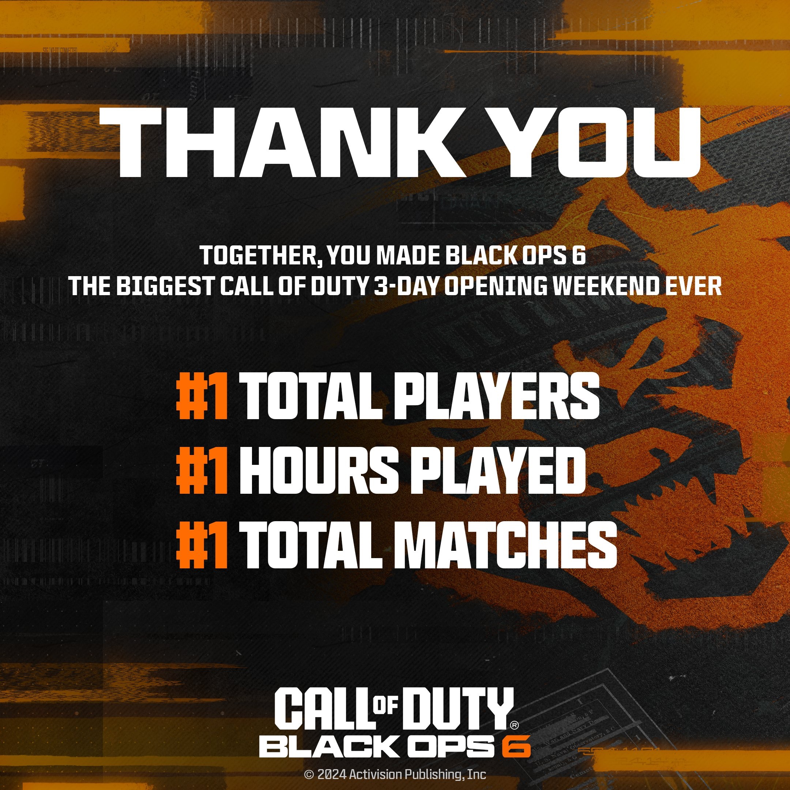

+++
title = "Xbox vend toujours plus de jeux, mais toujours moins de consoles"
date = 2024-10-31T08:17:32+01:00
draft = false
author = "Mickael"
tags = ["Actu"]
image = "https://nostick.fr/articles/vignettes/octobre/xbox.jpg"
+++

")

Arrêtez moi si vous avez déjà entendu ce refrain : Microsoft vend des jeux mais plus de consoles. Les résultats du troisième trimestre, c'est à dire l'été dernier, ont fait honneur à cette maxime. Les ventes de contenus et de services Xbox ont [grimpé](https://www.microsoft.com/en-us/Investor/earnings/FY-2025-Q1/press-release-webcast) de 61 % par rapport à l'an dernier, alors que les revenus tirés des ventes de consoles et de matos Xbox ont chuté de 29 %.

La hausse vertigineuse des ventes de jeux et de services est majoritairement attribuable à l'acquisition d'Activision ([dont on a fêté le premier anniversaire récemment](https://nostick.fr/articles/2024/octobre/1910-backlog-life-is-strange-atari-xbox--activision-ps5-pro/#le-gros-anniversaire-de-la-semaine--il-y-a-un-an-microsoft-achetait-activision-et-maintenant-)). L'éditeur a contribué à hauteur de 53 points à la hausse du chiffre d'affaires Xbox.

Ce n'est pas une surprise : [Microsoft se désintéresse du matériel](https://nostick.fr/articles/2024/juillet/2207-xbox-europe-aumone-pub/) et met le paquet sur les jeux, sans chapelle ni exclusive. D'où le portage de plusieurs jeux Xbox sur Switch et PlayStation en début d'année, et le rythme va se poursuivre et s'amplifier l'année prochaine. Il faut bien rentabiliser les 69 milliards de dollars de l'achat d'Activision, et ce n'est pas avec les 30 millions de Xbox en circulation que les sous vont rentrer en masse.

Pour le dernier *Call of Duty*, [c'est en tout cas bien parti](https://nostick.fr/articles/2024/octobre/2910-call-of-duty-black-ops-6-microsoft-reussi/) (c'est vrai qu'il est difficile de se planter avec un tel jeu). *Black Ops 6*, sorti la semaine dernière, a battu tous les records en nombre total de joueurs, en heures jouées et en matchs multi a [annoncé](https://x.com/CallofDuty/status/1851753565900927282) Activision. C'est tout simplement le plus gros lancement d'un *Call of* pour son premier week-end.

Satya Nadella, le patron de Microsoft, s'est de son côté réjoui des ventes en hausse de 60 % sur PlayStation et Steam par rapport à *Modern Warfare III*. Bon bin vous pouvez toujours essayer de refourguer votre Xbox sur Leboncoin.