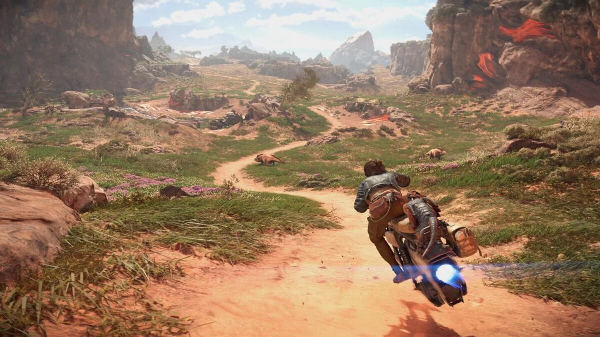
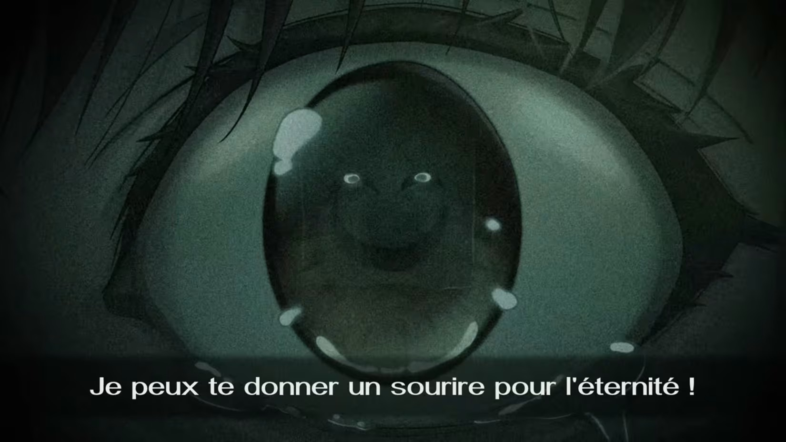

+++
title = "Star Wars Outlaws, Visions of Mana : le récap des sorties de la semaine (01/09)"
date = 2024-09-01T02:30:02+01:00
draft = false
author = "Félix"
tags = ["C’est dispo"]
image = "https://nostick.fr/articles/2024/0109-les-sorties-de-la-semaine/star.jpeg"
+++

Entre la garderie, les courses et la reprise qui approche, vous n’avez peut-être pas eu le temps de vous intéresser aux nouveautés du moment. Qu’à cela ne tienne : voici les sorties de ces derniers jours qui ont retenu notre attention.

## Ubisoft atteint presque les étoiles

C’est quasiment la rentrée, les AAA se multiplient : après *Black Myth : Wukong* la semaine dernière, voici venir ***Star Wars Outlaws***, le nouveau gros jeu d’Ubisoft. Il s’agit d’un open world laissant explorer 4 planètes allant du désert de Tatooine aux immenses forêts d'Akiva. Les zones sont denses sans être gigantesques, et les [tests](https://www.gamekult.com/jeux/star-wars-outlaws-3050886905/test.html) décrivent un univers maîtrisé avec un paquet d’activités annexes poussant à sortir des sentiers battus. D’un autre côté, le jeu ne réinvente pas la roue et plusieurs journalistes déplorent des mécaniques de gameplay assez superficielles ainsi qu’un [gros lot de bugs](https://nostick.fr/articles/2024/aout/2908-certains-joueur-star-wars-outlwas-vont-devoir-recommencer-partie/) au lancement. Bref, ça a l’air d’être du blockbuster classique, mais efficace qui devrait surtout ravir les fans de la franchise ou ceux qui sont réceptifs à son univers. On regrettera que le titre ne soit disponible sur PC que via [le launcher Ubi](https://store.ubisoft.com/fr/star-wars-outlaws/645ba713a9ce0448bffa4c12.html) ou Epic ainsi que le tarif zinzin de l’édition Ultimate (140 €) : les fans de Star Wars ont l’habitude de souffrir, mais quand même. Également dispo sur PS5/Xbox.

## Visions troubles

Si vous commenciez à être en manque de JRPG, le coloré ***Visions of Mana*** va peut-être vous donner une occasion de replonger. Il s’agit du nouvel opus de la série des Mana de Square Enix, qui arrive presque 20 ans après le précédent. On y incarne Val, un gardien chargé d’amener une équipe prête à se sacrifier pour le légendaire Arbre de Mana. Les attentes sur ce titre étaient hautes pour un résultat mi-figue mi-raisin. Le jeu a été bien accueilli par une partie la critique, louant une chouette histoire et un système de combat sympa. Les graphismes sont visiblement très jolis avec un casting de personnages attachants. Certains testeurs restent mesurés et n’ont pas accroché, se plaignant d’un scénario qui traîne en longueur et de quêtes secondaires pas très intéressantes. Bref, ça a l’air OK sans plus et les moins accrocs au genre pourront sans doute attendre quelques mois qu’une promo se pointe ou patienter avec la démo. 60 € sur [Steam](https://store.steampowered.com/app/2490990/Visions_of_Mana/), aussi dispo sur PS5 et Xbox.

 

## Fini de rire

Ce n’est pas tous les jours que Nintendo lance un jeu interdit aux moins de 18 ans ! Le troisième ([quatrième](https://nostick.fr/articles/2024/juillet/2307-sattelaview-console-oubliee-nintendo/) en fait) opus de la saga *Famicom Detective Club* baptisé ***Emio - L'Homme au sourire*** est sorti cette semaine. On doit y résoudre un intrigant mystère autour d’une légende urbaine sanglante semblant devenir réalité. C’est du visual novel à l’ancienne dans lequel on passe son temps à appuyer sur A pour lire la suite et cliquer sur des éléments du décor pour faire avancer le schmilblick. Si vous n’êtes pas forcément fan du genre, *Famicom Detective Club* est un bon moyen de s’initier : c’est pas trop compliqué à suivre, les différents tableaux sont très beaux et les personnages sont animés en plus d’être doublés en japonais. L’histoire glauque de ce nouvel épisode a convaincu les testeurs et devrait vous occuper une douzaine d’heures. Il y a une traduction en français, contrairement au remake [des deux premiers volets](https://www.nintendo.com/fr-fr/Jeux/Jeux-a-telecharger-sur-Nintendo-Switch/Famicom-Detective-Club-The-Missing-Heir-Famicom-Detective-Club-The-Girl-Who-Stands-Behind-1923576.html?srsltid=AfmBOorEfucSrlWe_9-JL2VGNMrLk3PPU9jsmLWvp8GUu6yhZeatrFro) lancé en 2021 qu’il n’est pas obligatoire d’avoir lus pour comprendre celui-là. Bref, un bon polar de fin d’été malheureusement vendu au prix fort de 50 € et uniquement [sur Switch](https://www.nintendo.com/fr-fr/Jeux/Jeux-Nintendo-Switch/Emio-L-Homme-au-sourire-Famicom-Detective-Club-2615498.html).

 
## 9 vies moins une

Au printemps dernier j’ai passé pas mal de temps sur *[Death’s Door](https://www.playdeathsdoor.com)*, un excellent metroidvania disponible sur tablette via Netflix dans lequel on incarne un corbeau-faucheuse chargé de moissonner les âmes des défunts. Malheureusement, l’ex-coloc qui payait le compte Netflix a fermé les vannes du jour au lendemain, bloquant définitivement ma sauvegarde et me laissant en soif de metroidvania morbido-mignon. ***Crypt Custodian*** va peut-être pouvoir combler ce vide : on y contrôle Pluto, un chat ayant perdu la vie et devant explorer un au-delà bourré de puzzles et de différents ennemis. Ça semble bien fichu avec une patte graphique agréable à l'œil et des personnages attachants. Les tests sont bons et décrivent un jeu complet, bien fini et pas prise de tête qui a l’air de largement mériter les 20 € demandés sur [Steam](https://store.steampowered.com/app/2394650/Crypt_Custodian/). Aussi dispo sur toutes les consoles, même la Switch.

 

## Il en reste un peu, je vous l’mets quand même ?

Et si au lieu de passer votre mois de septembre derrière votre bureau d’expert-comptable en banlieue vous restiez enfermé à la maison pour vous remettre à ***WoW*** ? L’idée est séduisante, d’autant plus que Blizzard vient de lancer la dixième extension pour son increvable MMORPG qui ne coûte [que 50 €](https://eu.shop.battle.net/fr-fr/product/world-of-warcraft-the-war-within). Et quitte à parler de rechutes, ***Vampire Survivors*** est désormais disponible sur PlayStation, soit la dernière plateforme sur laquelle je ne pouvais pas y jouer après l’écran de mon frigo connecté ou mon Apple Watch. Enfin, on notera aussi la sortie cette semaine d’**Akimbot**, un [plateformer 3D](https://store.steampowered.com/app/1843540/Akimbot/) qui puise son inspiration du côté des *Ratchet & Clank* de la PS2 plutôt bien accueilli par les joueurs.