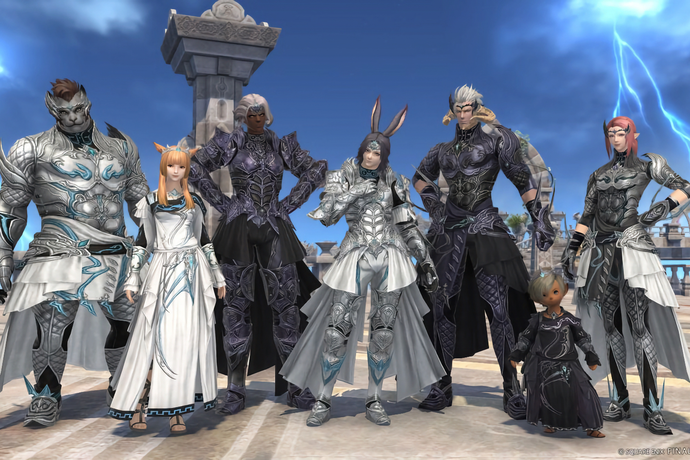

+++
title = "Final Fantasy XIV sur Switch ? Et pourquoi pas"
date = 2024-09-02T00:02:32+01:00
draft = false
author = "Mickael"
tags = ["Actu"]
image = "https://nostick.fr/articles/vignettes/septembre/ff14.jpg"
+++

*Final Fantasy XIV* ne connait pas de limites. Le MMORPG de Square Enix, sorti en 2010, est (finalement !) [disponible depuis mars sur Xbox](https://nostick.fr/articles/2024/aout/3108-backlog/#la-bonne-nouvelle-de-la-semaine--square-enix-veut-plus-de-final-fantasy-sur-xbox), mais il manque au tableau une console : la Switch, bien sûr. À première vue, voir un tel monstre sur la petite console hybride de Nintendo semble difficile, mais cela n'a pas l'air d'effrayer Naoki Yoshida, codirecteur du jeu.

Dans une interview à la chaîne *Easy Allies*, Yoshida [explique](https://www.youtube.com/watch?v=cUqkL0aGL4M) que son objectif ultime est que tout le monde puisse accéder au jeu, peu importe l'appareil. « *Nous avons discuté pendant des années pour porter le jeu sur la plateforme Xbox, et bien sûr, nous aimerions que le titre soit également disponible sur la plateforme de Nintendo* », indique-t-il.

Néanmoins, « *cela a pris beaucoup de temps* », en prenant en exemple le portage de *FFXIV* sur Xbox. « *Nous allons faire de notre mieux, continuer à travailler dur et à persévérer dans nos efforts. Un jour, ce serait génial [de jouer à FFXIV sur Switch] – quelque chose que nous aimerions explorer et réaliser* ». La Switch vivant ses derniers mois, il n'est pas impossible que cet épisode de *Final Fantasy* soit proposé sur la Switch 2.

Malgré tout, Square Enix ne voudra peut-être pas mettre de côté la centaine de millions de joueurs Switch actuels ; tous ne basculeront pas tout de suite sur la nouvelle console. Alors qui sait ?