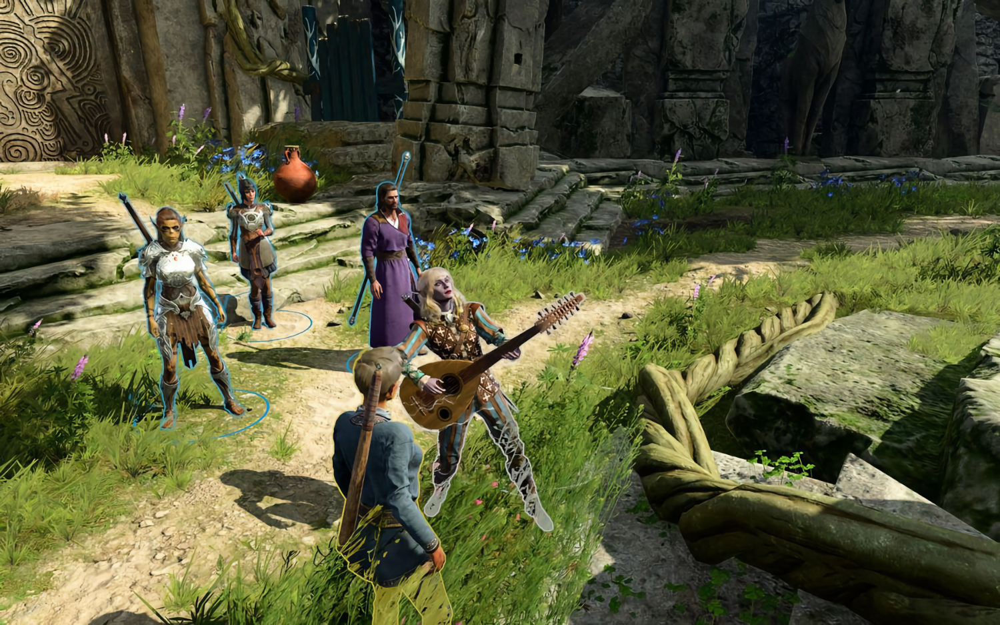

+++
title = "Le gros patch 7 pour Baldur's Gate 3 ne va plus tarder"
date = 2024-09-02T00:01:32+01:00
draft = false
author = "Mickael"
tags = ["Actu"]
type = "telex"
+++

Les aventuriers l'attendaient avec grande impatience mais enfin, les voilà récompensés : Larian lâchera le patch 7 de *Baldur's Gate 3* cette semaine ! Bon, on n'a pas le jour précis, mais l'insupportable attente sera bientôt terminée a [annoncé](https://www.youtube.com/watch?v=gVIYrwn6y9c) Swen Vincke, le fondateur du studio, durant une rétrospective BG3 à PAX West.

Ce patch 7 est attendu comme le loup blanc et pour cause : les nouveautés et changements sont de taille, comme un split screen un peu plus intelligent pour le mode coop, de nouvelles cinématiques pour les héros les plus méchants (il en faut pour tous les goûts), le fameux gestionnaire de mods et véritablement [UNE TONNE de trucs en plus](https://baldursgate3.game/news/closed-beta-delay-patch-7-highlights_120).

La suite pour BG3 sera un peu plus calme, Larian prévoyant de lever le pied. Il y aura toujours des petites mises à jour, mais désormais c'est surtout la communauté qui va être chargée de faire vivre le jeu au travers des mods.