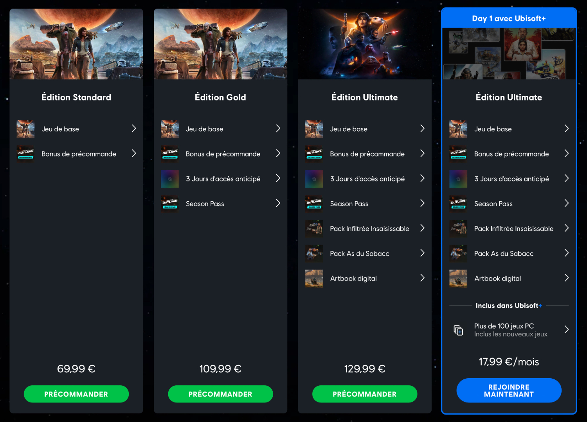

+++
title = "Ça pousse encore pour augmenter les prix des jeux"
date = 2024-09-02T08:01:32+01:00
draft = false
author = "Mickael"
tags = ["Actu"]
image = "https://nostick.fr/articles/vignettes/aout/borne-mario.jpg"
+++

") 

Les jeux vidéo [coûtent-ils trop cher… ou pas assez](https://nostick.fr/articles/2024/avril/1704-les-jeux-vidéo-coûtent-ils-vraiment-trop-cher-/) ? Le débat fait rage entre les joueurs qui s'estiment pressurés, et les éditeurs qui font face à des budgets toujours plus importants pour sortir des AAA. Michael Douse, directeur des éditions de *Baldur's Gate 3*, y est allé de son commentaire sur ~~cette merde de~~ Twitter en [s'appuyant](https://x.com/Cromwelp/status/1828077545100542195) sur l'exemple de l'édition ultime de *Star Wars Outlaws*.

Cette édition comprend le jeu de base, mais aussi des bonus de préco, l'accès anticipé de 3 jours, le season pass, des bundles de cosmétiques et un art book numérique. Le tout pour la bagatelle de 130 €. « *On gonfle le prix de base pour vendre un abonnement [le season pass] et des promesses vagues de contenu supplémentaire pour augmenter le prix des éditions ultimes, ce qui rend le prix de base plus attractif* », attaque-t-il.

 

Cette pratique, qui n'est pas l'apanage d'Ubisoft — Larian aussi a multiplié les éditions spéciales — lui semble « *dangereuse et déconnectée de la communauté* ». Selon Douse, un jeu devrait être tarifé « *en fonction de sa qualité, de son ampleur et de sa profondeur* ». Reste à déterminer les critères qui justifieront un prix plus élevé pour le jeu de base, et c'est bien là le dilemme de l'industrie.

Les éditeurs ne parviendront pas à imposer des hausses de prix « *avec des promesses de DLC* ». Pour lui, « *presque tous les jeux devraient coûter plus cher à la base* » : le coût de production, et cela inclue l'inflation qui a explosé ces dernières années, « *dépasse les tendances actuelles en matière de prix* ». Alors, comment faire ? Michael Douse a une petite idée : « *Tout le monde attend juste que GTA6 montre l'exemple, lol* ».

Le jeu miracle de Rockstar édité par Take-Two pourrait-il franchir la barre des 70 $ pour le jeu de base ? C'est à peu près le seul éditeur qui pourrait se le permettre, et les joueurs seraient probablement ravis de payer plus cher pour une nouvelle « expérience » GTA. Une fois l'abcès crevé, ce sera sans doute plus facile pour d'autres studios de relever leurs prix.

Le budget de développement d'un jeu AAA a été multiplié par 10 en 15 ans, [relevait](https://www.ft.com/content/839654c9-f8a2-4e73-a9dd-76a5584f7d1d) une analyse de JPMorgan en début d'année ; quant aux prix de ces mêmes jeux, sur la même période, ils se sont contentés d'augmenter de 17 % (en passant de 60 à 70 $). Rien d'étonnant donc de voir les éditeurs tester mille et une astuces pour gonfler leurs tarifs, souvent artificiellement.