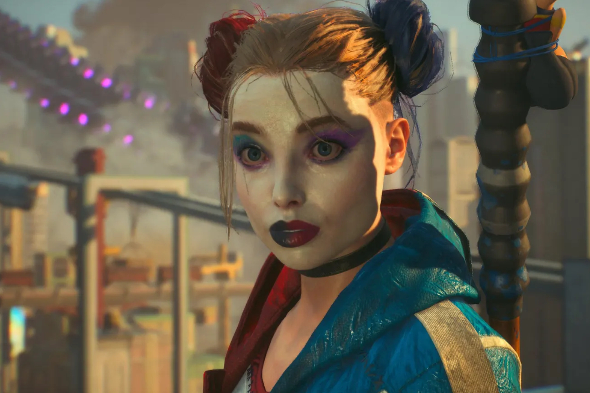

+++
title = "Rocksteady dégraisse après le fiasco Suicide Squad"
date = 2024-09-02T10:44:32+01:00
draft = false
author = "Mickael"
tags = ["Actu"]
type = "telex"
+++

*Suicide Squad: Kill the Justice League* ne sera pas [le plus gros four de l'année](https://nostick.fr/articles/2024/juillet/1507-test-suicide-squad-kill-the-justice-league/) — [Concord est en bonne position](https://nostick.fr/articles/2024/aout/3108-concord-25000-copies-playstation/) — mais ça ne sera pas un lot de consolation pour les salariés de Rocksteady licenciés à cause du flop du jeu. *Eurogamer* [rapporte](https://www.eurogamer.net/rocksteady-hit-by-layoffs-after-suicide-squad-kill-the-justice-league-underperforms) que l'équipe assurance qualité (QA) du studio a été décimée ces dernières semaines : la moitié des effectifs a été remerciée, en passant de 33 à 15 personnes.

Les ventes misérables du jeu sont la raison principale de cette restructuration qui touche aussi la communication et le marketing. Cela parait peu en regard des pertes enregistrées par Warner Bros. (200 millions de dollars), mais évidemment c'est un choc pour l'entreprise. Ce d'autant que la charrette concerne des employés de longue date ayant une grosse expérience dans la détection de bugs, la vérification des fonctions et les tests de compatibilité. Et on imagine que Rocksteady n'a pas fini de payer les pots cassés.