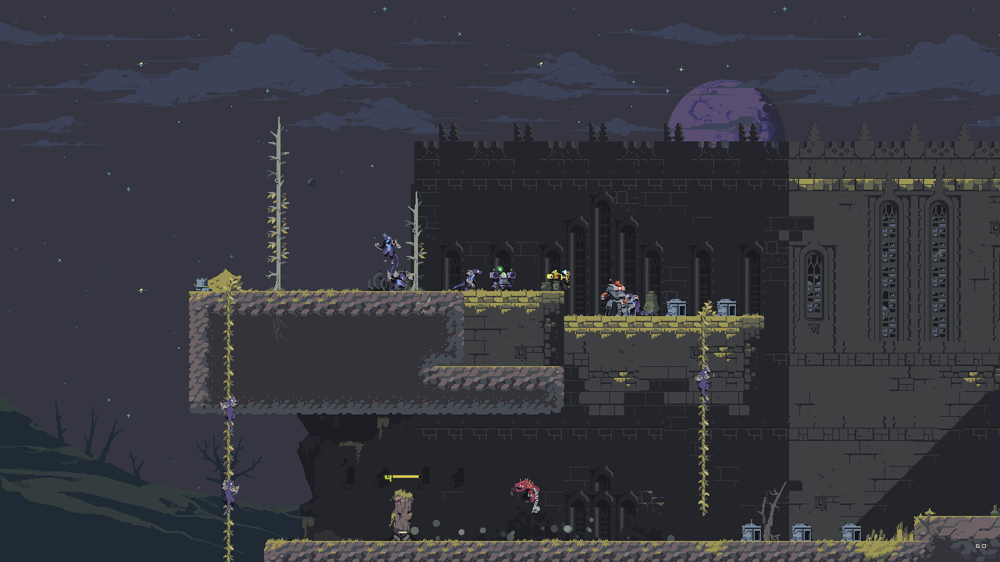

+++
title = "Les développeurs de Risk of Rain tirent le rideau et partent chez Valve"
date = 2024-09-03T17:00:32+01:00
draft = false
author = "Félix"
tags = ["Actu"]
image = "https://nostick.fr/articles/vignettes/aout/borne-mario.jpg"
+++

 

La direction de Valve ne se contente pas de ranger les palettes de billets que lui rapporte Steam toute la journée : parfois, elle décide aussi de racheter un studio. On l’a vu en 2018 avec l’acquisition de Campo Santo (*Firewatch*), et c’est aujourd’hui les développeurs de *Risk of Rain* et de *Deadbolt* qui vont rejoindre le navire. Hopoo Games a partagé la bonne nouvelle sur [Twitter](https://x.com/hopoogames/status/1830763152818217461), annonçant au passage entrer en hibernation et avoir abandonné son futur gros projet appelé « Snail ».

Le premier *Risk of Rain* avait fait du bruit à sa sortie et est rapidement devenu une référence du roguelike. Une version améliorée est parue l’année dernière tandis qu’Hopoo Games a également lancé une suite avec un premier DLC. La licence a depuis été vendue à Gearbox en 2022, qui a lancé la semaine dernière un second DLC… qui se fait [défoncer](https://store.steampowered.com/app/2306620/Risk_of_Rain_2_Seekers_of_the_Storm/) par les joueurs. Entre ça et la fermeture du studio originel, ça ne sent pas bon pour les fans de *Risk of Rain*.

Si le communiqué insiste sur la fin de l’aventure Hopoo Games, il se veut rassurant : « *Nous aimons créer des jeux - et nous continuerons à le faire dans les années à venir* ». Mais sur quoi vont-ils plancher chez Valve ? Il y a bien du boulot à faire sur *Deadlock*, le nouveau hero-shooter [officialisé](https://nostick.fr/articles/2024/aout/2308-valve-officialise-deadlock/) il y a peu. Des rumeurs sur un nouvel opus *Half-Life* ont aussi fait du bruit ces derniers temps, une doubleuse ayant [révélé](https://www.reddit.com/r/GamingLeaksAndRumours/comments/1ek3943/valve_is_working_on_a_title_under_the_codename/) avoir travaillé pour Valve sur un bien mystérieux projet appelé *White Sand*… un parc du Nouveau-Mexique, où se trouve Black Mesa.