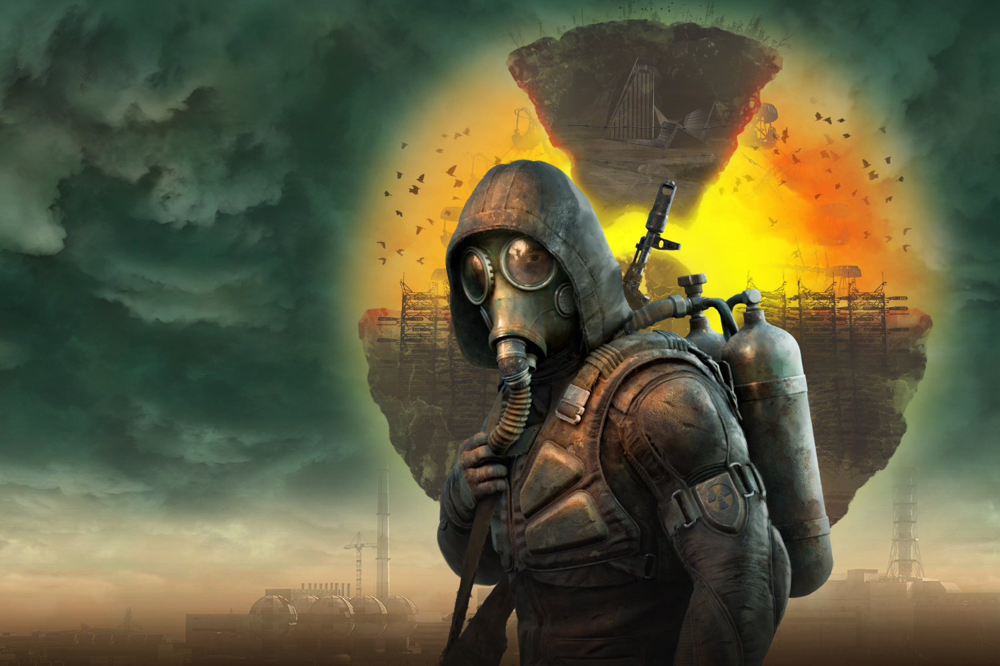

+++
title = "Ouf, STALKER 2 tournera à 30 FPS sur la Xbox Series S"
date = 2024-09-03T06:05:32+01:00
draft = false
author = "Mickael"
tags = ["Actu"]
image = "https://nostick.fr/articles/vignettes/septembre/stalker2.jpg"
+++

À chaque jour son drama ou presque chez Xbox. Avouez, on s'embêterait sans la petite polémique quotidienne autour des consoles de Microsoft… La semaine dernière, Slava Lukyanenka, producteur de *STALKER 2* chez GSC Game World, a eu le malheur d'avoir la langue qui fourche durant une interview avec le site *[wccftech](https://wccftech.com/stalker-2-currently-runs-at-25-fps-on-series-s-but-xbox-is-helping-with-optimization-devs-praise-their-support/)*. En parlant de la version du jeu pour Xbox Series S, il a expliqué qu'elle tournait à environ 25 images par seconde, en comparaison des 60 FPS sur la Series X.

Catastrophe. Putréfaction. Nouvelle plaie d'Égypte. 25 FPS sur la Series S pour un FPS, ça la fout mal. Cette déclaration a provoqué un nouveau torrent de critiques contre la petite console pas chère, de plus en plus accusée de tirer par le bas les possibilités de sa grande sœur et de rendre la vie des développeurs plus difficile. On se rappelle de l'épisode de *Baldur's Gate 3*, pour lequel Microsoft a dû faire une [exception](https://www.polygon.com/23861365/baldurs-gate-3-xbox-series-s-analysis) sur le mode coop de la Series S pour que le jeu puisse sortir sur Xbox.

Sauf que ce n'était pas 25 FPS, mais 35 FPS, comme l'a [clarifié](https://x.com/Ed_Wing/status/1829931865689497795) Slava Lukyanenka quelques jours plus tard. « *Il semble qu'il y ait eu un bug dans ma tête pendant l'entretien, car je voulais dire "environ 35 FPS"* », explique-t-il. L'objectif pour la Series S est de viser les 30 FPS partout dans le jeu. 

Il ajoute que « *l'optimisation pour la Series S est bien engagée. Certaines parties du jeu peuvent être légèrement en dessous de l'objectif pour le moment (d'où le bug dans ma tête), mais en moyenne, STALKER 2 tourne à 34-36 FPS* ». Tout va bien dans le meilleur des mondes donc, et « *il n'y a aucun drame, simplement du travail à terminer* ».

Le développement de *STALKER 2: Heart of Chernobyl*, qu'on imagine très compliqué (le studio est basé en Ukraine), a reçu un gros coup de main de Microsoft et pour cause : c'est un des gros jeux exclusifs Xbox ! Il sortira le 20 novembre.