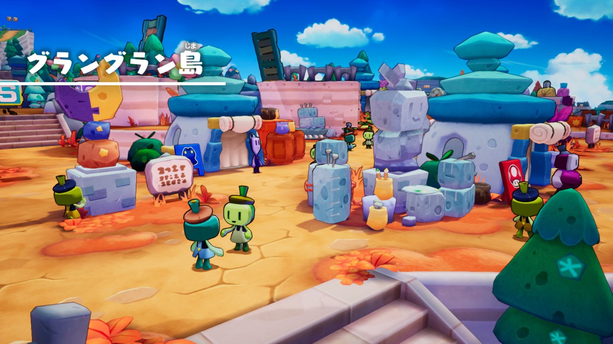
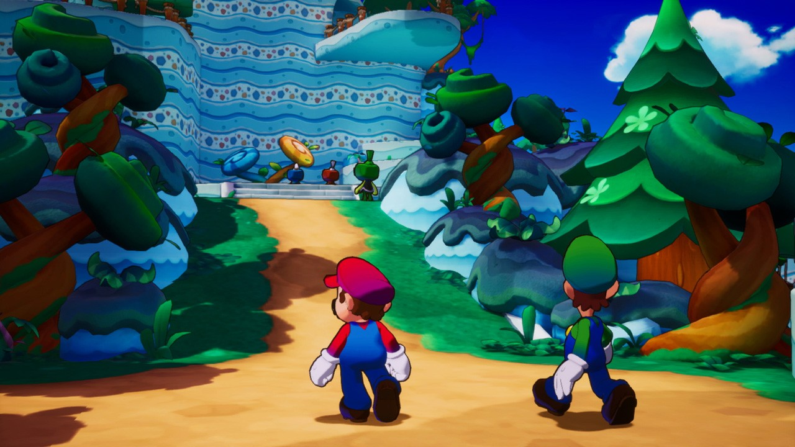
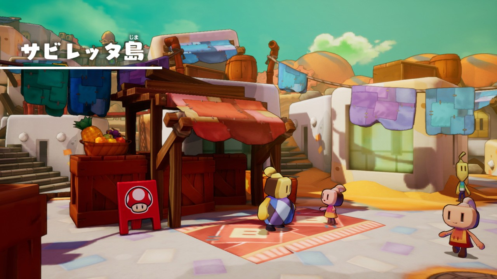
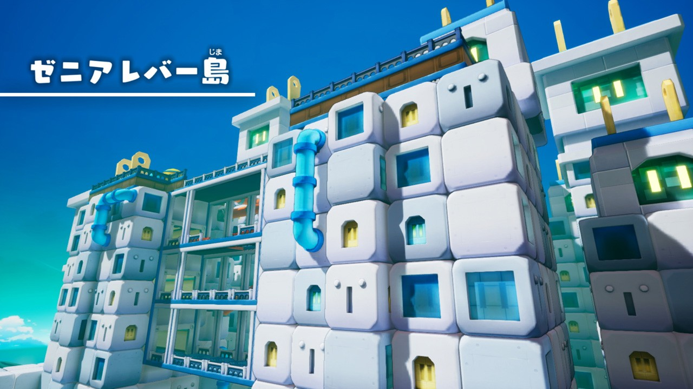
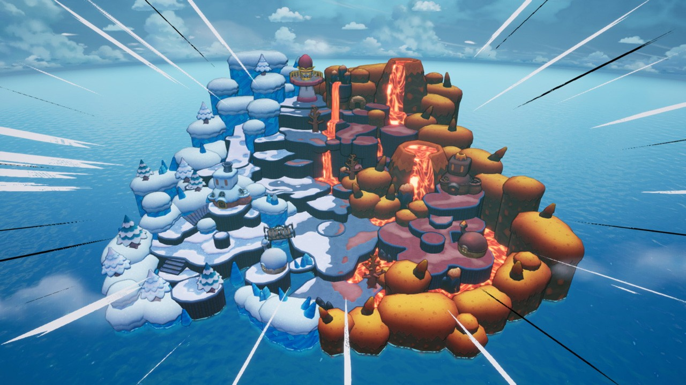
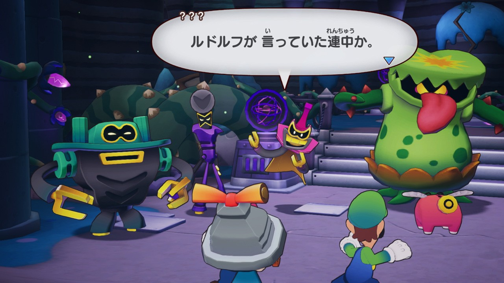

+++
title = "Nintendo fait monter la sauce autour de Mario & Luigi : L'épopée fraternelle"
date = 2024-09-04T07:05:32+01:00
draft = false
author = "Félix"
tags = ["Trailer"]
image = "https://nostick.fr/articles/2024/septembre/0409-nintendo-fait-monter-la-sauce-mario-luigi-rpg/02.jpg"
+++

 

L’une des prochaines (et dernières) grosses productions de la Switch sera *Mario & Luigi : L'épopée fraternelle*, un RPG au tour par tour dévoilé au début de l’été. Ce retour de la saga 9 ans après le dernier épisode sur 3DS sortira le 7 novembre, et Nintendo commence à faire monter la sauce sur [son site japonais](https://www.nintendo.com/jp/topics/article/a4000ce6-792e-49cb-8a9e-75497a691f4f) avec plusieurs vidéos et captures d’écran. On nous promet notamment plusieurs îles différentes, avec certaines urbaines et d’autres plus sauvages. Ça a l’air assez réussi, jugez par vous même :

Forcément, ces décors seront prétextes à de nombreux combats dans lesquels il faudra utiliser les capacités des deux frères. L’article présente aussi les antagonistes (enfin, de ce que j’ai compris avec Google Traduction). Il s’agira d’un trio se faisant appeler « l'escouade Boldrud » en plus d’un mystérieux personnage tirant les ficelles en coulisses.

 

Tout cela donne plutôt envie : le système de combat a l’air bien fichu, reposant toujours sur des mini-jeux d’adresse pour maximiser son attaque. Les graphismes sont ce qu’ils sont, mais restent une belle progression par rapport aux épisodes 3DS/DS. Je sais pas vous, mais personnellement je suis hypé. En attendant novembre, les plus impatients peuvent se refaire les opus précédents [sur iPhone](https://nostick.fr/articles/2024/avril/1904-comment-installer-et-utiliser-delta/) et Android, le tour par tour étant plutôt bien adapté aux écrans tactiles.