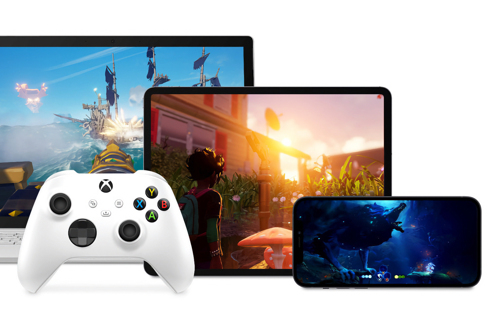

+++
title = "Toujours pas de Xbox Cloud Gaming sur iOS : Microsoft et Apple se bouffent le nez"
date = 2024-09-04T08:01:32+01:00
draft = false
author = "Mickael"
tags = ["Actu"]
image = "https://nostick.fr/articles/vignettes/septembre/xbox-cloud-gaming.jpg"
+++

 

Après avoir freiné des quatre fers, Apple a fini par autoriser les services de cloud gaming sur iPhone et iPad en début d'année. On attendait donc avec impatience de voir débouler les cadors du secteur, comme Nvidia (GeForce Now) et Microsoft (Xbox Cloud Gaming). Mais voilà, rien n'est venu ! Il faut toujours en passer par les versions web de ces services pour pouvoir jouer dans le nuage des deux entreprises. Des web apps très bien faites au demeurant, mais qui ne sont pas aussi bien intégrées que des applications natives.

À l'occasion d'une enquête de l'autorité britannique de la concurrence (CMA), Microsoft a détaillé le pourquoi du comment Xbox Cloud Gaming n'est toujours disponible dans l'App Store. Si Apple a effectivement levé plusieurs obstacles, il en reste toujours qui trainent dans la jungle confuse et byzantine des *[guidelines](https://developer.apple.com/app-store/review/guidelines)* que doivent suivre les développeurs.

Ces règles « *représentent toujours un obstacle aux applications natives pour le cloud gaming* », déplore Microsoft dans un document visé par *[The Verge](https://www.theverge.com/2024/9/3/24234777/microsoft-apple-cloud-gaming-app-store-changes-xbox-cma)*. Un article en particulier, le 3.1.3(b), concerne les « services multiplateformes » qui permettent aux utilisateurs d'accéder à du contenu et à des abonnements acquis sur d'autres plateformes (sur le web, par exemple), ailleurs que dans l'app iOS. 

 

Très bien, mais le hic c'est que les éléments présents dans les jeux multiplateformes doivent « *également [être] disponibles sous forme d'achats intégrés au sein de l'application* ». Cela reviendrait à proposer les micro-transactions des jeux Xbox Cloud Gaming dans l'application iOS. Chaque vente rapporterait dès lors 30 % à Apple. Pour Microsoft, cette commission empêche de monétiser son service de jeux en streaming. L'éditeur ajoute en plus que les développeurs seront dans l'obligation de reprogrammer leurs jeux pour intégrer le système de paiement d'Apple.

Une des solutions préconisées par le CMA est d'opérer les services de cloud gaming en « lecture seule », sans achats intégrés ni abonnements. L'utilisateur aurait accès aux jeux, sans plus. Mais cela représenterait un manque à gagner pour Microsoft, comme pour les développeurs tiers qui ne pourraient rien vendre aux joueurs iOS.

Le régulateur envisage aussi d'imposer à Apple et à Google l'obligation d'accepter les systèmes de paiement alternatifs, comme c'est le cas dans l'Union européenne dans le cadre du règlement sur les marchés numériques (DMA). Mais cela n'empêchera pas les deux contrôleurs d'accès de prélever des commissions.

Apple a répondu à Microsoft en donnant l'exemple d'Antstream, qui depuis quelques mois donne accès à [plus de 1 000 jeux rétro en streaming sur iOS](https://nostick.fr/articles/2024/juin/1906-antstream-premier-service-cloud-gaming-app-store/). Apple a donné un coup de main pour optimiser les abonnements et même faire un peu de pub. Le CMA devant publier son rapport final en février ou mars 2025, Microsoft et Apple vont pouvoir se bouffer le nez pendant encore un moment.