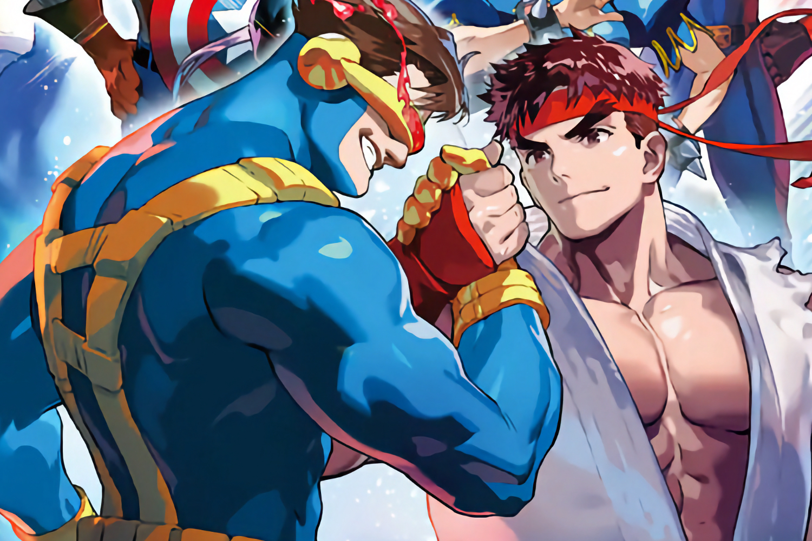

+++
title = "Finalement, les joueurs Xbox auront aussi droit aux compiles de baston de Capcom"
date = 2024-09-04T08:59:32+01:00
draft = false
author = "Mickael"
tags = ["Actu"]
image = "https://nostick.fr/articles/vignettes/septembre/capcom-xbox.jpg"
+++

Le cauchemar est terminé pour les joueurs Xbox amateurs de jeux de tape ! Capcom a [annoncé](https://x.com/CapcomUSA_/status/1830984496260219001) que les deux compiles *Marvel vs Capcom Fighting Collection Arcade Classics* et *Fighting Collection 2* sortiront finalement sur Xbox One — avec l'aide des fonctions de rétrocompatibilité, elles devraient être jouables aussi sur les Xbox Series.

La collection Arcade Classics, qui contient entre autres *Marvel Vs. Capcom 2: New Age of Heroes* et *X-Men Vs. Street Fighter*, sort le 12 septembre sur toutes les autres consoles et sur PC ; il faudra cependant attendre l'année prochaine pour Xbox. Quant à l'autre compilation, avec les jeux *Power Stone*,  *Street Fighter Alpha 3 UPPER* et *Capcom vs. SNK*, elle est prévue en 2025 pour tout le monde.

Capcom confirme qu'il s'agissait bien d'un problème technique, manifestement résolu avec l'aide de Microsoft. Le nœud du problème serait lié au moteur MT Framework (dont le RE Engine est le successeur bien connu), pour lequel il n'existerait pas de passerelle avec la plateforme Xbox. Quoi qu'il en soit, c'est une bonne nouvelle pour la team green, ça n'arrive pas si souvent en ce moment.