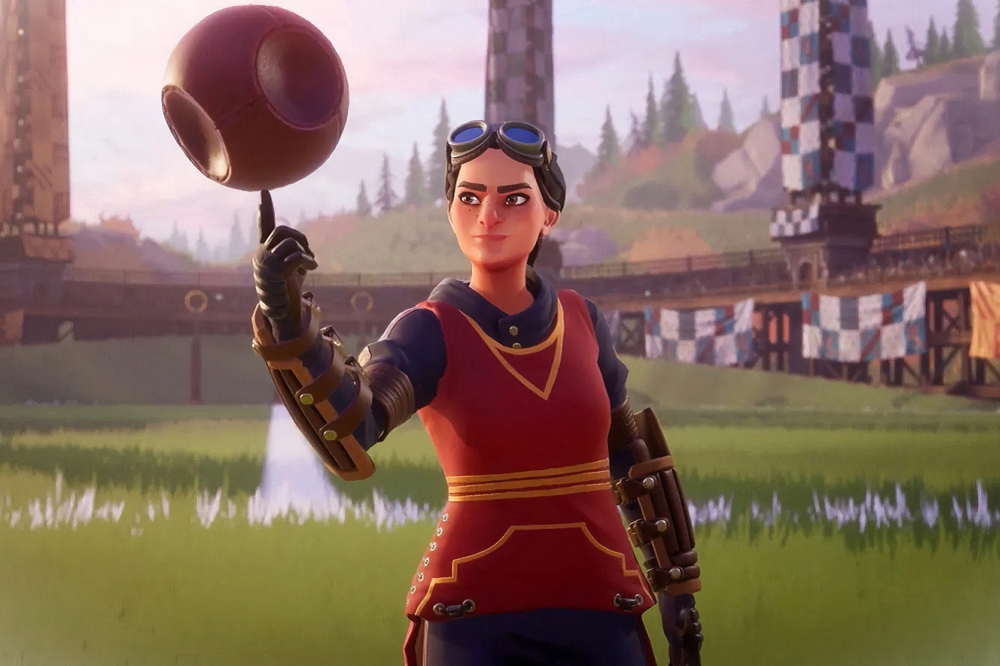

+++
title = "Warner Bros. mise beaucoup sur la suite de Hogwarts Legacy"
date = 2024-09-05T08:00:32+01:00
draft = false
author = "Mickael"
tags = ["Actu"]
type = "telex"
+++

Warner Bros. Games s'est lourdement planté avec *Suicide Squad: Kill the Justice League*, le jeu de Rocksteady ayant forcé le groupe à inscrire une perte de 200 millions de dollars dans ses comptes. Contre toute attente, le titre ne sera pas couronné [flop de l'année](https://nostick.fr/articles/2024/septembre/0309-sony-concord-debranche-serveurs-rembourse-joueurs/), mais tout de même ça la fout mal, surtout que WB était sur le toit du monde l'an dernier à la même période grâce à *Hogwarts Legacy*.

Le jeu qui se déroule dans l'univers de Harry Potter a conquis la première place des ventes annuelles, devant *Call of Duty*, avec 22 millions de copies vendues ! Un chiffre qui fait rêver en temps de vaches maigres. Par conséquent, une suite directe « *est l'une des plus grandes priorités dans les prochaines années* », a [confirmé](https://variety.com/2024/gaming/news/harry-potter-hogwarts-legacy-sequel-game-warner-bros-1236130719/) Gunnar Wiedenfels, le directeur financier de Warner Bros Discovery.

Interrogé durant une conférence Bank of America, le dirigeant a aussi dit toute sa confiance envers l'activité jeux vidéo du groupe malgré le four de *Suicide Squad*. Elle contribuera « *de manière significative* » à la croissance du groupe. WB a lancé cette semaine un nouveau jeu, *Harry Potter: Quidditch Champions*, qui n'est pas connecté à *Hogwarts Legacy* mais qui devrait tout de même rencontrer son petit succès.