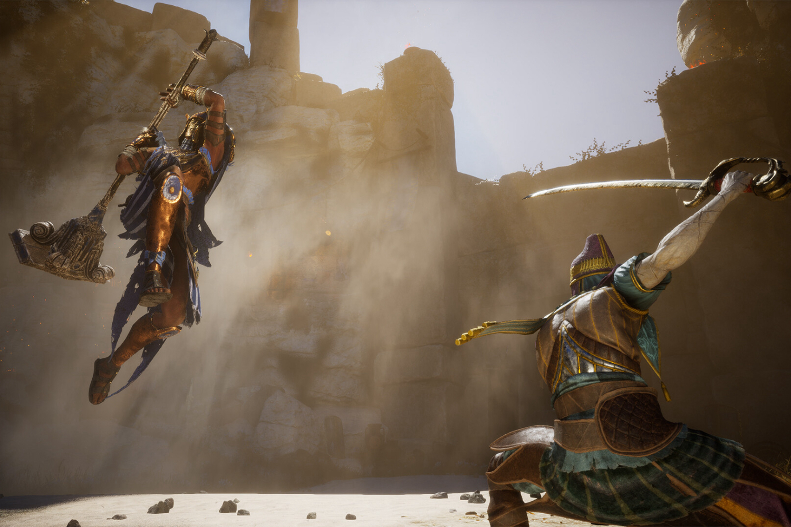

+++
title = "Par la grâce de Phil Spencer, Enotria: The Last Song sortira bien sur Xbox"
date = 2024-09-05T08:01:32+01:00
draft = false
author = "Mickael"
tags = ["Actu"]
image = "https://nostick.fr/articles/vignettes/septembre/enotria.jpg"
+++

Quand un studio n'a pas d'autre choix que de pousser une gueulante publique pour avoir des nouvelles de la certification de son jeu par Xbox, c'est que la plateforme a décidément quelque chose de cassé et de plutôt inquiétant. Le studio en question, c'est l'indépendant Jyamma, qui planche depuis des années sur *Enotria: The Last Song*, un *Souls*-like prévu pour le 19 septembre.

 

Malheureusement, si le jeu sortira bien sur PC et PS5 à la date prévue, la version Xbox a été repoussée « *indéfiniment* », a [expliqué](https://enotriathelastsong.com/news/enotria-the-last-song-official-announcement) l'entreprise italienne en début de semaine. En cause ? Un problème stupide de certification, un processus qui traine depuis deux mois. Et Microsoft a complètement ignoré les demandes des développeurs. 

Sur le Discord du jeu, [repris](https://www.gamesindustry.biz/microsoft-reportedly-apologises-to-jyamma-games-following-issues-with-enotria-xbox-certification) par *GamesIndustry.biz*, le patron du studio Jacky Greco déplore que Microsoft « *n'a évidemment rien à faire d'Enotria et qu'ils se fichent des joueurs* ». Pourtant, le jeu Xbox est semble-t-il fin prêt. Il a donc fallu une [annonce](https://x.com/enotriagame/status/1830677183695667270) publique sur les réseaux sociaux pour que ça se bouge du côté de Microsoft.

Phil Spencer a manifestement reçu le message et [contacté](https://x.com/enotriagame/status/1831359412897976811) Jyamma pour démêler les fils de l'histoire. Le studio est maintenant en contact direct avec la team Xbox. « *Nous travaillons maintenant de près avec Microsoft, et nous espérons que cette collaboration nous permettra de lancer le jeu sur Xbox le plus rapidement possible* ». Tout est bien qui finit bien, mais c'est une fois de plus un drama que la plateforme aurait pu s'éviter.
