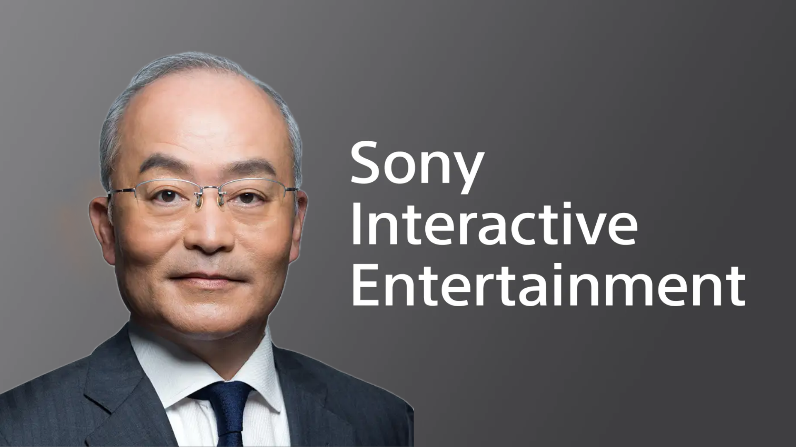

+++
title = "Deux jours après avoir enterré Concord, Sony se plaint de ne pas avoir assez de licences fortes"
date = 2024-09-05T18:30:32+01:00
draft = false
author = "Félix"
tags = ["Actu"]
image = "https://nostick.fr/articles/2024/septembre/0509-sony-se-plaint-de-ne-pas-avoir-assez-de-licences-originales/sie.png"
+++

Il vaut parfois mieux tourner 7 fois sa langue dans sa bouche avant de parler. À l’occasion d’une interview accordée au *[Financial Times](https://www.ft.com/content/307f7a2e-a755-4f6e-badc-9bc119f185df)*, le directeur financier de Sony a déclaré que son groupe n’avait pas assez de franchises originales « *soutenues depuis le début* ». Oui, on parle bien du même Sony qui vient tout juste de [débrancher *Concord*](https://nostick.fr/articles/2024/septembre/0309-sony-concord-debranche-serveurs-rembourse-joueurs/) sans même lui avoir deux semaines pour déployer ses ailes ni fait d'effort sur la partie marketing. La déclaration tombe mal et à sans doute du faire jazzer au studio Firewalk. 

« *Que ce soit pour des jeux, des films ou des animes, il nous manque la première phase (de licences) et c'est un problème pour nous* », a déclaré Hiroki Totoki. Il estime que l’entreprise s’en sort mieux quand il s’agit d’apporter à un public mondial pour un type de contenu qui est déjà devenu populaire sur un marché spécifique. Le *FT* rapporte que Sony va investir plusieurs milliards de dollars pour développer davantage d'œuvres originales, le but étant de favoriser un « *changement de création* » au sein du groupe.

Reste à voir comment tout cela va prendre forme, et si Sony va continuer sa poussée vers les jeux-services ou se concentrer sur les jeux solos AAA qui ont fait son succès. La mésaventure de *Concord* a de quoi faire peur aux marketeux, mais reste un pari qui peut rapporter gros : de tels projets ont l’avantage d’être beaucoup plus rentables sur le long terme en forçant les joueurs à régulièrement cracher au bassinet. Il est pourtant bien difficile de s’imposer en partant d’une nouvelle licence, le marché étant déjà rempli de titres implantés depuis des années. Un fan de FPS devra forcément faire le choix entre un *Overwatch* bien connu ayant fait ses preuves et un petit nouveau…

La sortie aujourd’hui d’*Astro Bot* montre que favoriser les vieilles licences peut être un pari gagnant. Le jeu a été très bien accueilli par la presse, [certains sites](https://www.videogameschronicle.com/review/astro-bot/) évoquant le « *meilleur plateformer 3D depuis une décennie* ». En espérant qu’il se vende bien pour que Sony comprenne le message. 