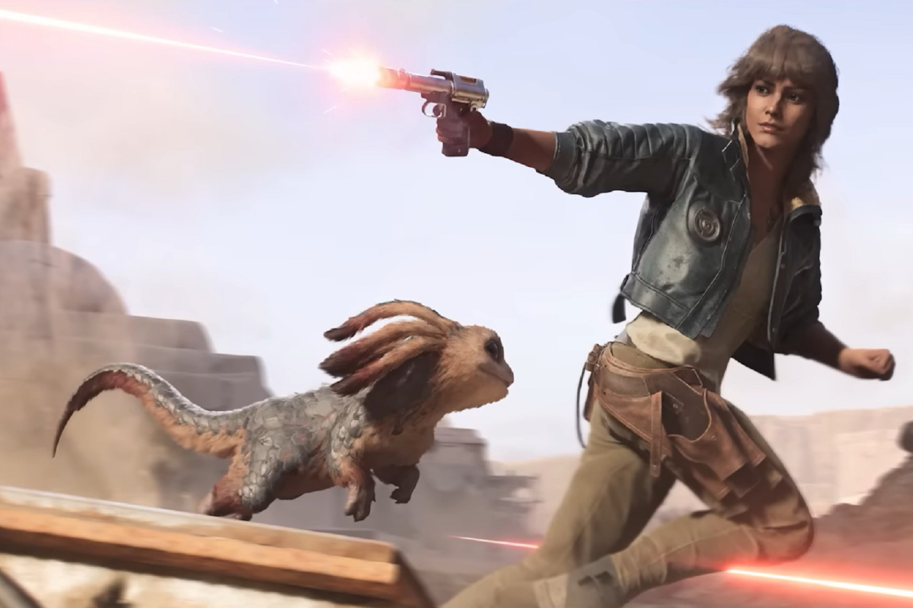

+++
title = "Star Wars Outlaws ne ferait pas le carton attendu"
date = 2024-09-05T09:01:32+01:00
draft = false
author = "Mickael"
tags = ["Actu"]
image = "https://nostick.fr/articles/vignettes/septembre/Star-Wars-Outlaws.jpg"
+++

*Star Wars Outlaws* ne sera peut-être pas le best seller absolu tant espéré par Ubisoft. Les analystes financiers ne sont en effet guère emballés par les ventes du jeu. JP Morgan a [réduit](https://insider-gaming.com/ubisoft-stock-tanks/) ses prévisions, passant de 7,5 millions de copies vendues d'ici fin mars 2025 (la fin de l'exercice fiscal de l'éditeur) à 5,5 millions.

De son côté, GfK [relève](https://x.com/Chris_Dring/status/1830887864403370276) cruellement que les ventes des versions physiques du jeu au Royaume-Uni sont en recul de 55 % par rapport à celles de *Star Wars: Jedi Survivor* sur la même période de lancement. Il manque bien sûr les ventes des versions démat', mais a priori les perspectives ne sont pas exceptionnelles pour ce *Outlaws*.

Le jeu n'est pourtant pas le mauvais bougre, il a été assez bien accueilli ([76 %](https://opencritic.com/game/16790/star-wars-outlaws) sur OpenCritic) et pas mal de joueurs semblent apprécier l'expérience. Mais Ubisoft ne s'aide pas non plus, en limitant les ventes PC à son *launcher* que tout le monde déteste ainsi qu'à l'Epic Games Store. La version Steam sortira probablement dans les six prochains mois, comme c'est le cas des autres titres de l'entreprise… mais il sera trop tard pour transformer la déception en victoire.

Si vous ajoutez à cela [les vilaines rumeurs concernant le shooter *XDefiant*](https://nostick.fr/articles/2024/aout/3008-xdefiant-ubisoft-multi-difficile/) qui [ferait une *Concord*](https://nostick.fr/articles/2024/septembre/0309-sony-concord-debranche-serveurs-rembourse-joueurs/) si le nombre de joueurs n'augmente pas, vous obtenez une situation périlleuse pour Ubisoft. Ce qui explique la chute du titre en Bourse, qui flirte désormais avec les 15 € (-33 % depuis le début de l'année).

Tous les espoirs reposent maintenant sur *Assassin's Creed Shadows*, qui sort le 15 novembre. Les épaules de Naoe et de Yasuke seront-elles suffisamment grandes pour redorer les comptes de Ubisoft ?