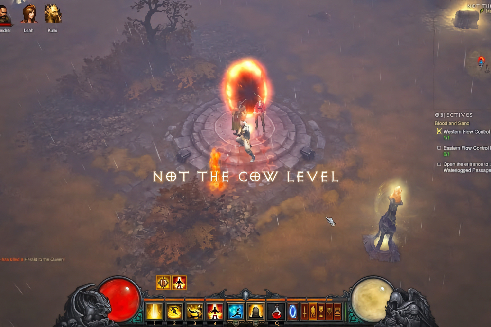
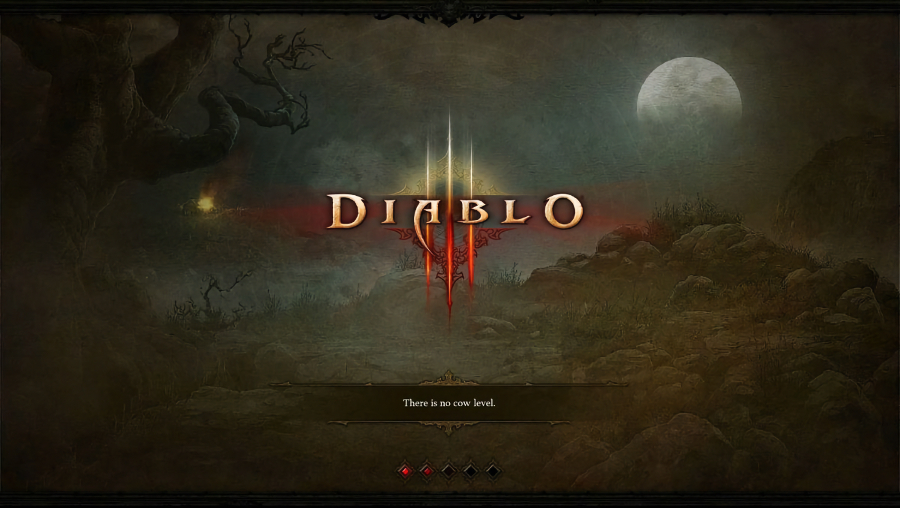
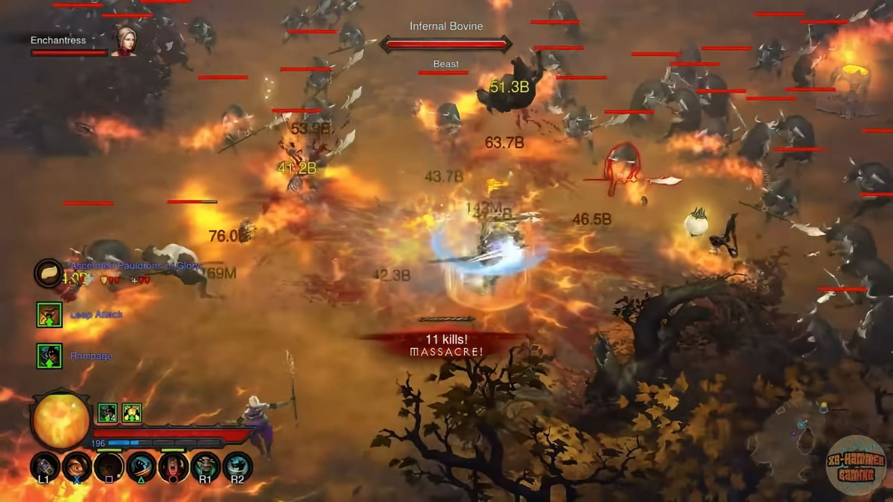
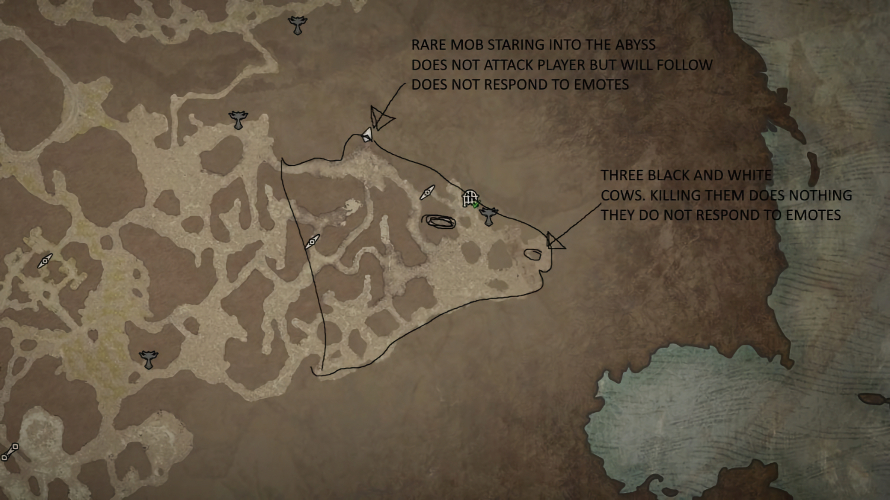

+++
title = "Y a-t-il un niveau secret des vaches dans Diablo 4 ?"
date = 2024-09-06T09:01:32+01:00
draft = false
author = "Mickael"
tags = ["Actu"]
image = "https://nostick.fr/articles/vignettes/septembre/diablo-3-vache.jpg"
+++

Il n'y a pas de niveau secret des vaches dans *Diablo 4*, a assuré Blizzard. Et après tout, c'est ce qu'ils disaient aussi pour *Diablo 2* et *Diablo 3*… qui cachaient pourtant bien des niveaux secrets avec des tas de vaches à trucider ! Il n'y a donc aucune raison de croire les fariboles des développeurs du jeu : oui, il y a bien un niveau secret des vaches dans le dernier opus, mais où bon sang de bois ?

 

Ce qui a débuté comme une légende urbaine avec le tout premier *Diablo* de 1997 est devenu réalité avec sa suite, qui contient un niveau secret des vaches. Pour ouvrir le portail vers la « ferme Meuh Meuh », il faut combiner un Livre de portails des villes avec la jambe de Wirt (trouvable sur un NPC du premier *Diablo* !) dans le cube Horadrim et bim, à vous le loot et les steaks.

Diablo 3 avait aussi, bien sûr, un niveau secret des vaches, malgré un écran de chargement sur lequel est marqué noir sur blanc qu'il n'y en a pas. Il a toutefois fallu attendre 2017 et le 20e anniversaire de la saga pour pouvoir y accéder. Et *Diablo 4* ? Bon sang ne saurait ~~ruminer~~ mentir, à tous les coups il y a aussi un niveau secret des vaches, affirme *[Windows Central](https://www.windowscentral.com/gaming/is-there-a-cow-level-in-diablo-4-evidence-suggests-yes)*.

Le jeu contient des indices, comme cette fontaine à Ked Bardu entourée de quatre statues de vaches et un message dédié aux Dieux-Bœufs, « *gardiens de la fontaine sacrée* ». Faire une offrande ici permet d'obtenir leur bénédiction. Et d'ouvrir un portail ? Pour l'instant, ce n'est pas le cas mais tuer 3 fois 666 vaches dans un certain ordre permet de collecter 3 reliques à purifier dans cette fameuse fontaine.

Les dataminers n'en sont pas restés là. D'autres indices plus ou moins obscurs sont présents dans des énigmes partout dans le jeu. Des tordus ont même cru deviner une tête de vache sur la carte de Sanctuaire… Le patch 2.0 prévu en même temps que le DLC *Vessel of Hatred* (le 8 octobre) semble contenir une partie de la réponse qui taraude les fans de massacre de vaches. 

Une arme présente dans la zone de test publique (PTR), la bardiche rouillée, ressemble beaucoup à la bardiche bovine de *Diablo 3* avec laquelle on pouvait ouvrir le portail vers le niveau secret des vaches. D'autres équipements de la PTR font aussi référence aux ruminants. Difficile de ne pas connecter les points entre eux…

Les fans de vaches dans *Diablo* peuvent rejoindre le Discord *[Not the Cow Level](https://discord.com/invite/KRAA4pMK)* pour partager leurs découvertes.